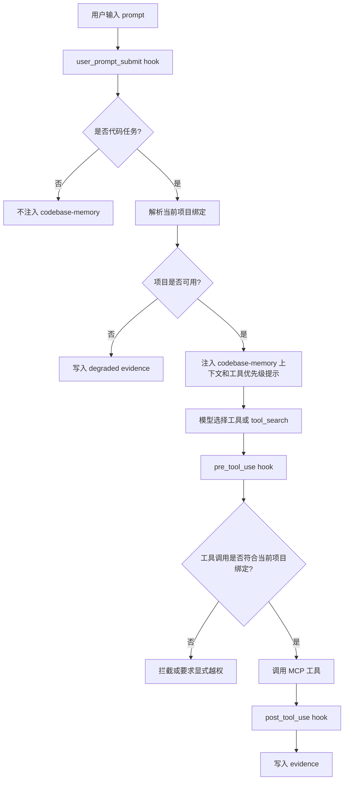

# OMP Custom Codex Adapter PRD

## 1. 文档信息

| 项目 | 内容 |
| --- | --- |
| 文档名称 | OMP Custom Codex Adapter PRD |
| 所属能力 | `BearMaxDD/omp-custom` |
| 目标宿主 | OpenAI Codex CLI / Codex Desktop |
| 当前 OMP 分支 | `BearMaxDD/oh-my-pi` / `mima/omp-custom` |
| 文档日期 | 2026-07-09 |
| 文档类型 | 产品需求文档 |
| 目标读者 | 个人维护者、后续实现代理、代码审查者、插件适配实现者 |

## 2. 背景

`mima/omp-custom` 已经在 OMP 中实现了面向个人工作流的增强能力，包括 PlanRun 执行闭环、Superpowers 技能门禁、codebase-memory 自动上下文、任务模型路由、审查证据和修复循环等。

此前已经确定长期方向：自定义能力主体迁出到 `BearMaxDD/omp-custom` 独立仓库，`BearMaxDD/oh-my-pi` fork 只保留加载、注册和适配官方核心接口的接线补丁。

在分析 OpenAI Codex 代码后，可以看到 Codex 已经具备更适合作为第二宿主的扩展面：

- `user_prompt_submit` hook：适合在用户输入后、模型调用前做 codebase-memory 自动触发。
- `pre_tool_use` hook：适合在工具调用前做项目绑定、越权拦截和参数补全。
- `tool_search`：适合提升 MCP 工具发现率，让 codebase-memory 工具更容易被模型主动调用。
- `post_tool_use` hook：适合在工具调用后记录 evidence、更新触发统计和沉淀验收材料。
- MCP runtime：适合接入全局安装的 `codebase-memory-mcp`，并由 Adapter 在会话层做项目绑定。
- memory / extension 风格：适合把“提示注入”和“工具贡献”分离，而不是把所有逻辑塞进主提示词。

因此，Codex 不应被当作要直接 fork 的新核心，而应被当作 `omp-custom` 的第二个宿主。Codex Adapter 的目标是让同一套自定义能力在 Codex 中获得接近 OMP 的行为，同时借助 Codex 原生 hooks、MCP 和工具发现机制提高 codebase 自动触发率。

## 3. 问题定义

当前需要解决的问题不是“把 OMP 全量迁移到 Codex”，而是：

1. Codex 中 codebase-memory 需要更高的自动触发率，不能完全依赖模型偶然选择 MCP 工具。
2. 多项目、多窗口、多 worktree 场景下，codebase-memory 必须绑定当前项目，避免跨项目图谱污染。
3. 全局安装的 `codebase-memory-mcp` 需要在 Codex 会话中按项目安全调用。
4. 工具调用产生的证据需要沉淀为结构化 evidence，供 PlanRun、审查、验收和后续记忆使用。
5. 自定义能力必须属于 `omp-custom`，Codex 侧只做 Adapter，避免维护 Codex core fork。

## 4. 产品目标

### 4.1 核心目标

建设 `omp-custom` 的 Codex Adapter，使 Codex 在代码任务中能够自动、稳定、可审计地触发 codebase-memory，并通过项目隔离和 evidence 记录把工具调用纳入 `omp-custom` 的执行闭环。

### 4.2 具体目标

1. 在 Codex 的 `user_prompt_submit` 阶段识别代码任务，并自动注入 codebase-memory 上下文或工具使用指令。
2. 在 Codex 的 `pre_tool_use` 阶段为 codebase-memory MCP 工具调用强制绑定当前项目，禁止默认跨项目访问。
3. 通过 `tool_search` 和工具元数据提升 codebase-memory MCP 工具的可发现性，让模型在代码任务中更容易主动调用。
4. 在 Codex 的 `post_tool_use` 阶段记录工具调用 evidence，形成可追踪、可验收、可复盘的数据。
5. 保持 `codebase-memory-mcp` 全局安装，不引入每项目单独 MCP 安装。
6. 保持 `BearMaxDD/omp-custom` 为能力主体，Codex Adapter 只承载宿主接入逻辑。

## 5. 非目标

本 PRD 不包含以下事项：

- 不 fork OpenAI Codex core。
- 不把 OMP 的 PlanRun、Superpowers、任务模型路由全量重写成 Codex Rust core 功能。
- 不替换 Codex 官方 memory、plugin、MCP 或 hooks 系统。
- 不要求首版实现 Codex 与 OMP 的完全 UI 等价。
- 不要求首版将 evidence 自动同步到远端数据库。
- 不要求每个项目独立安装 `codebase-memory-mcp`。
- 不改变 `codebase-memory-mcp` 的图谱存储格式，除非后续 PRD 单独定义。
- 不把普通聊天强行变成代码任务；自动触发必须受意图分类约束。

## 6. 目标用户与使用场景

### 6.1 主要用户

**个人维护者**

在 Codex 中处理多个本地项目，希望 codebase-memory 像 Codex 原生工具一样高频、准确、自动地参与代码任务。

**实现代理**

根据 PRD 实现 Codex Adapter，需要知道哪些逻辑属于 `omp-custom` core，哪些逻辑属于 Codex 宿主接线。

**代码审查者**

审查 Adapter 是否遵守项目隔离、是否没有把自定义能力侵入 Codex core、是否具备足够 evidence。

### 6.2 核心场景

**场景一：用户在 Codex 中提代码问题**

用户在某个项目目录下输入：

```text
分析这个模块为什么没有自动触发 codebase
```

Adapter 在 `user_prompt_submit` 阶段识别为代码任务，解析当前工作目录绑定的 projectId，并注入 codebase-memory 优先使用提示。

**场景二：模型调用 codebase-memory 工具**

模型准备调用 `search_graph`、`search_code`、`get_code_snippet` 等 MCP 工具时，Adapter 在 `pre_tool_use` 阶段检查调用参数。如果参数缺少当前 projectId，则自动补全；如果参数指向其他项目，则默认拦截并要求显式越权。

**场景三：工具发现率不足**

当模型不知道可用 MCP 工具名称时，Adapter 通过工具元数据、关键词和 `tool_search` search text 增强，使 `codebase-memory`、`代码图谱`、`函数调用链`、`项目索引` 等查询能返回相关工具。

**场景四：调用后沉淀证据**

codebase-memory 工具调用完成后，Adapter 在 `post_tool_use` 阶段记录输入、绑定项目、输出摘要、成功状态、耗时、是否越权、是否用于后续回答等 evidence。

**场景五：项目未索引或图谱不可用**

Adapter 检测到当前项目未索引、索引过期或 MCP transport 不可用时，不阻断普通对话，而是进入降级模式：提示用户或代理执行索引刷新，并记录 degraded evidence。

## 7. 产品原则

### 7.1 独立能力优先

分类策略、项目绑定策略、evidence schema、降级策略属于 `BearMaxDD/omp-custom`。Codex Adapter 只负责把这些能力接到 Codex hooks、MCP 和 tool_search 上。

### 7.2 默认强绑定

一个 Codex 会话默认只绑定一个项目。跨项目访问必须显式声明，并在 evidence 中记录越权原因。

### 7.3 自动触发但不打扰

Adapter 应提高 codebase-memory 自动触发率，但不能让普通聊天、写作、翻译、泛讨论全部触发代码图谱。

### 7.4 可审计优先于隐式便利

所有自动补参、拦截、降级、越权、重试和 evidence 写入都必须可追踪。失败时要能知道是意图分类失败、项目绑定失败、MCP 不可用还是工具发现失败。

### 7.5 不绑定 Codex core fork

首版只通过插件、hooks、MCP、配置和外部 Adapter 实现。只有当官方扩展点无法满足硬性需求时，才在后续单独评估 Codex core patch。

## 8. 范围定义

### 8.1 首版范围

首版 Adapter 聚焦四个 Codex 接入点：

1. `user_prompt_submit` 自动触发 codebase-memory。
2. `pre_tool_use` 项目隔离拦截。
3. `tool_search` 提升 MCP 发现率。
4. `post_tool_use` evidence 记录。

### 8.2 延后范围

以下能力延后到后续版本：

- Codex UI 面板展示 evidence。
- Codex Desktop 内的可视化项目绑定切换器。
- PlanRun 在 Codex 中完整执行。
- 多代理任务中的跨会话 evidence 聚合。
- codebase-memory broker / daemon 化。
- 自动创建 GitHub PR 或 Gitea PR。
- 将 evidence 写入长期知识库。

## 9. 术语定义

| 术语 | 定义 |
| --- | --- |
| Adapter | `omp-custom` 面向 Codex 的宿主接入层 |
| Host | 承载 `omp-custom` 的运行环境，当前包括 OMP 和 Codex |
| Project Binding | 当前会话绑定到某个本地项目及其 projectId 的状态 |
| codebase-memory | 代码图谱、源码搜索、调用链追踪、片段读取等项目级代码知识能力 |
| MCP Tool | 由 MCP server 暴露给 Codex 的工具 |
| Evidence | 工具调用、上下文注入、拦截、降级和验收相关的结构化记录 |
| Explicit Override | 用户或代理明确声明要访问非当前项目 |
| Degraded Mode | codebase-memory 不可用或不可信时的降级运行状态 |

## 10. 总体架构

### 10.1 推荐形态

```text
BearMaxDD/omp-custom
  core/
    intent/
      classify-codebase-task
    project/
      resolve-binding
      enforce-scope
    codebase-memory/
      build-context
      build-tool-search-metadata
      normalize-tool-call
    evidence/
      write-event
      summarize-tool-output
      export-run-evidence

  adapters/
    omp/
      register-extension
      register-tools
      inject-context

    codex/
      plugin/
        .codex-plugin/plugin.json
      hooks/
        session_start
        user_prompt_submit
        pre_tool_use
        post_tool_use
      mcp/
        codebase-memory-proxy
      skills/
        codebase-first
```

### 10.2 Codex 接入链路



## 11. 功能需求

### FR-1 Adapter 安装与启用

Codex Adapter 必须能够作为 Codex 插件或本地插件目录启用。

首版需要支持：

- 读取 Adapter 配置。
- 检测 `codebase-memory-mcp` 是否可用。
- 检测当前会话是否处于项目目录。
- 检测当前项目是否存在 project identity。
- 在不可用时进入降级模式，而不是让 Codex 无法启动。

验收标准：

- 安装后新开 Codex 会话能执行 `session_start` 初始化。
- 未安装 `codebase-memory-mcp` 时，普通 Codex 对话不受影响。
- Adapter 状态可以通过 evidence 或诊断命令看到。

### FR-2 项目身份解析

Adapter 必须为当前 Codex 会话解析稳定项目身份。

推荐读取顺序：

1. `.codebase-memory/project.json`
2. `.omp/codebase-memory-binding.json`
3. `codebase-memory-mcp list_projects` 中与当前 `cwd` 匹配的项目。
4. 当前 Git 根目录派生的候选 projectId。

项目身份至少包含：

```json
{
  "projectId": "Users-mima1234-Code-super-oh-my-pi",
  "root": "/Users/mima1234/Code/super/oh-my-pi",
  "bindingMode": "strict",
  "allowCrossProject": false,
  "createdAt": "2026-07-09T00:00:00+08:00",
  "updatedAt": "2026-07-09T00:00:00+08:00"
}
```

验收标准：

- 同一项目多次打开 Codex 得到同一个 projectId。
- 子目录中启动 Codex 能向上找到项目根。
- 找不到项目身份时，不自动绑定到其他项目。

### FR-3 `user_prompt_submit` 自动触发 codebase-memory

Adapter 必须在 `user_prompt_submit` 阶段识别代码任务并自动触发 codebase-memory 上下文策略。

触发信号包括：

- 用户提到文件、目录、函数、类、接口、路由、CLI、包名、模块名。
- 用户要求分析、修复、实现、重构、review、定位、追踪调用链。
- 用户提到 codebase、代码库、源码、项目、仓库、架构、依赖关系。
- 当前会话处于已绑定项目，且用户请求依赖当前代码现实。

非触发信号包括：

- 普通翻译、闲聊、写作。
- 与当前项目无关的通用知识问答。
- 用户明确要求不要读取代码库。

触发后 Adapter 应注入：

- 当前绑定项目摘要。
- codebase-memory 优先使用规则。
- 推荐工具顺序。
- 当前降级状态。
- 明确禁止跨项目默认读取。

验收标准：

- 代码分析类 prompt 能自动出现 codebase-memory 使用指引。
- 普通聊天不会注入代码图谱上下文。
- 用户明确禁止时不触发。
- 每次触发都写入 `prompt_submit` evidence。

### FR-4 `pre_tool_use` 项目隔离拦截

Adapter 必须在 codebase-memory MCP 工具调用前执行项目隔离检查。

适用工具包括但不限于：

- `search_graph`
- `search_code`
- `trace_path`
- `get_code_snippet`
- `query_graph`
- `get_architecture`
- `index_status`
- `index_repository`

检查规则：

1. 如果工具参数缺少 projectId，但当前会话已绑定项目，则自动补入当前 projectId。
2. 如果工具参数 projectId 与当前绑定项目一致，则允许调用。
3. 如果工具参数 projectId 指向其他项目，且没有显式越权，则阻断。
4. 如果用户明确要求跨项目比较，则允许一次性越权，并写入 evidence。
5. 如果当前项目未绑定，则不允许静默调用任意默认项目。

验收标准：

- 默认情况下，一个 Codex 会话只能调用当前项目图谱。
- 错误 projectId 会被拦截。
- 自动补参不会改变非 codebase-memory 工具。
- 越权调用必须记录原因、目标项目和触发 prompt。

### FR-5 `tool_search` 提升 MCP 发现率

Adapter 必须为 codebase-memory MCP 工具提供更适合模型检索的 search metadata。

每个工具需要提供：

- 中文和英文关键词。
- 适用场景。
- 不适用场景。
- 输入参数摘要。
- 与代码任务的关系。
- 推荐调用顺序。

示例 search text：

```text
codebase memory, code graph, search source code, find function, trace call path,
read code snippet, architecture summary, project index, 代码图谱, 源码搜索,
调用链追踪, 函数定位, 项目架构, 当前仓库, 当前项目
```

推荐工具发现策略：

1. 用户要求“找函数、类、符号”时优先暴露 `search_graph`。
2. 用户要求“搜文本、错误信息、配置值”时优先暴露 `search_code`。
3. 用户要求“谁调用谁、调用链、影响范围”时优先暴露 `trace_path`。
4. 用户要求“读具体实现”时优先暴露 `get_code_snippet`。
5. 用户要求“整体架构”时优先暴露 `get_architecture`。
6. 用户要求“索引是否可用”时优先暴露 `index_status`。

验收标准：

- 模型可以通过 `tool_search` 用中文查询找到 codebase-memory 工具。
- 模型可以通过 `tool_search` 用英文查询找到 codebase-memory 工具。
- codebase-memory 工具不会淹没普通文件、shell、浏览器等工具。
- search metadata 能区分结构化图谱搜索与普通全文搜索。

### FR-6 `post_tool_use` evidence 记录

Adapter 必须在 codebase-memory 工具调用后记录 evidence。

Evidence 至少包含：

```json
{
  "schemaVersion": 1,
  "eventType": "codebase_memory_tool_use",
  "host": "codex",
  "sessionId": "codex-session-id",
  "turnId": "turn-id",
  "projectId": "Users-mima1234-Code-super-oh-my-pi",
  "cwd": "/Users/mima1234/Code/super/oh-my-pi",
  "toolName": "search_graph",
  "toolInput": {},
  "toolOutputSummary": "命中 8 个符号",
  "success": true,
  "durationMs": 120,
  "bindingMode": "strict",
  "crossProjectOverride": false,
  "degraded": false,
  "createdAt": "2026-07-09T00:00:00+08:00"
}
```

Evidence 存储位置首版推荐：

```text
.omp/evidence/codex-adapter/YYYY-MM-DD.jsonl
```

验收标准：

- 成功调用会写入 evidence。
- 被拦截调用会写入 evidence。
- 降级状态会写入 evidence。
- evidence 不保存完整大段源码输出，只保存摘要、引用和必要元数据。

### FR-7 降级模式

Adapter 必须处理以下降级场景：

- `codebase-memory-mcp` 未安装。
- MCP transport 断开。
- 当前项目未索引。
- 当前项目索引过期。
- 项目身份文件不存在。
- evidence 写入失败。

降级行为：

- 不阻断普通 Codex 对话。
- 不伪装成已经读取图谱。
- 给模型提供明确的降级上下文。
- 必要时建议运行索引刷新。
- 写入 degraded evidence；如果 evidence 本身失败，则在 hook 输出中返回简短诊断。

验收标准：

- MCP 不可用时，用户仍可继续普通问答。
- Adapter 不会在降级状态下声称“已读取代码图谱”。
- 降级原因可被诊断。

### FR-8 配置项

Adapter 首版需要支持以下配置：

```json
{
  "enabled": true,
  "bindingMode": "strict",
  "autoInjectOnCodeTask": true,
  "allowCrossProjectByDefault": false,
  "toolSearchBoost": true,
  "recordEvidence": true,
  "evidenceDir": ".omp/evidence/codex-adapter",
  "maxInjectedContextChars": 6000,
  "degradedMode": "warn"
}
```

配置优先级：

1. 项目级配置。
2. 用户级 Codex / omp-custom 配置。
3. Adapter 默认值。

验收标准：

- 可以在项目级关闭自动注入。
- 可以在项目级关闭 evidence 写入。
- 默认配置必须安全，即强绑定、禁止默认跨项目。

### FR-9 隐私与安全

Adapter 必须避免把不必要的源码、密钥、环境变量写入 evidence 或注入上下文。

要求：

- evidence 默认只保存摘要和引用。
- 对疑似密钥字段做脱敏。
- 不把 `.env`、凭据、token、私钥内容写入 evidence。
- 不在跨项目越权时自动读取目标项目，必须先通过拦截或显式确认。

验收标准：

- evidence 中不出现常见 token / key 模式。
- 工具输出摘要不包含完整大段源码。
- 越权访问有明确记录。

## 12. 数据模型

### 12.1 项目绑定文件

推荐路径：

```text
.omp/codebase-memory-binding.json
```

推荐结构：

```json
{
  "schemaVersion": 1,
  "host": "codex",
  "projectId": "Users-mima1234-Code-super-oh-my-pi",
  "root": "/Users/mima1234/Code/super/oh-my-pi",
  "bindingMode": "strict",
  "allowCrossProject": false,
  "lastSessionId": "codex-session-id",
  "updatedAt": "2026-07-09T00:00:00+08:00"
}
```

### 12.2 Prompt 触发 evidence

```json
{
  "schemaVersion": 1,
  "eventType": "prompt_submit",
  "host": "codex",
  "projectId": "Users-mima1234-Code-super-oh-my-pi",
  "intent": "codebase_task",
  "matchedSignals": ["当前项目", "分析", "代码"],
  "autoInjected": true,
  "degraded": false,
  "createdAt": "2026-07-09T00:00:00+08:00"
}
```

### 12.3 拦截 evidence

```json
{
  "schemaVersion": 1,
  "eventType": "tool_use_blocked",
  "host": "codex",
  "projectId": "Users-mima1234-Code-super-oh-my-pi",
  "toolName": "search_graph",
  "reason": "cross_project_without_override",
  "requestedProjectId": "Users-mima1234-Code-other-project",
  "createdAt": "2026-07-09T00:00:00+08:00"
}
```

## 13. 成功指标

### 13.1 触发率指标

- 代码任务中 codebase-memory 自动触发率达到 80% 以上。
- 普通非代码任务误触发率低于 10%。
- 明确代码分析任务中，模型至少会看到 codebase-memory 使用指引或可检索工具。

### 13.2 隔离指标

- 默认跨项目调用拦截率达到 100%。
- 缺少 projectId 的 codebase-memory 调用自动补参成功率达到 95% 以上。
- 所有越权调用都有 evidence。

### 13.3 可观测性指标

- codebase-memory 工具调用 evidence 覆盖率达到 100%。
- 降级事件 evidence 覆盖率达到 100%。
- 单次 evidence 写入失败不会影响 Codex 主流程。

## 14. 验收用例

### AC-1 代码任务自动注入

给定当前 Codex 会话位于已绑定项目，用户输入：

```text
分析这个项目里面任务模型路由是怎么实现的
```

则 Adapter 应：

- 识别为代码任务。
- 注入当前项目绑定信息。
- 提示优先使用 codebase-memory。
- 写入 `prompt_submit` evidence。

### AC-2 普通聊天不触发

用户输入：

```text
帮我润色这句话
```

则 Adapter 应：

- 不注入 codebase-memory 上下文。
- 不调用 MCP。
- 可选择不写 evidence，或只写轻量 skipped evidence。

### AC-3 缺少 projectId 自动补参

模型调用：

```json
{
  "tool": "search_graph",
  "arguments": {
    "name_pattern": ".*ModelRouting.*"
  }
}
```

当前会话绑定项目为 `Users-mima1234-Code-super-oh-my-pi`。

则 Adapter 应在 `pre_tool_use` 阶段补入当前 projectId，并允许调用。

### AC-4 跨项目默认拦截

模型调用：

```json
{
  "tool": "search_graph",
  "arguments": {
    "project": "Users-mima1234-Code-other-project",
    "name_pattern": ".*ModelRouting.*"
  }
}
```

当前会话未获得显式越权。

则 Adapter 应阻断调用，并写入 `tool_use_blocked` evidence。

### AC-5 `tool_search` 中文可发现

模型调用 `tool_search` 查询：

```text
代码图谱 调用链 函数定位
```

则返回结果应包含 codebase-memory 相关工具。

### AC-6 工具调用后 evidence

codebase-memory 工具调用成功后，Adapter 应在 `.omp/evidence/codex-adapter/YYYY-MM-DD.jsonl` 追加一条 `codebase_memory_tool_use` evidence。

### AC-7 MCP 不可用降级

当 `codebase-memory-mcp` transport 断开时，用户继续提代码问题。

则 Adapter 应：

- 不声称已读取图谱。
- 注入降级提示。
- 建议刷新或恢复 MCP。
- 不阻断普通回答。

## 15. 实施阶段

### 阶段一：PRD 与接口固化

产出：

- 本 PRD。
- `omp-custom` core 与 Codex Adapter 的接口草案。
- evidence schema 草案。

完成标准：

- 四个接入点需求明确。
- 项目隔离规则明确。
- 首版非目标明确。

### 阶段二：Codex Adapter 最小可用版本

产出：

- Codex 本地插件骨架。
- `session_start` 初始化。
- `user_prompt_submit` 代码任务识别。
- `pre_tool_use` 项目绑定检查。
- `post_tool_use` evidence 写入。

完成标准：

- 能在一个本地项目中完成自动触发、工具调用、evidence 记录闭环。

### 阶段三：工具发现增强

产出：

- codebase-memory 工具 search metadata。
- 中文/英文 tool_search 查询优化。
- 工具推荐顺序策略。

完成标准：

- 模型在代码任务中更稳定地发现 codebase-memory 工具。

### 阶段四：OMP 与 Codex 双宿主对齐

产出：

- `omp-custom` core 中抽离公共策略。
- OMP Adapter 与 Codex Adapter 共享分类、绑定、evidence schema。
- 双宿主一致性测试清单。

完成标准：

- 同一类代码任务在 OMP 和 Codex 中触发策略一致。
- 宿主差异只存在于接线层。

## 16. 风险与对策

| 风险 | 影响 | 对策 |
| --- | --- | --- |
| Codex hooks API 变动 | Adapter 需要调整 | Adapter 层保持薄，核心策略放在 `omp-custom` |
| 自动触发过度 | 普通聊天被污染 | 分类器引入非触发规则和项目级开关 |
| MCP transport 不稳定 | 工具不可用 | 降级模式和明确 evidence |
| 跨项目误读 | 代码图谱污染和隐私风险 | 默认强绑定，跨项目必须显式越权 |
| evidence 泄露源码或密钥 | 安全风险 | 摘要化、脱敏、禁止保存完整敏感输出 |
| tool_search 噪声过大 | 模型工具选择变差 | 限制 search metadata，按场景召回 |
| 直接改 Codex core 的诱惑 | 后续同步成本高 | 首版明确禁止 core fork |

## 17. 开放问题

1. Codex 插件 hooks 的最终文件结构是否采用 `.codex-plugin/plugin.json` + hooks 脚本，还是先用用户级 hooks 配置验证？
2. Evidence 首版是否只写项目本地 `.omp/evidence`，还是同时写入 `omp-custom` 全局日志？
3. 显式越权的用户表达是否只通过 prompt 识别，还是需要增加一次确认机制？
4. tool_search metadata 是由 MCP proxy 动态生成，还是由 Codex Adapter 静态提供？
5. 项目身份缺失时，首版是否自动创建 `.codebase-memory/project.json`，还是只提示用户初始化？

## 18. 推荐决策

本 PRD 推荐以下首版决策：

1. Codex Adapter 首版不改 Codex core。
2. `codebase-memory-mcp` 保持全局安装。
3. 项目隔离默认强绑定，禁止默认跨项目。
4. Evidence 首版写入项目本地 `.omp/evidence/codex-adapter`。
5. 自动触发先以保守分类器实现，宁可少触发，也不污染普通对话。
6. `tool_search` 增强以 metadata 和推荐说明为主，不改变 MCP server 原始工具协议。
7. 后续再评估是否加入 broker / daemon，解决多宿主 MCP transport 生命周期问题。

## 19. 结论

Codex Adapter 的价值不是替代 OMP，而是让 `BearMaxDD/omp-custom` 获得第二个宿主，并利用 Codex 原生 hooks、MCP 和 `tool_search` 提高 codebase-memory 的自动触发率。

首版应聚焦一条最小闭环：

```text
user_prompt_submit 识别代码任务
  -> 注入 codebase-memory 策略
  -> tool_search 更容易发现 MCP 工具
  -> pre_tool_use 强制项目绑定
  -> post_tool_use 记录 evidence
```

完成该闭环后，再逐步把 PlanRun、Superpowers、任务模型路由等更重的 OMP 自定义能力接入 Codex。这样既能保留 OMP 的现有可用性，也能让 Codex 成为长期稳定的插件化宿主。
