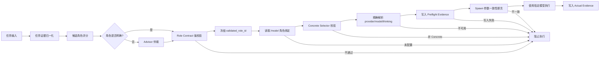
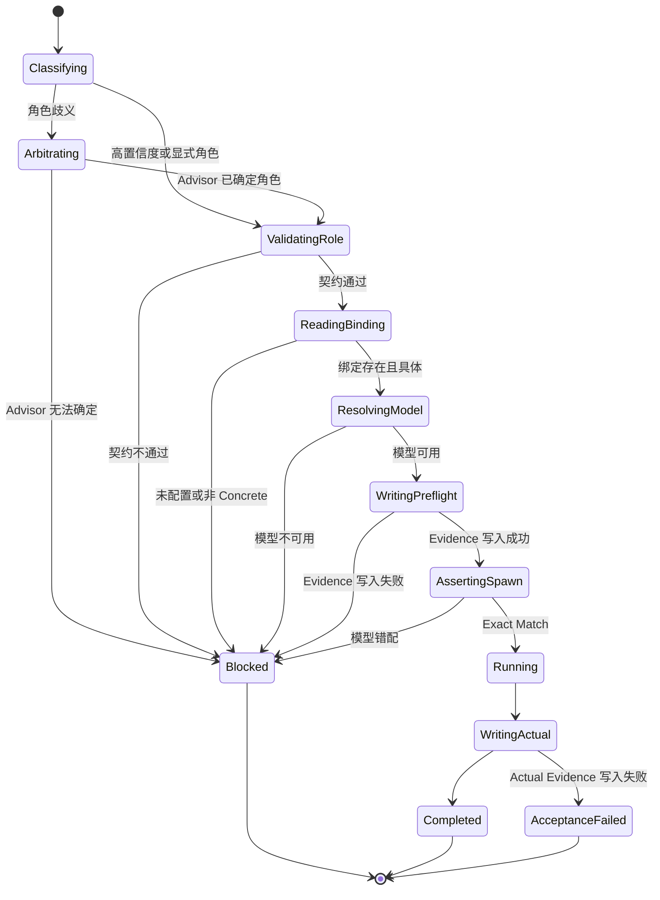

# OMP `/model` 批量角色分配与严格角色模型路由 PRD

## 1. 文档信息

| 项目 | 内容 |
| --- | --- |
| 文档名称 | OMP `/model` 批量角色分配与严格角色模型路由 PRD |
| 文档类型 | 产品需求文档（PRD） |
| 版本 | v1.0 |
| 状态 | 待书面审查 |
| 日期 | 2026-07-10 |
| 产品归属 | `omp-custom` |
| 首个宿主 | Oh My Pi CLI |
| 主要入口 | `/model`、Role-bound Task、PlanRun |
| 代码仓库 | `BearMaxDD/oh-my-pi` 的 `mima/omp-custom` 分支 |
| 相关 PRD | [OMP Custom Codex Adapter PRD](./2026-07-09-omp-custom-codex-adapter.md) |
| 相关 TRD | [OMP Custom Codex Adapter TRD](../TRD/2026-07-09-omp-custom-codex-adapter-trd.md) |

## 2. 执行摘要

OMP 已经支持在 `/model` 中为不同角色分配模型，也已经具备任务分类、Role Contract、Task Spawn 和模型路由证据等基础能力。

但当前产品仍有两个核心问题：

1. `/model` 的角色分配以单次、单角色操作为主，角色数量增加后操作冗长，列表中的模型、角色徽标和操作菜单也越来越拥挤。
2. Role-bound Task 的模型路由允许从通用 `role` 推断 `modelRole`，并可能继续使用角色回退、Agent Override、会话模型或模糊模型匹配，无法保证任务最终执行的模型就是用户在 `/model` 中为该角色指定的模型。

本 PRD 定义一套完整产品闭环：

```text
任务
  → 确定正确角色
  → 校验角色契约
  → 读取 /model 中该角色的唯一模型绑定
  → 精确解析 provider/model/thinking
  → Spawn 前一致性断言
  → 使用该模型执行
  → 写入可验收证据
```

同时，`/model` 保持现有终端交互基线，在 `Action for: <model>` 菜单中新增 `Assign to roles...`，支持多选角色、变更预览、原子写入和明确结果反馈。

## 3. 背景

### 3.1 当前模型角色体系

当前 `ModelRole` 已包含基础角色和 Superpowers 角色，例如：

- `default`
- `smol`
- `slow`
- `vision`
- `plan`
- `acceptance`
- `designer`
- `task`
- `advisor`
- `superpowers:tdd-writer`
- `superpowers:implementer`
- `superpowers:test-runner`
- `superpowers:spec-reviewer`
- `superpowers:quality-reviewer`
- `superpowers:acceptance`
- `superpowers:advisor`
- `superpowers:prompt-engineer`
- `superpowers:impact-reviewer`
- `superpowers:runtime-simulator`
- `superpowers:business-scenario-reviewer`
- `superpowers:frontend-designer`
- `superpowers:security-reviewer`
- `superpowers:release-auditor`
- `superpowers:payment-reviewer`
- `superpowers:data-migration-reviewer`

用户还可以通过 `modelTags` 引入自定义角色。

### 3.2 当前 `/model` 交互

`/model` 当前按以下顺序渲染：

1. 模型可用性提示。
2. provider / canonical Tab。
3. 模型搜索框。
4. 最多 10 条可见模型记录。
5. 模型角色徽标。
6. 当前模型详情。
7. 按 Enter 打开的 `Action for: <model>` 角色动作菜单。
8. 选择角色后继续选择 thinking level。

该交互已经形成用户习惯，因此本需求不重做 `/model`，只在现有动作菜单中增加一个批量分配分支。

### 3.3 当前角色模型配置

角色模型配置保存在：

```text
settings.modelRoles[role_id]
```

`Settings.setModelRole()` 写入角色模型，`Settings.getModelRole()` 读取合并后的有效配置。

当前配置值可能是：

- 明确的 `provider/modelId`。
- canonical model id。
- 角色别名。
- 带 thinking level 的 selector。
- 通过手动配置写入的模糊或兼容值。

这些灵活语义适合普通模型选择，但不适合需要强可证明性的 Role-bound Task。

### 3.4 当前任务路由链路

当前核心链路包括：

- `classifySpecTask()`：根据路径、任务文本和验收条件识别运行面和风险类型。
- Prompt Pack：保存 `role_id` 和 Role Contract。
- `buildRoleBoundStageRunInputs()`：把 Prompt Pack 的 `role_id` 传入 `modelRole`。
- `resolveTaskModelRouting()`：解析角色模型和回退模型。
- `TaskTool.#runSpawn()`：创建实际子代理任务。
- `createModelRoutingEvidence()`：记录模型路由结果。

现有链路已经具备可扩展基础，但缺少一个强制不变量：

```text
实际执行模型必须等于 /model 为 validated_role_id 配置的模型。
```

## 4. 问题定义

### 4.1 批量分配效率低

当角色数量较少时，逐个分配可以接受；当 Superpowers 角色和自定义角色增多后，用户需要反复执行：

```text
选择模型
  → 打开动作菜单
  → 选择角色
  → 选择 thinking level
  → 返回模型列表
  → 重复
```

同一个模型分配给多个角色时，重复操作没有产品价值。

### 4.2 菜单信息密度失控

模型列表同时展示 provider、model id、上下文限制和多个角色徽标；动作菜单又平铺全部角色。角色增加后，终端窄屏容易出现：

- 模型名和徽标互相挤压。
- 角色列表过长。
- 当前角色绑定不可见。
- 用户无法确认本次会覆盖哪些配置。
- 写入成功后缺少汇总反馈。

### 4.3 角色可能选错

任务分类当前主要识别风险和运行面，还没有形成统一的候选角色评分、置信度、歧义仲裁和 Role Contract 强校验闭环。

通用 `role` 与 `modelRole` 的字符串推断也可能把 Agent 角色名称误当成模型角色键。

### 4.4 模型可能与 `/model` 绑定不一致

当前 Role-bound Task 仍可能受到以下路径影响：

- `fallbackModelRoles`。
- `agentModelOverrides`。
- 当前会话模型。
- 默认模型。
- canonical provider 合并。
- 角色别名展开。
- fuzzy / glob 模型匹配。
- 模型不可用后的兼容回退。

这些机制各自有合理用途，但会破坏 Role-bound Task 的严格绑定语义。

### 4.5 证据不足以证明准确执行

当前 `ModelRoutingEvidence` 主要记录：

- `model_role`
- `requested_model`
- `resolved_model`
- `fallback_roles`
- `fallback_used`
- `model_overrides`

验收只检查 Role-bound Task 是否存在 `resolved_model`，不能证明：

```text
配置模型 = 解析模型 = 实际 Spawn 模型
```

## 5. 产品目标

### 5.1 目标一：提高角色模型配置效率

用户可以在现有 `/model` 交互中，一次把当前模型分配给多个角色。

### 5.2 目标二：保持终端交互稳定

现有模型列表、provider Tab、搜索、单角色动作和 thinking level 选择继续可用；批量能力按需进入，不增加主列表常驻噪音。

### 5.3 目标三：确保任务进入正确角色

每个 Role-bound Task 必须产生一个可解释、可校验的 `validated_role_id`。

### 5.4 目标四：确保角色使用 `/model` 指定模型

Role-bound Task 必须读取 `/model` 对应角色的明确模型绑定，并在 Spawn 前验证实际参数完全一致。

### 5.5 目标五：失败时停止而不是猜测

角色不明确、角色契约不匹配、模型未配置、模型不可用、模型错配或证据无法写入时，任务不得进入 Spawn。

### 5.6 目标六：形成可验收证据

每次 Role-bound Task 必须记录角色决策、模型配置、解析模型、实际模型、一致性断言和执行状态。

## 6. 非目标

本需求不包括：

- 重做 `/model` 为 Web 管理后台。
- 新增常驻浏览器服务。
- 修改普通主会话的默认模型选择规则。
- 修改 `vision`、compaction、title、memory 等非 Role-bound 内部任务的既有回退行为。
- 自动替用户选择“更聪明”或“更便宜”的模型。
- 在严格链路中根据价格、延迟或负载自动换模型。
- 自动修改旧的 canonical、alias、fuzzy 或 glob 配置。
- 让 Codex Adapter 直接控制 OMP 模型配置。
- 在本阶段引入角色分类 Tab。
- 在本阶段增加鼠标拖放式角色管理。

## 7. 用户与使用场景

### 7.1 主要用户

- 维护 `omp-custom` 的个人开发者。
- 使用多个模型承担不同工程角色的 OMP 用户。
- 通过 PlanRun、TaskTool 和 Superpowers 执行多阶段任务的用户。
- 需要审计任务实际使用模型的高级用户。

### 7.2 场景一：批量分配实现角色

用户希望将 `openai/gpt-5.3-codex` 同时分配给：

- `superpowers:tdd-writer`
- `superpowers:implementer`
- `superpowers:test-runner`

用户只需选择一次模型、勾选三个角色、确认一次。

### 7.3 场景二：审查任务进入 Reviewer

任务包含代码审查目标、只读范围和验收清单。系统选择 `superpowers:quality-reviewer`，Role Contract 校验通过后，只读取 `/model` 为该角色配置的模型。

### 7.4 场景三：任务角色存在歧义

任务同时包含实现和安全审查信号，Top-1 与 Top-2 分差不足。系统交给 Advisor 仲裁；Advisor 仍无法确定时，停止执行并要求用户明确角色或细化任务。

### 7.5 场景四：角色未配置模型

系统确定角色为 `superpowers:release-auditor`，但 `/model` 没有该角色绑定。任务不使用默认模型，直接提示用户在 `/model` 中完成分配。

### 7.6 场景五：配置模型不可用

角色配置为 `openai/gpt-5.3-codex`，但 provider 未认证或模型已不可用。任务停止，不尝试同角色的其他模型，也不借用其他角色模型。

### 7.7 场景六：实际 Spawn 参数被错误覆盖

预期模型为 `openai/gpt-5.3-codex`，某条兼容路径将实际模型改成 `openai/gpt-5.2`。Spawn 前一致性断言发现错配并阻止执行。

## 8. 术语定义

| 术语 | 定义 |
| --- | --- |
| Role-bound Task | 已经确定 `validated_role_id`，并要求按角色契约执行的任务 |
| `role_id` | Role Registry 中稳定、唯一的角色标识 |
| `modelRole` | TaskTool 当前使用的模型角色参数 |
| Validated Role | 通过候选决策和 Role Contract 校验后的冻结角色 |
| Role Contract | 角色的能力、读写权限、阶段和 Advisor 约束 |
| Configured Selector | `/model` 写入 `settings.modelRoles[role_id]` 的原始值 |
| Concrete Selector | 明确的 `provider/modelId`，可附带 thinking level |
| Canonical Selector | 不包含明确 provider、可能映射到多个 concrete model 的模型标识 |
| Exact Match | 配置模型、解析模型和实际 Spawn 模型在规范化后完全一致 |
| Advisor Arbitration | 候选角色不明确时，由 Advisor 对任务证据进行角色仲裁 |
| Fail Closed | 无法证明正确时阻止执行，不使用默认值继续 |
| Preflight Evidence | Spawn 前写入的角色和模型预检证据 |
| Actual Evidence | Spawn 创建时记录的实际模型参数和一致性结果 |

## 9. 产品原则

### 9.1 `/model` 是角色模型唯一事实源

Role-bound Task 的模型只能来自：

```text
settings.getModelRole(validated_role_id)
```

### 9.2 角色先确定，模型后解析

系统不能先看某个模型是否可用，再倒推出适合的角色。

### 9.3 角色冻结后不可静默替换

Role Contract 校验通过后，`validated_role_id` 在本次任务中保持不变。

### 9.4 严格链路只接受 Concrete Selector

Role-bound Task 必须使用明确的 `provider/modelId`。canonical、alias、fuzzy 和 glob 配置必须在执行前阻止，并提示用户通过 `/model` 重新选择 provider 具体模型。

### 9.5 thinking level 遵循用户选择

- `/model` 明确保存 thinking level 时，实际执行必须一致。
- `/model` 未明确保存 thinking level 时，允许模型使用其正常默认值，但证据必须记录该值来自默认解析，而不是用户显式配置。

### 9.6 不准确比不执行更糟

任何无法证明的路由都必须停止，不允许“尽量运行”。

### 9.7 批量配置必须原子化

批量写入要么全部成功，要么全部不生效，不能出现部分角色已更新、部分角色仍保留旧值。

### 9.8 普通模型行为保持兼容

非 Role-bound Task 和普通主会话继续使用现有模型选择、canonical、fallback 和 context promotion 语义。

## 10. 产品范围

### 10.1 首版范围

首版包含：

1. `/model` 新增 `Assign to roles...`。
2. 多角色选择、搜索、滚动和当前绑定展示。
3. 批量变更预览和原子写入。
4. 任务候选角色评分和置信度。
5. 歧义任务 Advisor 仲裁。
6. Role Contract 强校验。
7. Role-bound Task 严格读取 `/model` 绑定。
8. Concrete Selector 校验。
9. Spawn 前配置模型与实际模型一致性断言。
10. 两阶段路由证据。
11. 可修复错误提示。
12. 配置审计和发布验收。

### 10.2 后续范围

以下内容延后：

- `/model` 角色分类 Tab。
- 按角色类别一键全选。
- 角色配置模板导入导出。
- Web 版 Role Registry 管理页面。
- 跨设备同步角色模型绑定。
- 基于成本或延迟的自动模型策略。
- Codex Desktop 中的角色模型管理面板。
- 生产遥测面板。

## 11. 总体产品架构



## 12. `/model` 批量角色分配需求

### 12.1 保留现有入口

用户仍然通过 `/model`：

1. 选择 provider / canonical Tab。
2. 搜索模型。
3. 选择模型。
4. 按 Enter 打开 `Action for: <model>`。

### 12.2 新增批量入口

动作菜单第一项新增：

```text
Assign to roles...
```

其后继续展示现有单角色动作：

```text
Set as Default
Set as Advisor
Set as Developer
Set as Reviewer
...
```

### 12.3 Concrete Selector 限制

当用户选择 provider 具体模型时，可以进入批量分配。

当用户选择 canonical model 时：

- 普通会话模型选择继续允许。
- 严格 Role-bound 角色分配不可直接确认。
- UI 必须提示用户切换到 provider Tab，选择明确的 `provider/modelId`。

提示示例：

```text
Role-bound assignments require a concrete provider/model.
Select a provider-specific model before assigning roles.
```

### 12.4 多选角色列表

进入批量分配后，界面必须展示：

- 当前模型的完整 Concrete Selector。
- 当前已选角色数量。
- 角色搜索框。
- 所有可见内置角色。
- 所有自定义角色。
- 每个角色当前绑定的模型。
- 角色选择状态。

### 12.5 键盘交互

| 按键 | 行为 |
| --- | --- |
| `↑` / `↓` | 移动当前角色 |
| `Space` | 选中或取消当前角色 |
| `/` 或直接输入 | 过滤角色 |
| `Enter` | 进入变更预览 |
| `Esc` | 返回上一层，不写入配置 |

### 12.6 列表排版

角色列表采用固定信息列：

```text
[选择状态]  角色名称  当前模型
```

必须满足：

- 角色名称优先完整显示。
- 当前模型过长时从中间或尾部截断。
- 选中标记不随文本长度移动。
- 终端宽度变化时不出现重叠。
- 列表超过可视高度时使用现有 ScrollView。
- 当前绑定与目标模型相同时标记为 `unchanged`。

### 12.7 变更预览

按 Enter 后必须展示：

- 目标模型。
- 将发生变更的角色数量。
- 每个角色的旧模型。
- 每个角色的新模型。
- 未变化角色数量。
- 明确的提交和返回快捷键。

示例：

```text
Confirm role assignments

Model: openai/gpt-5.3-codex:high

Developer:     openai/gpt-5.2        → openai/gpt-5.3-codex:high
Reviewer:      anthropic/claude-opus → openai/gpt-5.3-codex:high
Test Runner:   openai/gpt-5.2        → openai/gpt-5.3-codex:high

Apply 3 assignments
```

### 12.8 原子写入

确认后必须一次提交全部角色配置：

- 全部写入成功后才更新 UI。
- 任一验证或保存失败时，不保留部分更新。
- 运行时 override 和持久配置必须保持一致。
- 成功后重新读取 Settings，验证最终值。

### 12.9 成功反馈

成功后显示：

```text
Assigned openai/gpt-5.3-codex:high to 3 roles.
```

如果所有目标角色原本已经使用该模型，则显示：

```text
No role assignments changed.
```

### 12.10 失败反馈

批量写入失败时必须显示：

- 失败原因。
- 未发生部分写入的确认。
- 用户可执行的修复动作。

## 13. 任务到正确角色需求

### 13.1 任务证据来源

系统必须综合以下信息生成角色候选：

- 任务标题。
- Todo 内容。
- 任务目标。
- 实现分析。
- 实现步骤。
- 允许文件。
- 可能涉及文件。
- 验收条件。
- runtime surface。
- 风险分类。
- 用户显式角色。
- Prompt Pack 中已声明的 `role_id`。

### 13.2 候选角色输出

角色分类器必须输出：

- Top-K 候选角色。
- 每个角色的分数。
- 命中的信号。
- 信号来源。
- Top-1 与 Top-2 的分差。
- 是否需要 Advisor 仲裁。

### 13.3 显式角色优先级

用户或已验证 Prompt Pack 显式提供角色时：

- 该角色具有最高决策优先级。
- 仍必须通过 Role Contract 校验。
- 显式角色不能绕过权限或能力约束。
- 未知角色必须阻止执行。

### 13.4 高置信度规则

首版推荐阈值：

```text
Top-1 score >= 0.85
并且
Top-1 - Top-2 >= 0.20
```

同时满足时，可以直接进入 Role Contract 校验。

阈值必须可测试、可配置，但首版不在普通用户 UI 中暴露。

### 13.5 歧义仲裁

以下情况必须进入 Advisor：

- Top-1 分数低于高置信度阈值。
- Top-1 与 Top-2 分差不足。
- 任务同时命中多个互斥角色能力。
- 风险角色与实现角色发生冲突。
- Prompt Pack 角色与任务证据明显冲突。

Advisor 必须返回：

- 选定角色。
- 选择理由。
- 被拒绝候选。
- 置信度。

Advisor 不可用或仍无法确定时，任务必须停止。

### 13.6 角色决策来源

最终决策必须记录以下来源之一：

- `explicit`
- `prompt_pack`
- `rules`
- `advisor`

## 14. Role Contract 强校验需求

### 14.1 能力匹配

角色的 `capabilities` 必须覆盖任务所需能力。

### 14.2 读写权限匹配

必须校验：

- `readOnly`
- `canEditProductionCode`
- `canEditTestCode`

例如，Researcher 不能因为用户显式指定而获得生产代码写权限。

### 14.3 阶段匹配

角色必须允许在当前 `stage_id` 执行。

### 14.4 Advisor 要求

`requiresAdvisor` 为 true 时，必须证明 Advisor 已参与并通过相应 Gate。

### 14.5 角色冻结

校验通过后生成：

```text
validated_role_id
```

后续模型解析、Prompt Pack、Task Spawn 和 evidence 必须使用同一个值。

### 14.6 自定义角色契约

自定义角色可以出现在 `/model` 中，也可以通过批量操作获得模型绑定。

但自定义角色只有在具备完整 Role Contract 时，才能执行 Role-bound Task。至少必须定义：

- 稳定的 `role_id`。
- `capabilities`。
- `readOnly`。
- `canEditProductionCode`。
- `canEditTestCode`。
- 允许的任务阶段。
- `requiresAdvisor`。

只存在名称、颜色、描述或模型绑定的自定义角色，不得被任务分类器选为可执行角色。

缺少完整契约时返回：

```text
role_contract_missing
```

## 15. `/model` 严格模型绑定需求

### 15.1 唯一读取路径

Role-bound Task 只能调用：

```text
settings.getModelRole(validated_role_id)
```

不得依次尝试其他角色。

### 15.2 绑定存在性

配置不存在时返回：

```text
role_model_unconfigured
```

任务不得进入模型解析后的执行阶段。

### 15.3 Concrete Selector 校验

配置必须符合：

```text
provider/modelId
provider/modelId:thinkingLevel
```

以下值不得进入严格执行链：

- canonical id。
- `pi/<role>` 角色别名。
- bare model id。
- fuzzy selector。
- glob selector。
- 多模型候选数组。

不符合时返回：

```text
role_model_not_concrete
```

### 15.4 模型可用性

Concrete Model 必须：

- 存在于当前 ModelRegistry。
- provider 未被禁用。
- provider 认证可用，或属于明确的 keyless provider。
- 模型未被当前 project settings 禁用。
- 满足当前任务的最小上下文要求。

不满足时返回：

```text
role_model_unavailable
```

### 15.5 thinking level

配置包含 thinking level 时：

- 必须验证该模型支持该级别。
- 实际 Spawn 参数必须使用同一级别。
- 不支持时不得自动降级。

配置不包含 thinking level 时：

- 允许使用模型正常默认值。
- Evidence 必须标记 `thinking_source = model_default`。

### 15.6 禁止的模型来源

Role-bound Task 必须忽略：

- `fallbackModelRoles`。
- `agentModelOverrides`。
- `activeModelPattern`。
- `fallbackModelPattern`。
- 当前主会话模型。
- 默认角色模型。
- provider preference 对模糊 selector 的自动选择。

### 15.7 Spawn 前一致性断言

必须比较：

```text
canonicalize(configured_selector)
canonicalize(resolved_model)
canonicalize(actual_spawn_model)
```

三者不一致时返回：

```text
role_model_mismatch
```

TaskTool 不得创建子代理进程。

## 16. 路由状态机



## 17. 两阶段 Evidence 需求

### 17.1 Schema 版本

Evidence 升级为：

```text
schema_version: 2
```

### 17.2 Preflight Evidence

Spawn 前必须记录：

- `run_id`
- `task_id`
- `stage_id`
- `agent_id`
- 角色候选与分数。
- 角色决策来源。
- `validated_role_id`。
- Role Contract 版本和校验结果。
- `configured_selector`。
- 规范化 provider。
- 规范化 model id。
- 配置 thinking level。
- thinking 来源。
- `preflight_status`。
- `execution_allowed`。
- 阻止原因。

### 17.3 Actual Evidence

Spawn 创建时必须追加：

- `actual_provider`
- `actual_model`
- `actual_thinking`
- `exact_match`
- `execution_started`
- `execution_started_at`
- Evidence 内容摘要。

### 17.4 Evidence 位置

沿用现有位置：

```text
accepting/tasks/<task_id>/model-routing-evidence.json
```

### 17.5 Evidence 写入规则

- Preflight Evidence 写入失败时，阻止 Spawn。
- Actual Evidence 写入失败时，任务结果不能通过最终验收。
- Evidence 不记录 API key、Authorization header 或 provider secret。
- 用户输入仅保存必要摘要，避免复制大段敏感 Prompt。

### 17.6 Evidence 验收

Role-bound Task 必须满足：

```text
validated_role_id != null
configured_selector != null
resolved_model != null
actual_model != null
exact_match == true
execution_started == true
fallback_used == false
```

## 18. 错误处理与恢复

### 18.1 错误码

| 错误码 | 含义 | 是否允许 Spawn | 用户动作 |
| --- | --- | --- | --- |
| `unknown_role` | 角色不存在 | 否 | 选择有效角色或修复 Prompt Pack |
| `ambiguous_role` | 角色无法可靠确定 | 否 | 明确角色或细化任务 |
| `advisor_unavailable` | 歧义仲裁不可用 | 否 | 配置 Advisor 或显式指定角色 |
| `role_contract_missing` | 自定义角色缺少完整执行契约 | 否 | 补充 Role Contract 或选择内置角色 |
| `role_contract_mismatch` | 角色能力或权限不匹配 | 否 | 选择兼容角色或调整任务范围 |
| `role_model_unconfigured` | `/model` 未分配该角色 | 否 | 在 `/model` 中分配模型 |
| `role_model_not_concrete` | 配置不是明确 provider/model | 否 | 在 provider Tab 重新选择模型 |
| `role_model_unavailable` | 指定模型不可用 | 否 | 修复认证、provider 或角色绑定 |
| `role_thinking_unsupported` | thinking level 不受支持 | 否 | 在 `/model` 中选择有效级别 |
| `role_model_mismatch` | 实际模型与配置不一致 | 否 | 修复内部路由，不允许用户绕过 |
| `routing_evidence_write_failed` | Preflight Evidence 无法写入 | 否 | 修复目录或权限后重试 |
| `actual_evidence_write_failed` | Actual Evidence 无法写入 | 已执行 | 标记验收失败并修复证据链 |

### 18.2 可修复提示

错误提示必须包含：

- 任务或角色名称。
- 当前配置值。
- 期望值与实际值。
- 推荐的下一步操作。
- 是否已经启动执行。

示例：

```text
Cannot start Superpowers Implementer.
No concrete model is assigned to this role.

Run /model, select a provider-specific model,
then choose "Set as Superpowers Implementer".

No task process was started.
```

### 18.3 重试策略

- 配置修复后，用户可以重新执行原任务。
- 重试必须重新读取最新 Settings。
- 不复用失败预检中的模型解析结果。
- 不自动切换到其他模型重试。

## 19. 配置兼容与迁移

### 19.1 启动审计

升级后，系统应提供角色模型配置审计能力，枚举：

- 已知 Role-bound 角色。
- 当前配置 selector。
- 是否为 Concrete Selector。
- 是否能在 ModelRegistry 精确解析。
- provider 是否可用。
- thinking level 是否受支持。

### 19.2 审计结果

审计状态包括：

- `ready`
- `unconfigured`
- `not_concrete`
- `unavailable`
- `thinking_unsupported`

### 19.3 不自动迁移

系统不得自动把 canonical、alias 或 fuzzy selector 改成某个 provider/model，因为该选择可能不符合用户意图。

### 19.4 用户修复路径

所有不合格绑定都通过 `/model` 重新选择 concrete model 修复。

### 19.5 生效范围

严格绑定只作用于：

- TaskTool 中明确的 Role-bound Task。
- PlanRun 的 Role-bound Stage。
- Superpowers 角色执行链。

以下行为保持不变：

- 主会话普通选模。
- `/model` 临时会话模型。
- title / tiny / vision 等非 Role-bound 内部任务。
- context promotion。
- 非 Role-bound 的 legacy Agent model routing。

## 20. 功能需求清单

### 20.1 `/model` 需求

| 编号 | 需求 |
| --- | --- |
| FR-MODEL-001 | 动作菜单第一项提供 `Assign to roles...` |
| FR-MODEL-002 | 支持 Space 多选角色 |
| FR-MODEL-003 | 显示每个角色当前绑定 |
| FR-MODEL-004 | 支持角色搜索与滚动 |
| FR-MODEL-005 | 提供变更预览 |
| FR-MODEL-006 | 批量写入必须原子化 |
| FR-MODEL-007 | 成功后显示变更汇总 |
| FR-MODEL-008 | 失败时确认未发生部分写入 |
| FR-MODEL-009 | 严格角色只允许 concrete provider/model |
| FR-MODEL-010 | 保留现有单角色分配动作 |

### 20.2 角色路由需求

| 编号 | 需求 |
| --- | --- |
| FR-ROLE-001 | 生成 Top-K 角色候选和分数 |
| FR-ROLE-002 | 记录候选信号及来源 |
| FR-ROLE-003 | 显式角色优先但不能绕过契约 |
| FR-ROLE-004 | 高置信度角色直接进入校验 |
| FR-ROLE-005 | 歧义角色必须进入 Advisor |
| FR-ROLE-006 | Advisor 无法确定时阻止执行 |
| FR-ROLE-007 | Role Contract 必须校验能力和权限 |
| FR-ROLE-008 | 通过后冻结 `validated_role_id` |
| FR-ROLE-009 | Prompt Pack、Spawn 和 Evidence 使用同一角色 |

### 20.3 严格模型需求

| 编号 | 需求 |
| --- | --- |
| FR-ROUTING-001 | 只读取 `settings.getModelRole(validated_role_id)` |
| FR-ROUTING-002 | 未配置时阻止执行 |
| FR-ROUTING-003 | 非 Concrete Selector 阻止执行 |
| FR-ROUTING-004 | 模型不可用时阻止执行 |
| FR-ROUTING-005 | 禁止 Role-bound 角色回退 |
| FR-ROUTING-006 | 禁止 Agent Override 覆盖角色模型 |
| FR-ROUTING-007 | 禁止会话模型覆盖角色模型 |
| FR-ROUTING-008 | thinking level 必须遵循角色配置 |
| FR-ROUTING-009 | Spawn 前执行 Exact Match 断言 |
| FR-ROUTING-010 | 错配时不得创建子代理进程 |

### 20.4 Evidence 需求

| 编号 | 需求 |
| --- | --- |
| FR-EVIDENCE-001 | Evidence schema 升级为 v2 |
| FR-EVIDENCE-002 | Spawn 前写入 Preflight Evidence |
| FR-EVIDENCE-003 | Spawn 时写入 Actual Evidence |
| FR-EVIDENCE-004 | 记录 configured / resolved / actual 三元组 |
| FR-EVIDENCE-005 | 记录 exact_match |
| FR-EVIDENCE-006 | Preflight 写入失败时阻止执行 |
| FR-EVIDENCE-007 | Actual 写入失败时阻止最终验收 |
| FR-EVIDENCE-008 | Evidence 不得包含 secret |

## 21. 非功能需求

### 21.1 性能

- 高置信度规则路由不增加额外模型请求。
- `/model` 批量角色列表在 100 个角色以内保持即时响应。
- Spawn 前模型一致性断言为内存比较，不产生网络请求。
- Advisor 只用于歧义任务。

### 21.2 可靠性

- 批量配置不得部分写入。
- Role-bound Task 不得静默降级。
- Evidence 写入顺序必须稳定。
- 配置修复后重试必须读取最新值。

### 21.3 可观察性

- 每次角色决策可解释。
- 每次阻止有结构化错误码。
- 每次执行可以证明实际模型来源。
- 不需要读取普通日志才能完成验收。

### 21.4 安全与隐私

- 不记录 API key。
- 不记录 Authorization header。
- 不复制完整系统 Prompt。
- 权限校验不能被显式角色绕过。
- Evidence 文件遵循现有 accepting 目录权限。

### 21.5 终端可用性

- 80 列终端下不重叠。
- 长模型名必须安全截断。
- 操作状态不依赖颜色表达。
- 所有操作均支持键盘完成。
- Esc 始终返回上一层且不产生隐式写入。

## 22. 成功指标

### 22.1 配置效率

- 同一模型分配给 3 个角色，用户确认动作不超过 5 步。
- 批量分配成功后不需要逐个角色复查。

### 22.2 角色准确率

- 固定验收夹具中，期望角色命中率为 100%。
- 高置信度直接路由用例中，不允许出现 Top-2 角色被执行。
- 歧义任务必须进入 Advisor 或被阻止，不能使用默认角色。

### 22.3 模型准确率

- 所有已执行 Role-bound Task 的 `exact_match` 为 100%。
- Role-bound Task 的角色回退次数为 0。
- 模型错配注入用例的 Spawn 阻止率为 100%。
- 未配置模型用例的默认模型误用次数为 0。

### 22.4 证据完整率

- 已执行 Role-bound Task 的 Preflight Evidence 完整率为 100%。
- 已执行 Role-bound Task 的 Actual Evidence 完整率为 100%。
- 缺少 Evidence 的任务最终验收通过率为 0%。

## 23. 验收测试矩阵

### 23.1 批量分配

| 用例 | 操作 | 预期结果 |
| --- | --- | --- |
| 单角色选择 | 选择 1 个角色 | 成功写入 1 个角色 |
| 多角色选择 | 选择 3 个角色 | 一次写入全部角色 |
| 全部未变化 | 选择已使用目标模型的角色 | 显示无变化，不重复保存 |
| 混合变化 | 部分角色已使用目标模型 | 只提交有变化角色 |
| 保存失败 | 注入持久化失败 | 所有角色保持旧值 |
| Esc 返回 | 预览页按 Esc | 不写入任何值 |
| 自定义角色 | 选择 modelTags 角色 | 正常写入和重新显示 |
| canonical model | 从 canonical Tab 尝试严格角色分配 | 提示选择 provider 具体模型 |
| 窄屏 | 80 列终端显示 | 无文本重叠 |

### 23.2 任务选角

| 用例 | 输入 | 预期结果 |
| --- | --- | --- |
| 显式合法角色 | 用户指定 Implementer | 通过契约后冻结角色 |
| 显式非法角色 | Read-only 角色执行生产写入 | 阻止 |
| 高置信度角色 | 单一实现任务 | 直接选择 Implementer |
| 候选接近 | 实现与审查混合任务 | Advisor 仲裁 |
| Advisor 不可用 | 歧义任务 | 阻止 |
| 未知角色 | Prompt Pack 使用不存在的 role_id | 阻止 |
| 自定义角色缺少契约 | 只有 modelTags 与模型绑定 | 阻止 |
| 自定义角色契约完整 | 能力和权限覆盖任务 | 通过校验后冻结角色 |

### 23.3 严格模型绑定

| 用例 | `/model` 配置 | 预期结果 |
| --- | --- | --- |
| 明确模型 | `openai/gpt-5.3-codex` | 使用该模型执行 |
| 明确 thinking | `openai/gpt-5.3-codex:high` | 使用 high 执行 |
| 未配置 | 无值 | 阻止 |
| canonical | `gpt-5.3-codex` | 阻止并要求 concrete selector |
| 角色别名 | `pi/slow` | 阻止并要求 concrete selector |
| 模型未注册 | 不存在的 provider/model | 阻止 |
| provider 未认证 | 明确模型但无认证 | 阻止 |
| thinking 不支持 | 配置不受支持级别 | 阻止 |
| Agent Override 冲突 | Override 指向其他模型 | 忽略 Override，仍使用角色模型 |
| 会话模型冲突 | 主会话使用其他模型 | 仍使用角色模型 |
| 实际参数错配 | 注入其他 actual model | Spawn 前阻止 |

### 23.4 Evidence

| 用例 | 预期结果 |
| --- | --- |
| 正常执行 | configured / resolved / actual 完全一致 |
| Preflight 写入失败 | 不启动任务 |
| Actual 写入失败 | 任务结果标记验收失败 |
| 角色歧义阻止 | Evidence 记录候选和阻止原因 |
| 模型未配置阻止 | Evidence 记录 validated_role_id 和空配置 |
| secret 扫描 | Evidence 不包含 API key 或认证 header |

## 24. 测试分层

### 24.1 单元测试

覆盖：

- 角色候选评分。
- 置信度和候选分差。
- Role Contract 校验。
- Concrete Selector 解析。
- provider/model/thinking 规范化。
- Exact Match 比较。
- 错误码映射。
- Evidence v2 验收校验。

### 24.2 组件测试

覆盖：

- `Assign to roles...` 菜单入口。
- 角色多选状态。
- 搜索和滚动。
- 变更预览。
- Esc 返回。
- 原子写入。
- 成功和失败反馈。

### 24.3 集成测试

覆盖：

- Model Selector → Settings。
- Settings → Strict Resolver。
- Strict Resolver → TaskTool。
- TaskTool → Preflight Evidence。
- Spawn 参数 → Actual Evidence。
- PlanRun Stage → validated role → exact model。

### 24.4 真实业务路径测试

至少准备 12 个任务夹具，并覆盖所有可执行角色类别：

- 实现。
- 测试。
- 规格审查。
- 质量审查。
- 安全审查。
- 前端设计。
- 发布审计。
- 数据迁移审查。
- 支付审查。
- 运行时模拟。
- 业务场景审查。
- 验收。

每个夹具必须断言：

- 期望角色。
- `/model` 配置模型。
- 实际模型。
- Exact Match。
- Evidence 完整性。

## 25. 发布门

以下命令必须全部通过：

```bash
bun run check
bun run test
bun run build
bun run prepack
```

此外必须通过：

1. 12 个任务夹具的角色准确率验收。
2. 所有 Role-bound 角色配置审计。
3. 批量写入原子性测试。
4. 模型错配注入测试。
5. Evidence secret 扫描。
6. 80 列与宽终端渲染快照。
7. 非 Role-bound 模型行为回归测试。

## 26. 发布与迁移策略

### 26.1 发布前

- 输出所有 Role-bound 角色配置审计结果。
- 修复所有计划参与执行的 `unconfigured` 角色。
- 把 canonical、alias、fuzzy 配置通过 `/model` 改为 concrete selector。
- 验证 provider 认证。

### 26.2 发布时

- Role-bound Task 严格模式直接生效。
- 不提供关闭严格校验的用户配置。
- 普通模型选择保持兼容。

### 26.3 发布后

- 观察 `ambiguous_role` 数量。
- 观察 `role_model_unconfigured` 数量。
- 观察 `role_model_mismatch`，该值必须始终为 0。
- 观察 Advisor 仲裁比例，防止规则分类器过度保守。

## 27. 依赖关系

### 27.1 OMP 现有依赖

本需求依赖：

- Model Selector。
- Model Registry。
- Settings。
- Model Resolver。
- TaskTool。
- Spec Task Framework。
- Prompt Pack。
- Role Contract。
- PlanRun Driver。
- Model Routing Evidence。

### 27.2 与 Codex Adapter 的关系

本 PRD 不要求修改 Codex core。

`omp-custom` 后续可以把以下通用能力复用到 Codex Adapter：

- 角色候选和决策 schema。
- Role Contract 校验。
- Evidence v2。
- 项目隔离后的任务证据。

但 `/model` 终端 UI、Settings 写入和 OMP TaskTool Spawn 属于 OMP Adapter / Host 范围。

## 28. 风险与缓解

### 28.1 严格模式导致旧任务无法运行

风险：旧配置缺失或使用 canonical / alias。

缓解：发布前提供配置审计；明确提示用户通过 `/model` 修复；普通非 Role-bound 行为不受影响。

### 28.2 Advisor 成为额外依赖

风险：歧义任务在 Advisor 未配置时被阻止。

缓解：只有低置信度任务才进入 Advisor；允许用户显式指定合法角色；错误提示明确。

### 28.3 角色规则过度匹配

风险：关键词同时命中多个角色。

缓解：使用 Top-K 和候选分差；高置信度阈值；歧义仲裁；固定任务夹具回归。

### 28.4 批量写入产生部分状态

风险：多个 `setModelRole()` 分别排队保存，过程中失败。

缓解：产品要求新增原子批量写入语义；写入后重新读取和校验。

### 28.5 Evidence 阻塞任务

风险：磁盘或权限问题导致任务无法执行。

缓解：错误必须说明 Evidence 路径和修复动作；保证准确执行时，缺证据不允许绕过。

### 28.6 provider/model 标识变化

风险：上游模型被移除或重命名。

缓解：严格模式阻止并提示重新分配；不自动猜测替代模型。

### 28.7 context promotion 与严格绑定冲突

风险：执行中因上下文溢出切换到其他模型。

缓解：Role-bound Task 首版不允许通过 context promotion 改变实际模型；上下文不足时在 Spawn 前阻止，并要求用户为该角色重新选择合适模型。

## 29. 已确认的产品决策

以下决策已经确认：

1. `/model` 保持当前 OMP CLI 交互基线。
2. 批量入口采用现有 `Action for: <model>` 菜单的方案 A。
3. 批量分配采用多选、预览、确认三段流程。
4. 任务路由目标是“任务 → 正确角色 → 正确模型”。
5. 角色选择采用规则分类 + Advisor 歧义仲裁 + Role Contract 强校验。
6. 实际执行必须使用 `/model` 中给该角色分配的模型。
7. 角色模型未配置、不可用或不一致时阻止执行。
8. Role-bound Task 不允许自动换模型。
9. 使用两阶段 Evidence 证明准确执行。
10. 发布必须通过完整测试矩阵和构建门。

## 30. 开放问题

以下问题不阻塞 PRD，但应在 TRD 或实现计划中落定：

1. 角色候选分数的具体权重如何配置和版本化。
2. Advisor 仲裁 Prompt 的固定 schema 和超时。
3. 原子批量 Settings 写入采用内存事务、临时文件替换还是现有存储层事务。
4. Preflight 和 Actual Evidence 是同文件原子更新，还是事件日志加最终快照。
5. 角色配置审计入口采用 `/model audit`、`omp models roles --check` 还是 `/model` 内状态提示。
6. 任务所需最小上下文如何计算。
7. Role-bound Task 的 context promotion 是否永久禁用，还是后续引入用户显式批准。

## 31. 技术落点附录

以下是当前代码中最直接的实施锚点，详细接口由后续 TRD / 实现计划定义：

| 产品能力 | 当前代码锚点 |
| --- | --- |
| 模型列表和动作菜单 | `packages/coding-agent/src/modes/components/model-selector.ts` |
| `/model` 控制器 | `packages/coding-agent/src/modes/controllers/selector-controller.ts` |
| 角色定义 | `packages/coding-agent/src/config/model-roles.ts` |
| Settings 角色读写 | `packages/coding-agent/src/config/settings.ts` |
| 模型精确解析 | `packages/coding-agent/src/config/model-resolver.ts` |
| 任务角色路由 | `packages/coding-agent/src/task/model-routing.ts` |
| Spawn 前断言 | `packages/coding-agent/src/task/index.ts` |
| 任务分类 | `packages/coding-agent/src/codex-plan-run/spec-task-framework.ts` |
| Role Contract / Prompt Pack | `packages/coding-agent/src/codex-plan-run/prompt-pack.ts` |
| Role-bound Stage | `packages/coding-agent/src/codex-plan-run/role-bound-stage-scheduler.ts` |
| 路由证据 | `packages/coding-agent/src/codex-plan-run/model-routing-evidence.ts` |
| PlanRun 验收 | `packages/coding-agent/src/codex-plan-run/driver.ts` |

## 32. 需求追踪矩阵

| 产品目标 | 关键需求 | 主要验收 |
| --- | --- | --- |
| 批量配置高效 | FR-MODEL-001 至 FR-MODEL-010 | 3 个角色不超过 5 步，写入原子 |
| 任务进入正确角色 | FR-ROLE-001 至 FR-ROLE-009 | 固定任务夹具角色命中率 100% |
| 角色使用指定模型 | FR-ROUTING-001 至 FR-ROUTING-010 | Exact Match 100%，错配 Spawn 0 次 |
| 路由可审计 | FR-EVIDENCE-001 至 FR-EVIDENCE-008 | Preflight / Actual Evidence 完整率 100% |
| 失败可修复 | 错误码和恢复要求 | 每个阻止错误都有明确 `/model` 修复路径 |

## 33. 最终产品验收定义

本需求只有同时满足以下条件才可视为完成：

1. 用户可以在现有 `/model` 终端流程中，把一个 concrete model 一次分配给多个角色。
2. 批量写入不会产生部分状态。
3. 每个 Role-bound Task 都能确定并冻结一个合法角色。
4. 每个已执行 Role-bound Task 都从 `/model` 读取该角色的 concrete model。
5. 配置模型、解析模型和实际 Spawn 模型完全一致。
6. 任何未配置、不可用、非 concrete 或模型错配情况都在 Spawn 前阻止。
7. 任何高风险角色契约不匹配都不能通过显式角色绕过。
8. 每次执行都生成完整的两阶段 Evidence。
9. 所有负向用例都证明“没有子代理进程被创建”。
10. `bun run check`、`bun run test`、`bun run build`、`bun run prepack` 全部通过。

## 34. 结论

本 PRD 不把 `/model` 变成新的管理系统，而是在用户已经熟悉的 OMP CLI 交互上增加批量能力。

更重要的是，它把角色模型配置从“偏好提示”提升为 Role-bound Task 的强执行合同：

```text
用户在 /model 中给角色分配什么模型，
该角色执行任务时就必须使用什么模型。
```

系统只有在能够证明任务角色正确、角色契约正确、模型配置明确、实际模型一致时才允许执行；否则停止并给出可修复提示。
