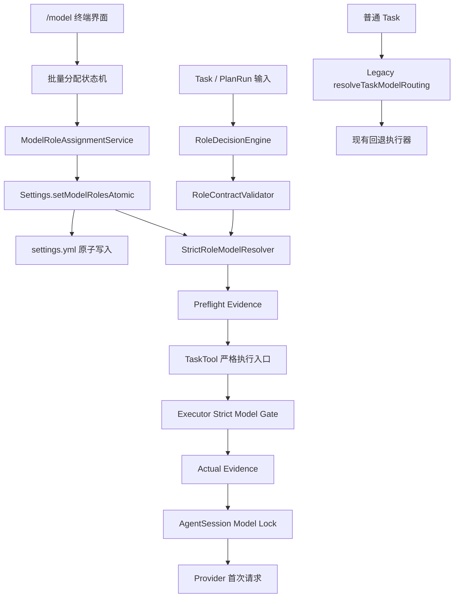
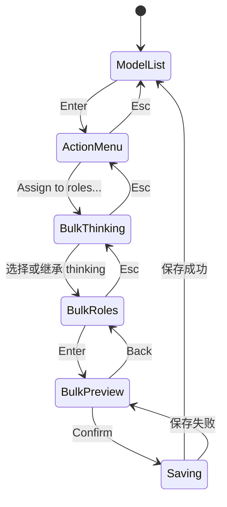
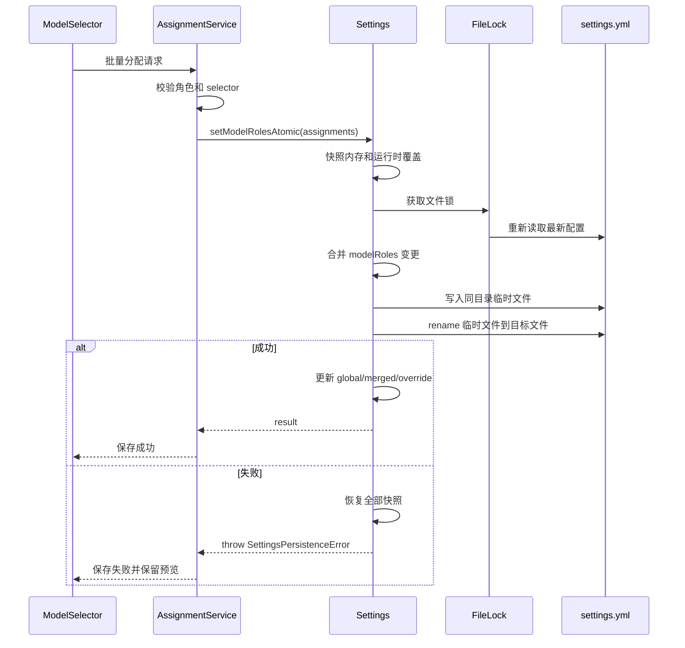
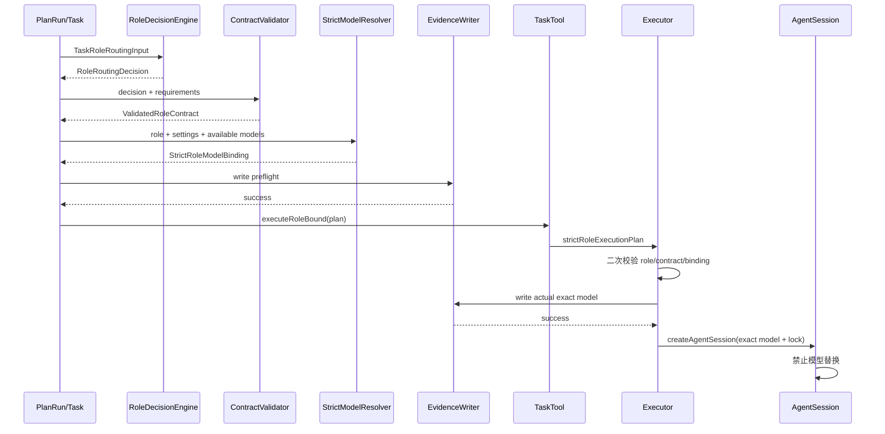

# OMP 模型角色批量分配与严格路由 TRD

## 1. 文档信息

| 项目 | 内容 |
| --- | --- |
| 文档类型 | 技术需求文档（TRD） |
| 状态 | 待评审 |
| 日期 | 2026-07-10 |
| 适用仓库 | `BearMaxDD/oh-my-pi` 的 `mima/omp-custom` 分支 |
| 上游产品文档 | `docs/PRD/2026-07-10-omp-model-role-bulk-assignment-strict-routing.md` |
| 参考技术文档 | `docs/TRD/2026-07-09-omp-custom-codex-adapter-trd.md` |
| 目标版本 | OMP Custom 后续版本 |
| 核心范围 | `/model` 批量分配、任务角色决策、角色契约校验、严格模型绑定、执行期模型锁、路由 Evidence |

本文档把已确认的产品链路：

> 任务 → 正确角色 → `/model` 为该角色配置的准确模型 → 实际执行

落实为可实现、可测试、可审计的技术方案。

---

## 2. 技术结论

本需求不能通过给现有 `/model` 菜单增加多选界面单独完成。当前系统中，角色配置、任务角色推断、模型解析、子代理模型回退和运行证据分散在多个模块中；即使界面正确保存了角色模型，执行期仍可能因为别名解析、鉴权回退、父会话回退、重试回退或上下文提升而使用其他模型。

最终采用以下技术方案：

1. 保留现有 `/model` 终端交互基线，在模型动作菜单首项增加 `Assign to roles...`。
2. 新增独立的批量分配状态机，支持思考等级选择、角色多选、差异预览、确认和错误恢复。
3. 在 `Settings` 中新增真正可等待、可失败、可回滚的批量原子写入接口，不使用循环调用 `setModelRole()` 模拟事务。
4. 保留现有 `resolveTaskModelRouting()` 作为普通任务兼容路径，不修改其回退语义。
5. 新增严格角色路由通道：先生成不可变的 `RoleRoutingDecision`，再验证 Role Contract，最后从 `settings.getModelRole(validatedRoleId)` 读取唯一模型来源。
6. 严格角色模型仅接受精确的 `provider/modelId[:thinking]`，禁止 canonical、alias、glob、模糊匹配和提供方替代映射。
7. 严格执行器跳过父模型回退、鉴权回退、子代理模型回退链和上下文模型提升。
8. 在创建子代理会话之前完成第二次模型一致性校验；不一致时不得创建会话。
9. 路由 Evidence 升级为 v2，记录角色候选、决策来源、契约校验、配置模型、实际模型和精确匹配结果。
10. PlanRun 的每个阶段单独生成 Evidence，避免多个阶段覆盖同一任务文件。
11. 自定义角色可以在 `/model` 中配置模型，但只有拥有完整 Role Contract 时才允许执行严格角色任务。
12. 严格路由是角色任务的内部强制约束，不提供关闭开关；普通非角色任务保持原有行为。

技术边界如下：

| 场景 | 路由模式 | 模型来源 | 是否允许回退 |
| --- | --- | --- | --- |
| PlanRun 固定阶段 | 严格 | 对应阶段 `role_id` 的 `/model` 配置 | 否 |
| 已验证的角色任务 | 严格 | `settings.getModelRole(validatedRoleId)` | 否 |
| Advisor 仲裁任务 | 严格 | `superpowers:advisor` 的 `/model` 配置 | 否 |
| 普通 Task 调用 | 兼容 | 现有模型角色、代理覆盖和父会话逻辑 | 保持现状 |
| 当前主会话模型切换 | 兼容 | 用户选择的当前模型 | 保持现状 |

---

## 3. 当前代码架构与问题定位

### 3.1 `/model` 选择器现状

当前模型选择器位于：

```text
packages/coding-agent/src/modes/components/model-selector.ts
```

现有能力包括：

- 模型检索和列表滚动；
- 当前模型、角色和思考等级标记；
- 针对单个模型选择一个角色；
- 针对单个模型设置思考等级；
- 已知角色和自定义角色展示；
- 终端宽度适配和键盘操作。

当前 `#updateMenu()` 显示 `Action for: <model>`，`#buildMenuRoleActions()` 为每个角色生成一个 `Set as ...` 操作。控制器在回调中通过 `settings.setModelRole(...)` 写入单个角色。

现有实现的问题不是缺少复选框，而是缺少：

- 一次操作选择多个角色的状态；
- 批量变更预览；
- 一次性确认和取消；
- 异步保存结果反馈；
- 所有角色全部成功或全部失败的原子语义；
- canonical 模型不能用于严格角色绑定的约束。

### 3.2 Settings 保存现状

相关实现位于：

```text
packages/coding-agent/src/config/settings.ts
```

当前 `setModelRole(role, modelId)` 的主要行为是：

1. 读取全局 `modelRoles`；
2. 修改单个角色；
3. 调用通用 `set("modelRoles", current)`；
4. 如果运行时覆盖已包含该角色，则同步更新覆盖值。

通用 `set()` 只负责修改内存并进入防抖保存队列。现有 `#saveNow()` 具备文件锁和外部配置合并能力，但存在两个与本需求冲突的语义：

1. 写入错误被内部捕获并记录，不向调用者抛出；
2. 使用 `Bun.write` 直接覆盖目标文件，不具备临时文件加重命名的文件级原子性。

因此，界面循环调用多次 `setModelRole()` 无法实现真正的批量事务，也无法在保存失败后准确恢复界面状态。

### 3.3 角色定义现状

角色类型和元信息位于模型角色注册表中。当前 `ModelRoleInfo` 已包含：

- 名称和中文描述；
- 能力标签；
- 是否可作为子代理；
- 是否只读；
- 是否可修改生产代码或测试代码；
- 是否需要 Advisor；
- 推荐模型层级和回退角色。

Prompt Pack 当前可根据 `roleId` 生成一个基础 Role Contract。但对未知自定义角色，系统会使用角色 ID 和默认权限信息生成弱契约。这种行为适合展示，不适合严格执行。

本需求要求区分：

- **可配置角色**：可以出现在 `/model` 中并保存模型；
- **可执行角色**：除模型配置外，还必须拥有完整、可校验的 Role Contract。

### 3.4 Task 路由现状

当前任务参数同时存在：

```ts
interface TaskParams {
  agent?: string;
  role?: string;
  modelRole?: string;
  assignment?: string;
  description?: string;
  context?: string;
  // ...
}
```

两个字段语义必须彻底分离：

| 字段 | 语义 | 是否可作为技术身份 |
| --- | --- | --- |
| `role` | 面向人的角色名称或提示文本 | 否 |
| `modelRole` | 模型角色注册表中的稳定 ID | 仅在完成验证后可以 |

当前 `resolveTaskModelRouting()` 会：

- 优先使用显式 `modelRole`；
- 某些情况下从 `role` 推断已知角色；
- 读取角色模型配置；
- 使用代理模型覆盖；
- 生成角色回退链；
- 允许默认角色和父会话模型参与后续解析。

这些行为已有测试覆盖，属于普通 Task 的兼容合同。新需求不能直接把现有函数改成无回退，否则会扩大行为变化并破坏普通任务。

### 3.5 执行器模型解析现状

当前子代理执行器会把模型模式交给模型注册表解析，并可能执行：

- 鉴权失败后的替代模型选择；
- 父会话模型回退；
- 子代理重试模型链；
- 上下文不足时的模型提升；
- canonical、别名和提供方特殊映射。

这些能力对普通任务是容错机制，但对“角色必须准确使用 `/model` 配置模型”的严格任务会造成不可审计的偏移。

### 3.6 PlanRun 现状

PlanRun 使用固定阶段模板组织工作流，典型阶段包括：

```text
tdd-writer
implementer
test-runner
spec-reviewer
quality-reviewer
acceptance
```

每个阶段本身已有明确的 `role_id`。因此 PlanRun 不需要为六个阶段重新猜测一个统一主角色，而应当：

1. 把阶段模板的 `role_id` 作为显式角色决策；
2. 校验该角色能否执行当前阶段；
3. 从 `/model` 读取该角色模型；
4. 为每个阶段分别记录路由证据。

### 3.7 Evidence 现状

现有 `ModelRoutingEvidence` 能记录请求角色、候选模式、解析模型和回退信息，但无法完整回答：

- 为什么选择这个角色；
- 是否经过 Advisor；
- Role Contract 是否完整；
- `/model` 中配置的原始值是什么；
- 实际模型是否与配置精确一致；
- 模型是否在会话创建前发生替换；
- 多阶段任务的证据是否互相覆盖。

因此需要升级证据结构和写入时机。

---

## 4. 目标技术架构

### 4.1 分层架构



### 4.2 核心模块职责

| 模块 | 职责 |
| --- | --- |
| `ModelRoleBulkAssignmentState` | 管理批量角色选择、思考等级、预览和确认状态 |
| `ModelRoleAssignmentService` | 校验角色、模型选择器和变更集，调用 Settings 事务接口 |
| `Settings.setModelRolesAtomic` | 一次性修改、持久化、失败回滚并返回结果 |
| `RoleDecisionEngine` | 根据显式阶段、用户指定、规则评分或 Advisor 产生唯一角色决策 |
| `RoleContractValidator` | 验证角色是否完整、可执行且满足任务权限和阶段约束 |
| `StrictRoleModelResolver` | 从角色配置精确解析唯一可用模型和思考等级 |
| `StrictRoleExecutionGate` | 在执行器边界再次校验绑定并禁止所有模型替代 |
| `AgentSessionModelLock` | 运行期禁止上下文提升和模型切换 |
| `ModelRoutingEvidenceWriter` | 原子写入 preflight、actual 和最终状态证据 |
| `RoleModelAuditService` | 复用同一套校验逻辑，为 `/model` 和 CLI 提供配置诊断 |

### 4.3 不可变路由对象

角色决策和模型绑定一旦进入执行阶段，不再通过松散字符串重新解析，而是传递不可变对象：

```ts
interface StrictRoleExecutionPlan {
  readonly decision: RoleRoutingDecision;
  readonly contract: ValidatedRoleContract;
  readonly binding: StrictRoleModelBinding;
  readonly evidence: RoutingEvidenceLocation;
}
```

执行器只接受该对象，不接受在执行中重新读取 `role` 文本或重新构造模型模式。

### 4.4 核心不变量

实现必须满足以下不变量：

```text
validatedRoleId
  = RoleRoutingDecision.selectedRoleId
  = ValidatedRoleContract.roleId
  = StrictRoleModelBinding.roleId

configuredSelector
  = settings.getModelRole(validatedRoleId)

actualProvider/actualModelId
  = StrictRoleModelBinding.provider/modelId

strict role task:
  fallbackUsed = false
  parentModelUsed = false
  contextPromotionUsed = false
  exactMatch = true
```

任何一条不成立都必须在创建子代理会话之前阻断，或在运行后验收阶段明确失败。

---

## 5. `/model` 批量分配技术设计

### 5.1 交互流程

保持当前模型列表和动作菜单布局。用户在模型上按回车后，动作菜单顺序调整为：

```text
Action for: provider/model

  Assign to roles...
  Set as default
  Set as advisor
  Set as implementer
  ...
```

批量流程：



思考等级只与模型绑定值有关，不需要为每个角色单独选择。最终写入值统一为：

```text
provider/modelId
provider/modelId:thinkingLevel
```

### 5.2 状态模型

新增纯状态模块，避免继续扩大 `model-selector.ts`：

```text
packages/coding-agent/src/modes/components/model-role-bulk-assignment.ts
```

建议接口：

```ts
type BulkAssignmentStep =
  | "thinking"
  | "roles"
  | "preview"
  | "saving"
  | "error";

interface ModelRoleBulkAssignmentState {
  readonly step: BulkAssignmentStep;
  readonly model: Model<Api>;
  readonly modelSelector: string;
  readonly thinkingLevel?: ThinkingLevel;
  readonly roles: readonly BulkAssignableRole[];
  readonly selectedRoleIds: ReadonlySet<string>;
  readonly initialAssignments: Readonly<Record<string, string | undefined>>;
  readonly preview: readonly ModelRoleAssignmentChange[];
  readonly cursor: number;
  readonly scrollOffset: number;
  readonly error?: string;
}

type ModelRoleBulkAssignmentAction =
  | { type: "select_thinking"; thinkingLevel?: ThinkingLevel }
  | { type: "toggle_role"; roleId: string }
  | { type: "toggle_all_visible" }
  | { type: "move"; delta: number }
  | { type: "preview" }
  | { type: "confirm" }
  | { type: "save_succeeded"; result: ModelRoleBatchUpdateResult }
  | { type: "save_failed"; message: string }
  | { type: "back" };
```

状态更新使用纯 reducer，渲染器只读取状态，异步保存由控制器负责。

### 5.3 可分配角色来源

角色列表来自统一角色注册表，包含内置角色和自定义角色。列表展示：

- 中文名称；
- 稳定角色 ID；
- 当前绑定模型摘要；
- 当前是否选择；
- Role Contract 状态。

自定义角色缺少完整契约时仍允许配置，但应显示 `仅配置，暂不可执行` 状态，不在配置阶段强制阻止。

角色顺序固定为：

1. 默认和基础角色；
2. 内置执行角色；
3. Superpowers 角色；
4. 自定义角色，按角色 ID 排序。

### 5.4 canonical 模型约束

严格角色绑定必须保存明确的提供方和模型 ID。模型列表中的 canonical 聚合项不能直接批量分配。

当用户从 canonical 项进入批量分配时，界面显示可操作错误：

```text
该模型是聚合别名，不能用于严格角色绑定。
请选择具体的 provider/model。
```

普通的当前会话模型选择仍可保留 canonical 行为。

### 5.5 预览结构

```ts
interface ModelRoleAssignmentChange {
  readonly roleId: string;
  readonly roleLabel: string;
  readonly previous?: string;
  readonly next: string;
  readonly changed: boolean;
  readonly contractStatus: "complete" | "incomplete";
}
```

预览仅展示实际选择角色。未变化项可显示，但必须明确标记 `unchanged`，保存时不会产生无意义写入。

### 5.6 终端布局约束

批量界面沿用现有 OMP TUI 样式，不引入新的视觉体系：

- 使用现有 `DynamicBorder`、`ScrollView`、颜色主题和键盘提示；
- 固定选择标记列、角色名称列和模型摘要列；
- 80 列终端不出现横向溢出；
- 长模型 ID 中间截断，保留提供方和末尾版本信息；
- 列表高度稳定，切换选择不改变容器尺寸；
- `Space` 切换，`Enter` 下一步，`Esc` 返回；
- 保存中禁用重复提交；
- 错误后保留已选角色和预览，不要求重新选择。

### 5.7 ModelSelector 接口兼容

不修改现有单角色回调合同，新增可选批量回调：

```ts
interface ModelSelectorOptions {
  // 现有字段保持不变
  onBulkRoleSelect?: (
    request: ModelRoleBulkAssignmentRequest,
    selector: ModelSelectorComponent,
  ) => Promise<ModelRoleBatchUpdateResult>;
}

interface ModelRoleBulkAssignmentRequest {
  readonly model: Model<Api>;
  readonly selector: string;
  readonly thinkingLevel?: ThinkingLevel;
  readonly roleIds: readonly string[];
}
```

现有 `onSelect(model, role, thinkingLevel, selector)` 继续处理单角色配置，降低回归范围。

---

## 6. Settings 批量原子写入设计

### 6.1 公共接口

新增：

```ts
interface ModelRoleBatchUpdateResult {
  readonly changedRoleIds: readonly string[];
  readonly unchangedRoleIds: readonly string[];
  readonly previous: Readonly<Record<string, string | undefined>>;
  readonly next: Readonly<Record<string, string>>;
  readonly persisted: boolean;
}

interface Settings {
  setModelRolesAtomic(
    assignments: Readonly<Record<string, string>>,
  ): Promise<ModelRoleBatchUpdateResult>;
}
```

该接口只接受已经构造好的最终选择器，不负责角色决策。

### 6.2 事务流程



### 6.3 原子写入实现

新增内部 helper：

```ts
async function writeYamlAtomic(
  targetPath: string,
  content: string,
): Promise<void>;
```

实现要求：

1. 临时文件位于目标文件同一目录；
2. 临时文件名包含进程 ID 和随机后缀；
3. 写入完成后再执行原子 `rename`；
4. 失败时尽力删除临时文件；
5. 保留现有文件权限，或使用与当前配置文件一致的安全权限；
6. 整个读取、合并、写入和重命名过程位于 `withFileLock` 内；
7. 禁止把配置内容写入日志。

### 6.4 严格保存与后台保存分离

现有通用 `set()` 和防抖后台保存语义保持不变。新增严格内部保存入口：

```ts
interface StrictSaveOptions {
  readonly throwOnError: true;
  readonly atomicWrite: true;
}

async #saveNowStrict(options: StrictSaveOptions): Promise<void>;
```

或者将 `#saveNow()` 重构为可配置的底层实现，但默认调用路径仍保持“记录错误并重试”的旧语义。

### 6.5 回滚规则

调用前必须快照：

- `#global.modelRoles`；
- `#runtimeOverrides.modelRoles`；
- `#merged.modelRoles`；
- 待保存路径集合；
- 本批次变更前的外部文件内容摘要。

写入失败时：

- 恢复全部内存快照；
- 不触发成功变更事件；
- 抛出可识别错误；
- 界面继续显示原预览；
- 不允许部分角色显示为已成功。

### 6.6 运行时覆盖规则

沿用现有单角色行为：如果某个角色已经存在运行时覆盖，批量写入应同步更新该覆盖值，使本次用户操作立即成为有效绑定；未存在运行时覆盖的角色不新建覆盖层。

### 6.7 变更通知

一次批量成功只触发一次 `modelRoles` 变更通知，事件载荷包含 changed role IDs。不得为每个角色分别触发保存和刷新。

---

## 7. 角色决策引擎

### 7.1 决策来源

角色决策按优先级分为四类：

```ts
type RoleDecisionSource =
  | "explicit_stage"
  | "explicit_user"
  | "rule"
  | "advisor";
```

优先级：

1. PlanRun 阶段模板明确提供 `role_id`；
2. 可信内部调用明确提供稳定角色 ID；
3. 规则引擎高置信匹配；
4. 规则结果模糊时调用 Advisor 仲裁。

`role` 展示文本永远不参与稳定 ID 推断。

### 7.2 输入结构

```ts
interface TaskRoleRoutingInput {
  readonly runId?: string;
  readonly taskId: string;
  readonly stageId?: string;
  readonly assignment: string;
  readonly description?: string;
  readonly context?: string;
  readonly explicitRoleId?: string;
  readonly source: "plan_run" | "task_tool" | "internal";
  readonly classification?: SpecTaskClassification;
  readonly operationRequirements: TaskOperationRequirements;
}

interface TaskOperationRequirements {
  readonly needsProductionWrite: boolean;
  readonly needsTestWrite: boolean;
  readonly needsShell: boolean;
  readonly needsBrowser: boolean;
  readonly needsAcceptanceDecision: boolean;
  readonly readOnly: boolean;
}
```

### 7.3 Role Contract 扩展

在角色元信息中补充严格执行所需字段：

```ts
interface RoleRoutingHints {
  readonly keywords?: readonly string[];
  readonly pathPatterns?: readonly string[];
  readonly classificationFlags?: readonly string[];
  readonly runtimeSurfaces?: readonly string[];
  readonly stageIds?: readonly string[];
}

interface ExecutableRoleContract {
  readonly schemaVersion: 1;
  readonly contractVersion: string;
  readonly roleId: string;
  readonly capabilities: readonly RoleCapability[];
  readonly canRunAsSubagent: boolean;
  readonly readOnly: boolean;
  readonly canEditProductionCode: boolean;
  readonly canEditTestCode: boolean;
  readonly allowedStageIds?: readonly string[];
  readonly routingHints: RoleRoutingHints;
  readonly successCriteria: readonly string[];
  readonly failureCriteria: readonly string[];
}
```

内置可执行角色必须提供完整契约。自定义角色缺少任一必填字段时，`resolveExecutableRoleContract()` 返回结构化错误，禁止进入严格执行。

### 7.4 候选评分

规则引擎使用可解释、确定性的信号评分，不让模型直接在无约束角色列表中自由选择。

```ts
interface RoleCandidate {
  readonly roleId: string;
  readonly score: number;
  readonly signals: readonly RoleRoutingSignal[];
  readonly contractStatus: "complete" | "incomplete" | "incompatible";
}

interface RoleRoutingSignal {
  readonly kind:
    | "explicit_stage"
    | "explicit_role"
    | "keyword"
    | "path"
    | "classification"
    | "runtime_surface"
    | "required_capability"
    | "permission_conflict";
  readonly value: string;
  readonly weight: number;
}
```

确定性排序规则：

1. 分数降序；
2. 契约完整优先；
3. 角色 ID 字典序作为最终稳定排序。

直接选择阈值：

```text
top1.score >= 0.85
且
top1.score - top2.score >= 0.20
```

不满足阈值时进入 Advisor。阈值通过常量集中管理，首版不开放用户配置，避免不同项目产生不可比较的决策证据。

### 7.5 显式角色仍需校验

`explicit_stage` 和 `explicit_user` 可跳过候选竞争，但不能跳过：

- 角色是否存在；
- Role Contract 是否完整；
- 是否允许作为子代理；
- 是否允许当前阶段；
- 是否满足任务读写权限；
- 是否配置严格模型。

显式指定不是绕过安全约束的机制。

### 7.6 Advisor 仲裁

新增接口：

```ts
interface RoleAdvisorArbitrator {
  chooseRole(input: {
    readonly task: TaskRoleRoutingInput;
    readonly candidates: readonly RoleCandidate[];
    readonly allowedRoleIds: readonly string[];
  }): Promise<AdvisorRoleDecision>;
}

interface AdvisorRoleDecision {
  readonly selectedRoleId: string;
  readonly confidence: number;
  readonly reasons: readonly string[];
}
```

Advisor 自身按固定 `superpowers:advisor` 角色运行，并严格使用该角色在 `/model` 中配置的模型。为避免递归：

- Advisor 路由源固定为 `explicit_stage`；
- Advisor 不再调用 Advisor；
- Advisor 模型未配置、不可用或契约不完整时返回 `advisor_unavailable`；
- 不回退到默认模型或父会话模型；
- Advisor 只能从传入的 `allowedRoleIds` 中选择；
- 输出使用结构化 JSON 校验；
- 非法输出只允许一次格式修复，不允许更换模型。

现有 `evaluateAdvisorGate()` 属于确定性证据门禁，不直接充当角色选择器。两者可以共享证据结构，但职责必须分离。

### 7.7 决策输出

```ts
interface RoleRoutingDecision {
  readonly schemaVersion: 1;
  readonly decisionId: string;
  readonly source: RoleDecisionSource;
  readonly selectedRoleId: string;
  readonly confidence: number;
  readonly candidates: readonly RoleCandidate[];
  readonly reasons: readonly string[];
  readonly taskFingerprint: string;
  readonly createdAt: string;
  readonly advisor?: {
    readonly roleId: "superpowers:advisor";
    readonly decisionId: string;
    readonly configuredModelSelector: string;
  };
}
```

`taskFingerprint` 基于规范化后的 assignment、stage ID、operation requirements 和显式角色 ID 计算，不包含密钥、完整上下文或用户隐私内容。

### 7.8 PlanRun 的角色决策

PlanRun 每个固定阶段直接生成：

```ts
{
  source: "explicit_stage",
  selectedRoleId: stage.role_id,
  confidence: 1,
  reasons: [`plan_run_stage:${stage.id}`],
}
```

任务分类可以决定是否增加专门审查或验收信息，但不能把固定 `implementer` 阶段悄悄改成其他角色。

---

## 8. Role Contract 校验

### 8.1 校验接口

```ts
interface RoleContractValidationResult {
  readonly passed: boolean;
  readonly roleId: string;
  readonly contractVersion?: string;
  readonly checks: readonly RoleContractCheck[];
}

interface RoleContractCheck {
  readonly code:
    | "role_exists"
    | "contract_complete"
    | "subagent_allowed"
    | "stage_allowed"
    | "production_write_allowed"
    | "test_write_allowed"
    | "readonly_compatible"
    | "capabilities_satisfied";
  readonly passed: boolean;
  readonly message: string;
}
```

### 8.2 校验时机

校验执行两次：

1. 角色决策完成后，模型解析前；
2. 执行器创建子代理会话前。

第二次校验使用第一次生成的不可变契约快照和版本号，不重新根据展示文本构造契约。

### 8.3 失败规则

以下任一情况直接阻断：

- `unknown_role`；
- `role_contract_missing`；
- `role_contract_mismatch`；
- `role_not_subagent_capable`；
- `role_stage_forbidden`；
- `role_permission_conflict`；
- `role_capability_missing`。

失败信息必须包含角色 ID、检查代码和修复建议，但不泄漏完整任务上下文。

---

## 9. 严格模型绑定

### 9.1 唯一配置来源

严格角色任务的模型配置只能来自：

```ts
settings.getModelRole(validatedRoleId)
```

禁止使用：

- `agentModelOverrides`；
- 父会话当前模型；
- default role 模型；
- `fallbackRoleIds`；
- 模型 registry 的模糊候选；
- canonical 展开；
- OpenRouter 等提供方替代模型；
- Bedrock profile 自动映射；
- 模型版本别名。

### 9.2 选择器语法

允许：

```text
provider/modelId
provider/modelId:thinkingLevel
```

模型 ID 本身可能包含冒号，因此必须复用现有 `splitThinkingSuffix()` 识别合法思考等级后缀，禁止直接按最后一个冒号粗暴切分。

思考等级规则：

- 显式后缀：记录 `thinkingSource = "explicit"`；
- 无后缀：使用模型默认思考等级，记录 `thinkingSource = "model_default"`；
- 显式等级不受模型支持：阻断 `role_thinking_unsupported`；
- 运行中不得改为其他思考等级。

### 9.3 精确模型查找

现有 `resolveProviderModelReference()` 会执行变体和提供方兼容映射，不满足严格语义。新增独立函数：

```ts
function findExactConcreteModelReference(
  provider: string,
  modelId: string,
  availableModels: readonly Model<Api>[],
): Model<Api> | undefined;
```

查找规则：

1. 只在 `ModelRegistry.getAvailable()` 返回的可用模型中查找；
2. `provider` 和 `model.id` 必须分别精确相等；
3. 不调用 alias、variant、canonical 或 fallback 解析；
4. 结果必须唯一；
5. 保留原始 provider/model ID 用于 Evidence；
6. 提供方被禁用或无鉴权时视为不可用，不寻找替代模型。

### 9.4 严格绑定接口

```ts
interface StrictRoleModelBinding {
  readonly schemaVersion: 1;
  readonly roleId: string;
  readonly configuredSelector: string;
  readonly provider: string;
  readonly modelId: string;
  readonly model: Model<Api>;
  readonly thinkingLevel?: ThinkingLevel;
  readonly thinkingSource: "explicit" | "model_default";
  readonly canonicalSelector: string;
  readonly bindingHash: string;
  readonly createdAt: string;
}

interface StrictRoleModelResolverInput {
  readonly validatedRoleId: string;
  readonly contract: ValidatedRoleContract;
  readonly settings: Settings;
  readonly availableModels: readonly Model<Api>[];
  readonly requiredContextTokens?: number;
}

function resolveStrictRoleModelBinding(
  input: StrictRoleModelResolverInput,
): StrictRoleModelBinding;
```

### 9.5 绑定哈希

`bindingHash` 使用稳定字段的 canonical JSON 计算 SHA-256：

```json
{
  "role_id": "superpowers:implementer",
  "configured_selector": "openai/gpt-5.2-codex:high",
  "provider": "openai",
  "model_id": "gpt-5.2-codex",
  "thinking_level": "high",
  "contract_version": "1"
}
```

哈希用于执行器二次校验和 Evidence 对齐，不用于安全签名。

### 9.6 错误类型

```ts
type StrictRoleRoutingErrorCode =
  | "unknown_role"
  | "role_contract_missing"
  | "role_contract_mismatch"
  | "ambiguous_role"
  | "advisor_unavailable"
  | "role_model_unconfigured"
  | "role_model_not_concrete"
  | "role_model_unavailable"
  | "role_thinking_unsupported"
  | "role_model_mismatch"
  | "routing_evidence_write_failed";
```

所有错误通过统一 `StrictRoleRoutingError` 返回，包含 `code`、`roleId`、`stageId`、安全消息和建议修复动作。

---

## 10. TaskTool 严格执行入口

### 10.1 兼容策略

现有 `TaskTool.execute()` 和 `resolveTaskModelRouting()` 保留。新增内部严格入口，不让 PlanRun 通过公开工具参数夹带接受目录等内部字段：

```ts
interface RoleBoundExecutionContext {
  readonly runId?: string;
  readonly taskId: string;
  readonly stageId?: string;
  readonly evidenceLocation: RoutingEvidenceLocation;
  readonly decision?: RoleRoutingDecision;
}

class TaskTool {
  executeRoleBound(
    toolCallId: string,
    params: TaskParams,
    context: RoleBoundExecutionContext,
  ): Promise<TaskToolResult>;
}
```

普通 LLM 工具 schema 不暴露 `acceptingDir`、`bindingHash` 或 Evidence 路径。

### 10.2 严格入口流程



### 10.3 会话创建前阻断

以下操作必须全部发生在 `createAgentSession()` 之前：

- 可用模型复查；
- provider/model ID 精确比较；
- thinking level 比较；
- binding hash 比较；
- actual Evidence 原子写入；
- model lock 安装。

如果 actual Evidence 无法写入，任务不得启动。这样“已运行但无证据”的状态不会被误认为合规。

---

## 11. 执行器严格模型门禁

### 11.1 ExecutorOptions 扩展

```ts
interface ExecutorOptions {
  // 现有字段保持不变
  readonly strictRoleExecutionPlan?: StrictRoleExecutionPlan;
}
```

存在 `strictRoleExecutionPlan` 时进入严格分支；否则执行当前兼容分支。

### 11.2 严格分支禁止项

严格分支必须跳过：

- `resolveModelOverrideWithAuthFallback()`；
- parent active model fallback；
- `installSubagentRetryFallbackChain()`；
- fallback role model patterns；
- canonical 和 alias 解析；
- provider 之间的自动切换；
- 上下文模型提升。

允许同一 provider/model 的网络重试，但不得更换模型身份或思考等级。

### 11.3 二次校验

```ts
function assertStrictRoleExecutionPlan(
  plan: StrictRoleExecutionPlan,
  availableModels: readonly Model<Api>[],
): void;
```

校验：

```text
decision.selectedRoleId === contract.roleId
contract.roleId === binding.roleId
binding.model.provider === binding.provider
binding.model.id === binding.modelId
available exact model === binding.model identity
recomputed binding hash === binding.bindingHash
```

任何不一致抛出 `role_model_mismatch`，并保证子代理会话计数仍为零。

### 11.4 冻结配置语义

单个任务一旦生成 `StrictRoleExecutionPlan`，本次执行使用冻结绑定。用户在任务运行过程中修改 `/model`：

- 不影响已经启动的任务；
- 新任务读取新配置；
- 恢复同一中断任务时校验原 binding hash；
- 如果原模型已不可用，恢复失败，不切换到新配置或替代模型。

该语义保证一次任务内 Evidence 前后一致。

---

## 12. AgentSession 模型锁

### 12.1 会话选项

```ts
interface AgentSessionModelLock {
  readonly mode: "strict_role";
  readonly roleId: string;
  readonly provider: string;
  readonly modelId: string;
  readonly thinkingLevel?: ThinkingLevel;
  readonly bindingHash: string;
}

interface CreateAgentSessionOptions {
  // 现有字段保持不变
  readonly modelLock?: AgentSessionModelLock;
}
```

### 12.2 锁定行为

当 `modelLock.mode === "strict_role"`：

- `#tryContextPromotion()` 直接返回不可提升结果；
- `#promoteContextModel()` 不得执行；
- 运行时模型切换 API 拒绝请求；
- 子代理 retry 只能重试同一模型；
- 恢复会话时校验模型和 binding hash；
- provider 首次请求前再次断言当前模型身份。

### 12.3 上下文不足

严格角色模型上下文不足时返回明确错误：

```text
strict_role_context_limit_exceeded
```

错误包含：

- 角色 ID；
- 配置模型；
- 所需和可用上下文 token 摘要；
- 建议用户在 `/model` 为该角色选择上下文更大的具体模型。

禁止自动提升到其他模型。

---

## 13. 路由 Evidence v2

### 13.1 文件路径

PlanRun 阶段：

```text
<acceptingDir>/tasks/<task_id>/stages/<stage_id>/model-routing-evidence.json
```

无阶段的严格任务：

```text
<artifactsDir>/tasks/<task_id>/model-routing-evidence.json
```

禁止继续用多个阶段覆盖同一个 `tasks/<task_id>/model-routing-evidence.json`。

### 13.2 Schema

```ts
interface ModelRoutingEvidenceV2 {
  readonly schema_version: 2;
  readonly run_id?: string;
  readonly task_id: string;
  readonly stage_id?: string;
  readonly agent_id?: string;
  readonly status:
    | "preflight_passed"
    | "blocked"
    | "started"
    | "completed"
    | "acceptance_failed";
  readonly role_decision: {
    readonly decision_id: string;
    readonly source: RoleDecisionSource;
    readonly selected_role_id: string;
    readonly confidence: number;
    readonly candidates: readonly EvidenceRoleCandidate[];
    readonly reasons: readonly string[];
    readonly advisor?: EvidenceAdvisorDecision;
  };
  readonly contract_validation: {
    readonly contract_version: string;
    readonly passed: boolean;
    readonly checks: readonly RoleContractCheck[];
  };
  readonly model_binding: {
    readonly configured_selector: string;
    readonly provider: string;
    readonly model_id: string;
    readonly thinking_level?: ThinkingLevel;
    readonly thinking_source: "explicit" | "model_default";
    readonly binding_hash: string;
  };
  readonly actual?: {
    readonly provider: string;
    readonly model_id: string;
    readonly thinking_level?: ThinkingLevel;
    readonly exact_match: boolean;
    readonly fallback_used: false;
    readonly parent_model_used: false;
    readonly context_promotion_used: false;
    readonly session_created: boolean;
    readonly first_dispatch?: boolean;
  };
  readonly timestamps: {
    readonly created_at: string;
    readonly updated_at: string;
    readonly started_at?: string;
    readonly completed_at?: string;
  };
  readonly error?: {
    readonly code: StrictRoleRoutingErrorCode;
    readonly message: string;
  };
}
```

### 13.3 写入阶段

| 阶段 | 写入内容 | 失败处理 |
| --- | --- | --- |
| Preflight | 角色决策、契约校验、配置绑定 | 阻断任务 |
| Executor gate | 实际模型、exact match、会话尚未创建 | 阻断任务 |
| Session started | `session_created=true`、`started_at` | 标记验收风险 |
| First dispatch | `first_dispatch=true` | 标记验收风险 |
| Completed | 最终状态和时间 | 验收必须存在 |

每次更新使用临时文件加重命名，不直接覆盖半个 JSON 文件。

### 13.4 Evidence 隐私

Evidence 允许记录：

- 角色 ID；
- 模型 provider 和 ID；
- 思考等级；
- 决策信号摘要；
- 哈希和错误代码。

Evidence 禁止记录：

- API Key；
- 鉴权 header；
- 完整用户提示；
- 完整项目文件内容；
- provider 响应正文；
- Settings 文件全文。

### 13.5 验收校验

升级 `validateModelRoutingEvidenceForAcceptance()`。严格任务通过条件：

```text
schema_version == 2
contract_validation.passed == true
actual.exact_match == true
actual.fallback_used == false
actual.parent_model_used == false
actual.context_promotion_used == false
model_binding.provider == actual.provider
model_binding.model_id == actual.model_id
configured/effective thinking level 一致
status == completed
```

任一阶段缺证据、证据无法解析或 binding hash 不一致，整个 PlanRun 验收失败。

---

## 14. PlanRun 接入设计

### 14.1 阶段参数

当前 `PlanRunTaskSpawnParams` 中：

- `role` 继续作为中文展示名称和提示内容；
- `modelRole` 继续保存稳定 `role_id`；
- 新增内部 `RoleBoundExecutionContext`，不进入 LLM 工具 schema。

`buildPlanRunStageSpawnParams()` 必须保证：

```text
params.modelRole === stage.role_id
context.stageId === stage.id
decision.selectedRoleId === stage.role_id
```

### 14.2 阶段执行流程

每个阶段执行：

1. 从模板读取 `stage.role_id`；
2. 生成 `explicit_stage` 决策；
3. 验证 Role Contract 和阶段权限；
4. 解析严格模型绑定；
5. 写入阶段 preflight Evidence；
6. 调用 `TaskTool.executeRoleBound()`；
7. 执行器写 actual Evidence；
8. 创建模型锁定的子代理会话；
9. 完成后更新阶段 Evidence；
10. 验收汇总所有阶段证据。

### 14.3 阶段模型独立

不同阶段可以绑定相同或不同模型。PlanRun 不把第一个阶段模型继承给后续阶段，也不使用主会话模型补空缺。

如果任一必需阶段未配置模型，PlanRun 在该阶段开始前失败，并提示：

```text
角色 superpowers:implementer 尚未配置具体模型。
请通过 /model 选择 provider/model 后分配给该角色。
```

### 14.4 Manifest

接受清单中的模型路由条目升级为阶段粒度：

```ts
interface ModelRoutingManifestEntry {
  readonly task_id: string;
  readonly stage_id?: string;
  readonly role_id: string;
  readonly evidence_path: string;
  readonly binding_hash: string;
}
```

---

## 15. 配置审计与迁移

### 15.1 审计服务

```ts
interface RoleModelAuditEntry {
  readonly roleId: string;
  readonly selector?: string;
  readonly contractStatus: "complete" | "incomplete";
  readonly modelStatus:
    | "valid"
    | "unconfigured"
    | "not_concrete"
    | "unavailable"
    | "thinking_unsupported";
  readonly executable: boolean;
  readonly message: string;
}

function auditStrictRoleBindings(
  settings: Settings,
  registry: ModelRegistry,
): readonly RoleModelAuditEntry[];
```

`/model` 和 CLI 共用该服务，避免 UI 与执行器使用两套判断。

### 15.2 CLI 入口

新增脚本化审计命令：

```bash
omp models roles --check
omp models roles --check --json
```

退出码：

| 退出码 | 含义 |
| --- | --- |
| `0` | 所有需要执行的内置角色均有效 |
| `1` | 存在未配置、不可用或契约错误 |
| `2` | 配置文件或模型注册表加载失败 |

首版不自动修改旧配置，避免把 alias 猜测成错误的具体模型。

### 15.3 旧配置兼容

旧 `modelRoles` 数据继续读取。处理规则：

- 精确 `provider/modelId[:thinking]`：可直接通过审计；
- canonical、alias、glob：普通任务仍可使用，严格角色任务阻断；
- 空值：视为未配置；
- 未知角色：保留配置，不自动删除；
- 自定义角色缺契约：允许配置，不允许严格执行。

---

## 16. 并发与一致性

### 16.1 配置并发

批量设置必须继续使用现有文件锁，并在锁内重新读取磁盘内容。只合并本次 `modelRoles` 变更，保留其他进程对无关设置的修改。

同一角色并发修改采用最后成功获得锁的写入者为准；返回结果中的 `previous` 必须反映锁内重新读取后的真实旧值，而不是过期界面快照。

### 16.2 运行时配置变化

严格执行计划生成后冻结。配置变化不会重写正在运行任务的 Evidence。新任务始终重新读取当前有效 Settings。

### 16.3 Evidence 并发

Evidence 路径包含 task/stage，正常情况下每个阶段只有一个写入者。恢复执行时必须：

- 读取现有 Evidence；
- 校验 run/task/stage 和 binding hash；
- 拒绝覆盖其他运行的证据；
- 仅允许合法状态迁移。

合法状态迁移：

```text
preflight_passed -> started -> completed
preflight_passed -> blocked
started -> acceptance_failed
started -> completed
```

---

## 17. 可观测性

### 17.1 结构化事件

新增事件：

```text
role_routing.decision_created
role_routing.contract_validated
role_routing.model_bound
role_routing.execution_verified
role_routing.blocked
model_roles.batch_update_succeeded
model_roles.batch_update_failed
```

公共字段：

```ts
interface RoleRoutingLogFields {
  runId?: string;
  taskId: string;
  stageId?: string;
  roleId?: string;
  decisionSource?: RoleDecisionSource;
  provider?: string;
  modelId?: string;
  bindingHashPrefix?: string;
  errorCode?: StrictRoleRoutingErrorCode;
}
```

日志不记录完整 selector 之外的鉴权信息，也不记录任务正文。

### 17.2 指标

建议指标：

```text
omp_role_routing_decisions_total{source,role}
omp_role_routing_advisor_total{result}
omp_role_routing_blocked_total{reason}
omp_role_model_exact_match_total{result}
omp_role_model_batch_update_total{result}
omp_role_routing_evidence_write_total{phase,result}
```

严格模式下 `fallback_used` 理论值必须恒为零。出现非零应作为严重缺陷报警，而不是普通容错指标。

---

## 18. 安全设计

### 18.1 参数信任边界

- `role` 是不可信展示文本；
- LLM 传入的 `modelRole` 是候选输入，不直接成为已验证角色；
- `RoleRoutingDecision` 只能由内部决策引擎生成；
- `StrictRoleExecutionPlan` 不进入工具 schema；
- Evidence 路径只能由运行上下文构造，不能由模型任意指定。

### 18.2 路径安全

构建 Evidence 路径时验证 task/stage ID，只允许安全标识符，不允许：

- `..`；
- 绝对路径；
- 路径分隔符；
- NUL 和控制字符。

最终路径必须位于指定 artifacts/accepting 根目录之内。

### 18.3 配置文件安全

- 原子临时文件使用安全权限；
- 不在异常消息中输出配置文件全文；
- 不允许通过模型 selector 注入换行或 YAML 结构；
- 角色 ID 必须来自注册表或经过自定义角色格式校验。

### 18.4 Advisor 输出安全

Advisor 只能输出允许列表中的一个角色 ID。解释文本仅用于 Evidence 摘要，不作为命令、路径或模型 selector 执行。

---

## 19. 错误与用户提示

### 19.1 错误分层

| 层级 | 典型错误 | 用户动作 |
| --- | --- | --- |
| 配置 | `role_model_unconfigured` | 在 `/model` 分配具体模型 |
| 配置 | `role_model_not_concrete` | 选择 `provider/model`，不要使用 alias |
| 可用性 | `role_model_unavailable` | 启用提供方或配置鉴权 |
| 契约 | `role_contract_missing` | 完善自定义角色契约 |
| 决策 | `ambiguous_role` | 增加任务信息或配置 Advisor |
| 执行 | `role_model_mismatch` | 停止运行并检查路由实现 |
| 证据 | `routing_evidence_write_failed` | 修复目录权限或磁盘问题 |

### 19.2 提示原则

- 首行说明阻断原因；
- 第二行给出角色和模型摘要；
- 最后一行给出可执行修复入口；
- 不把内部堆栈直接显示在 TUI；
- debug 日志保留错误 cause。

---

## 20. 测试设计

### 20.1 `/model` 单元测试

扩展：

```text
packages/coding-agent/test/model-selector-role-badge-thinking.test.ts
```

新增独立状态测试：

```text
packages/coding-agent/test/model-role-bulk-assignment.test.ts
```

覆盖：

- `Assign to roles...` 固定为首项；
- 思考等级选择；
- 多角色切换和全选；
- Esc 逐级返回；
- 预览 changed/unchanged；
- 保存中防重复提交；
- 保存失败保留状态；
- 自定义角色契约状态；
- canonical 项阻断；
- 80 列和窄终端文本不溢出；
- 现有单角色回调不受影响。

### 20.2 Settings 测试

新增：

```text
packages/coding-agent/test/config/model-role-batch-settings.test.ts
```

覆盖：

- 多角色只写入一次；
- 全部成功后一次通知；
- 写入失败恢复 global/merged/override；
- 临时文件重命名失败不破坏原文件；
- 文件锁内合并外部无关修改；
- 运行时覆盖只更新已存在角色；
- unchanged 角色不产生写入；
- 严格保存错误向调用者抛出；
- 普通 `set()` 的旧错误处理保持不变。

### 20.3 角色决策测试

新增：

```text
packages/coding-agent/test/task/role-decision-engine.test.ts
```

覆盖：

- PlanRun 阶段角色置信度为 1；
- 显式稳定角色不从展示文本推断；
- 高置信规则直接选择；
- 分差小于阈值调用 Advisor；
- Advisor 只能选择允许角色；
- Advisor 不可用时阻断；
- Advisor 不递归调用自身；
- 自定义角色契约缺失时不可执行；
- 权限不匹配时阻断；
- 候选排序稳定且证据可复现。

### 20.4 严格模型解析测试

新增：

```text
packages/coding-agent/test/task/strict-role-model-binding.test.ts
```

覆盖：

- 精确 `provider/modelId` 成功；
- 显式 thinking 成功；
- 模型 ID 自带冒号时正确解析；
- canonical 被拒绝；
- alias 被拒绝；
- glob 被拒绝；
- OpenRouter 替代匹配被拒绝；
- Bedrock profile 自动映射被拒绝；
- provider 禁用时阻断；
- 鉴权不可用时阻断；
- thinking 不支持时阻断；
- binding hash 稳定。

### 20.5 兼容路由测试

保留并继续运行：

```text
packages/coding-agent/test/task/model-routing.test.ts
```

现有 fallback、agent override 和 parent model 行为继续作为非严格模式合同。不得为了让严格测试通过而重写这些断言。

### 20.6 TaskTool 与 Executor 测试

新增：

```text
packages/coding-agent/test/task/strict-role-execution.test.ts
```

覆盖：

- 严格计划传入精确 `Model` 对象；
- 不调用 auth fallback resolver；
- 不读取 agent model override；
- 不使用 parent active model；
- 不安装 retry fallback chain；
- 模型不一致时 `createAgentSession` 调用次数为零；
- actual Evidence 写入失败时会话调用次数为零；
- 同模型网络重试允许；
- 更换模型的重试被拒绝。

### 20.7 AgentSession 测试

覆盖：

- model lock 存在时上下文提升被拒绝；
- 普通会话上下文提升行为保持不变；
- 恢复会话 binding hash 不一致时失败；
- 首次 provider dispatch 前模型一致；
- context limit 错误给出角色模型修复建议。

### 20.8 Evidence 测试

新增或升级：

```text
packages/coding-agent/test/codex-plan-run/model-routing-evidence-v2.test.ts
```

覆盖：

- v2 schema 序列化与解析；
- preflight 和 actual 合法状态迁移；
- 原子写入失败保留旧文件；
- 多阶段路径不覆盖；
- 路径穿越被拒绝；
- exact match 为 false 时验收失败；
- fallback/parent/promotion 任一为 true 时验收失败；
- 缺少阶段证据时 PlanRun 验收失败；
- Evidence 中不包含密钥和完整提示。

### 20.9 端到端场景矩阵

至少建立以下 12 个固定场景：

| 编号 | 场景 | 预期 |
| --- | --- | --- |
| E2E-01 | 批量给三个角色分配同一精确模型 | 一次写入，三角色生效 |
| E2E-02 | 批量写入过程中磁盘失败 | 全部回滚 |
| E2E-03 | PlanRun implementer 已配置模型 | 精确模型执行 |
| E2E-04 | implementer 未配置 | 会话创建前阻断 |
| E2E-05 | 配置 canonical 模型 | 严格解析阻断 |
| E2E-06 | 规则高置信选择角色 | 不调用 Advisor |
| E2E-07 | 两角色接近 | Advisor 仲裁并留证 |
| E2E-08 | Advisor 未配置 | 明确阻断，不回退 |
| E2E-09 | 自定义角色有模型无契约 | 可配置、不可执行 |
| E2E-10 | 严格模型上下文不足 | 不提升模型，明确失败 |
| E2E-11 | 普通 Task 模型不可用 | 继续使用现有回退行为 |
| E2E-12 | 六阶段 PlanRun | 六份独立 Evidence 全部通过 |

### 20.10 验证命令

实现阶段应根据仓库实际脚本执行至少：

```bash
bun run check
bun test packages/coding-agent/test/model-role-bulk-assignment.test.ts
bun test packages/coding-agent/test/config/model-role-batch-settings.test.ts
bun test packages/coding-agent/test/task/role-decision-engine.test.ts
bun test packages/coding-agent/test/task/strict-role-model-binding.test.ts
bun test packages/coding-agent/test/task/strict-role-execution.test.ts
bun test packages/coding-agent/test/codex-plan-run/model-routing-evidence-v2.test.ts
bun test packages/coding-agent/test/task/model-routing.test.ts
bun run build
bun run prepack
```

最终命令以仓库 `package.json` 和 CI 定义为准。

---

## 21. 文件落点建议

### 21.1 新增文件

```text
packages/coding-agent/src/modes/components/model-role-bulk-assignment.ts
packages/coding-agent/src/config/model-role-assignment-service.ts
packages/coding-agent/src/task/role-decision-engine.ts
packages/coding-agent/src/task/role-contract-validator.ts
packages/coding-agent/src/task/strict-role-model-binding.ts
packages/coding-agent/src/task/strict-role-execution.ts
packages/coding-agent/src/config/role-model-audit.ts
```

测试文件按第 20 节建立。

### 21.2 修改文件

```text
packages/coding-agent/src/modes/components/model-selector.ts
packages/coding-agent/src/modes/controllers/selector-controller.ts
packages/coding-agent/src/config/settings.ts
packages/coding-agent/src/config/model-roles.ts
packages/coding-agent/src/config/model-registry.ts
packages/coding-agent/src/task/index.ts
packages/coding-agent/src/task/types.ts
packages/coding-agent/src/task/model-routing.ts
packages/coding-agent/src/task/executor.ts
packages/coding-agent/src/session/agent-session.ts
packages/coding-agent/src/codex-plan-run/driver.ts
packages/coding-agent/src/codex-plan-run/plan-run-spawn-adapter.ts
packages/coding-agent/src/codex-plan-run/prompt-pack.ts
packages/coding-agent/src/codex-plan-run/model-routing-evidence.ts
packages/coding-agent/src/codex-plan-run/manifest.ts
```

实际文件名以当前目录结构为准；实现前应再次用代码图谱确认 qualified name 和调用链。

### 21.3 模块依赖方向

```text
TUI -> AssignmentService -> Settings

PlanRun/TaskTool
  -> RoleDecisionEngine
  -> RoleContractValidator
  -> StrictRoleModelResolver
  -> EvidenceWriter
  -> Executor
  -> AgentSession
```

禁止反向依赖：

- Settings 不依赖 TUI；
- ModelRegistry 不依赖 TaskTool；
- Evidence writer 不调用角色决策；
- AgentSession 不重新读取角色配置；
- Executor 不根据展示文本推断角色。

---

## 22. 实施分阶段

### 阶段 A：批量配置基础

交付：

- 批量状态机；
- `/model` 菜单接线；
- `setModelRolesAtomic()`；
- 原子 YAML 写入；
- Settings 与 TUI 测试。

退出条件：批量变更可全部提交或全部回滚，现有单角色操作无回归。

### 阶段 B：Role Contract 和严格解析

交付：

- 完整契约结构；
- 自定义角色完整性校验；
- `RoleDecisionEngine`；
- `StrictRoleModelResolver`；
- 审计服务和 CLI。

退出条件：给定任务可稳定得到一个已验证角色和一个精确模型绑定。

### 阶段 C：执行器强制约束

交付：

- TaskTool 严格入口；
- Executor strict branch；
- AgentSession model lock；
- 模型不一致的会话前阻断。

退出条件：严格任务无法通过任何现有 fallback 路径切换模型。

### 阶段 D：Evidence 与 PlanRun

交付：

- Evidence v2；
- 分阶段路径；
- PlanRun 接线；
- 验收校验升级；
- 六阶段端到端测试。

退出条件：每个阶段均可证明“任务角色、配置模型和实际模型一致”。

### 阶段 E：兼容和回归

交付：

- 普通 Task 回退合同验证；
- 终端窄屏测试；
- 全量 check/test/build/prepack；
- 中文 README 和变更说明更新。

退出条件：严格路径达标，兼容路径无行为回归。

---

## 23. 验收标准

### 23.1 `/model` 批量分配

- [ ] 动作菜单首项为 `Assign to roles...`。
- [ ] 可以一次选择多个内置或自定义角色。
- [ ] 可以选择或继承思考等级。
- [ ] 保存前展示旧值和新值。
- [ ] 一次批量操作只产生一次持久化写入。
- [ ] 任一写入失败时所有角色回滚。
- [ ] canonical 模型不能用于严格角色批量分配。
- [ ] 80 列终端可完整操作。

### 23.2 角色决策

- [ ] PlanRun 阶段始终使用模板中的稳定角色 ID。
- [ ] 普通任务高置信规则可直接选中正确角色。
- [ ] 模糊任务由 Advisor 在允许角色范围内仲裁。
- [ ] Advisor 严格使用 `/model` 中为 Advisor 配置的模型。
- [ ] 展示字段 `role` 不会被当作技术 ID。
- [ ] 自定义角色缺少完整契约时不能执行。

### 23.3 模型执行

- [ ] 模型唯一来源为 `settings.getModelRole(validatedRoleId)`。
- [ ] 只接受精确 `provider/modelId[:thinking]`。
- [ ] 配置模型不可用时直接阻断。
- [ ] 严格任务不使用 agent override。
- [ ] 严格任务不使用父会话模型。
- [ ] 严格任务不安装模型 fallback chain。
- [ ] 严格任务不执行上下文模型提升。
- [ ] 模型不一致时不得创建 AgentSession。

### 23.4 Evidence

- [ ] 每个 PlanRun 阶段有独立 v2 Evidence。
- [ ] Evidence 包含角色决策、契约、配置模型和实际模型。
- [ ] Evidence 在会话创建前记录 actual exact match。
- [ ] Evidence 写入失败会阻断启动。
- [ ] 验收拒绝任何 fallback、parent model 或 context promotion。
- [ ] Evidence 不包含密钥和完整提示。

### 23.5 兼容性

- [ ] 普通 Task 的原有 fallback 测试继续通过。
- [ ] 当前会话模型选择行为不变。
- [ ] 现有单角色 `/model` 分配行为不变。
- [ ] 旧配置可读取且不会被自动破坏性迁移。

---

## 24. 风险与控制

| 风险 | 影响 | 控制措施 |
| --- | --- | --- |
| Settings 原子写入重构影响全局配置 | 高 | 严格保存与旧后台保存分离，增加失败注入测试 |
| Executor 严格分支遗漏某个 fallback | 高 | 依赖注入 spy 测试，断言相关函数调用次数为零 |
| AgentSession 后续切换模型 | 高 | 引入 model lock，并在首次 dispatch 前再次断言 |
| Advisor 形成递归 | 高 | Advisor 使用固定显式角色并禁止再仲裁 |
| 自定义角色弱契约被误执行 | 高 | 配置与可执行状态分离，严格完整性检查 |
| 多阶段 Evidence 覆盖 | 中 | 路径加入 stage ID，manifest 使用阶段粒度 |
| 精确解析误伤含冒号模型 ID | 中 | 复用 `splitThinkingSuffix()`，建立专门 fixture |
| 用户旧 alias 配置突然不可执行 | 中 | 普通路径兼容，严格路径给出审计和修复提示 |
| 配置中途变化导致证据漂移 | 中 | 每个任务冻结 binding hash，新任务读取新配置 |
| TUI 状态复杂度增长 | 中 | 独立纯 reducer，ModelSelector 只负责组合和渲染 |

---

## 25. 明确不做

本轮不包含：

- 自动选择“更便宜”或“更快”的替代模型；
- 角色模型自动降级；
- 根据 provider 健康状态动态更换角色模型；
- 自动把旧 alias 配置迁移为某个猜测的具体模型；
- 允许角色任务关闭严格模式；
- 重写普通 Task 的现有 fallback 机制；
- 让一个主角色替代 PlanRun 的所有固定阶段角色；
- 把 Role Contract 的自然语言说明作为唯一安全校验；
- 将完整用户提示或代码正文写入路由 Evidence。

---

## 26. 完成定义

本需求只有同时满足以下条件才算完成：

1. 用户能够在现有 OMP `/model` 终端流程中批量给角色分配模型；
2. 批量配置具备真正的全成或全败持久化语义；
3. 任务角色由显式阶段、规则或 Advisor 生成稳定且可解释的决策；
4. Role Contract 在执行前被完整验证；
5. 严格角色任务只从该角色的 `/model` 配置读取模型；
6. 配置 selector 被解析为唯一、可用的精确 provider/model；
7. 执行器不能通过任何回退或提升改变该模型；
8. 子代理会话创建前已完成实际模型一致性证明；
9. PlanRun 每个阶段拥有独立、可验收的 Evidence；
10. 普通 Task 和现有模型选择行为保持兼容；
11. 所有新增测试、现有路由测试、类型检查、构建和打包验证通过。

最终技术判断标准不是“配置看起来正确”，而是能够用机器可验证的证据证明：

> 当前任务选择了正确角色，该角色通过了契约校验，执行器实际使用的模型与 `/model` 为该角色配置的精确模型完全一致，并且整个运行过程中没有发生模型回退、替换或提升。
