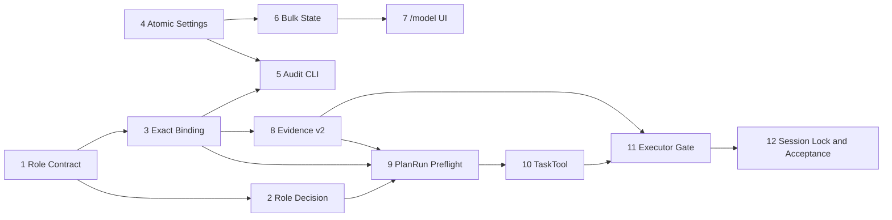

# OMP 模型角色批量分配与严格路由实现计划

> **面向 AI 代理的工作者：** 必需子技能：使用 `superpowers:subagent-driven-development`（推荐）或 `superpowers:executing-plans` 逐任务实现此计划。步骤使用复选框（`- [ ]`）语法来跟踪进度。

**目标：** 让角色任务从 `/model` 中为已验证角色配置的精确 `provider/modelId[:thinking]` 启动，并在整个执行期间禁止任何模型回退、替换或提升；同时提供终端批量角色分配和可验收的阶段级路由证据。

**架构：** 在保留普通 `TaskTool -> resolveTaskModelRouting -> runSubprocess` 兼容路径的前提下，增加严格角色执行通道。该通道按“角色决策 → 契约校验 → 精确模型绑定 → preflight evidence → 执行器二次校验 → 锁定 AgentSession”传递不可变对象。`/model` 批量操作通过 `Settings.setModelRolesAtomic()` 进行单次、可等待、可回滚的持久化写入。

**技术栈：** TypeScript、Bun、`bun:test`、Biome、tsgo、现有 OMP TUI、YAML Settings、`withFileLock`、ModelRegistry、Codex Plan Run。

---

## 1. 计划依据与范围锁定

### 1.1 已核对的代码链路

本计划基于 `docs/TRD/2026-07-10-omp-model-role-bulk-assignment-strict-routing-trd.md`，并已用代码图谱确认以下实际锚点：

| 链路 | 当前入口 | 关键现状 | 本计划的改动边界 |
| --- | --- | --- | --- |
| 模型选择 | `modes/components/model-selector.ts` 的 `#updateMenu()` | 当前菜单仅有单角色和 thinking 两级操作 | 新增独立批量状态机，不重写模型列表 |
| 角色持久化 | `config/settings.ts` 的 `setModelRole()`、`#saveNow()` | 单角色、异步防抖、保存错误被吞掉、直接 `Bun.write` | 新增严格批量事务；普通 `set()` 语义不变 |
| 普通任务路由 | `task/model-routing.ts` 的 `resolveTaskModelRouting()` | 允许从 `role` 推断、agent 覆盖、fallback roles、别名解析 | 保持原函数和现有测试不变 |
| 子代理启动 | `task/index.ts` 的 `TaskTool.#runSpawn()` | 当前总是构造兼容路由并传给 `runSubprocess()` | 新增内部严格入口和不可变执行计划 |
| 执行器 | `task/executor.ts` 的 `runSubprocess()` | 可解析 auth fallback、parent active model 和 retry fallback | 严格分支绕过所有模型替代逻辑 |
| 会话提升 | `session/agent-session.ts` 的 `#tryContextPromotion()` | 上下文溢出时可提升模型 | 严格模型锁直接拒绝提升 |
| PlanRun | `codex-plan-run/role-bound-stage-scheduler.ts`、`plan-run-spawn-adapter.ts` | 每个阶段已有稳定 `role_id` | 固定阶段直接产生 `explicit_stage` 决策 |
| 路由证据 | `codex-plan-run/model-routing-evidence.ts` | v1 以 task 为粒度直接写 JSON | 升级 v2，写到 task/stage 粒度并原子更新 |

### 1.2 范围内

- `/model` 动作菜单首项 `Assign to roles...`；
- 一次选择多个角色、统一 thinking、预览和事务保存；
- 内置与自定义角色的“可配置”和“可严格执行”分离；
- 规则/Advisor/PlanRun 显式阶段的角色决策；
- 严格模型的精确解析、执行期锁定和 Evidence；
- `omp models roles --check[ --json]` 配置审计；
- 现有普通 Task 路由的兼容回归。

### 1.3 明确不在本计划中

- 自动选取更便宜、延迟更低或健康度更高的替代模型；
- 自动猜测旧 alias 应迁移到哪个模型；
- 把普通 Task 的 fallback 逻辑改造成严格逻辑；
- 用一个主角色覆盖 PlanRun 的所有固定阶段；
- 把完整任务正文、密钥或 provider 响应写入证据文件。

### 1.4 文件结构决策

| 文件 | 操作 | 单一职责 |
| --- | --- | --- |
| `packages/coding-agent/src/config/model-roles.ts` | 修改 | 扩展可执行 Role Contract 元信息和稳定角色读取 |
| `packages/coding-agent/src/task/role-contract-validator.ts` | 创建 | 只校验角色契约、阶段和权限 |
| `packages/coding-agent/src/task/role-decision-engine.ts` | 创建 | 只产生可解释的角色决策和 Advisor 接口 |
| `packages/coding-agent/src/task/strict-role-model-binding.ts` | 创建 | 只解析精确模型选择器和生成 binding hash |
| `packages/coding-agent/src/task/strict-role-execution.ts` | 创建 | 聚合决策、契约、绑定与 Evidence 位置 |
| `packages/coding-agent/src/config/settings.ts` | 修改 | 增加严格批量原子写入，不改变通用保存合同 |
| `packages/coding-agent/src/config/model-role-assignment-service.ts` | 创建 | 校验批量请求并协调 Settings 写入 |
| `packages/coding-agent/src/config/role-model-audit.ts` | 创建 | 复用严格解析规则审计配置 |
| `packages/coding-agent/src/cli/models-cli.ts` | 修改 | 增加 `models roles --check` 命令接线 |
| `packages/coding-agent/src/modes/components/model-role-bulk-assignment.ts` | 创建 | 纯 reducer 和批量界面渲染数据 |
| `packages/coding-agent/src/modes/components/model-selector.ts` | 修改 | 组合批量状态机，不复制业务规则 |
| `packages/coding-agent/src/modes/controllers/selector-controller.ts` | 修改 | 把 UI 请求交给 AssignmentService |
| `packages/coding-agent/src/codex-plan-run/model-routing-evidence.ts` | 修改 | v2 schema、原子更新、验收校验 |
| `packages/coding-agent/src/codex-plan-run/role-bound-stage-scheduler.ts` | 修改 | 为阶段生成显式角色决策上下文 |
| `packages/coding-agent/src/codex-plan-run/plan-run-spawn-adapter.ts` | 修改 | 调用严格 TaskTool 内部入口并回传阶段 evidence |
| `packages/coding-agent/src/codex-plan-run/driver.ts` | 修改 | 汇总并验收每个阶段的 v2 evidence |
| `packages/coding-agent/src/task/types.ts` | 修改 | 增加内部严格执行上下文类型，不暴露到工具 schema |
| `packages/coding-agent/src/task/index.ts` | 修改 | 添加 `executeRoleBound()` 并保持 `execute()` 兼容 |
| `packages/coding-agent/src/task/executor.ts` | 修改 | 实现严格模型 gate，跳过替代路径 |
| `packages/coding-agent/src/sdk.ts` | 修改 | 在会话创建选项中传递模型锁 |
| `packages/coding-agent/src/session/agent-session.ts` | 修改 | 在运行期强制模型锁，禁止提升和模型 fallback |

---

### 任务 1：可执行 Role Contract 与契约校验器

**文件：**

- 修改：`packages/coding-agent/src/config/model-roles.ts:125-168`
- 创建：`packages/coding-agent/src/task/role-contract-validator.ts`
- 创建：`packages/coding-agent/test/task/role-contract-validator.test.ts`
- 修改：`packages/coding-agent/src/codex-plan-run/prompt-pack.ts:21-29,104-119`
- 修改：`packages/coding-agent/test/codex-plan-run/prompt-pack.test.ts`

**目标：** 明确“能在 `/model` 中配置”不等于“能作为严格子代理执行”，并提供所有后续任务共用的契约校验结果。

- [ ] **步骤 1：编写失败的契约校验测试**

```ts
import { describe, expect, it } from "bun:test";
import { validateRoleContractForTask } from "../../src/task/role-contract-validator";

describe("validateRoleContractForTask", () => {
	it("拒绝缺少完整契约的自定义角色", () => {
		const result = validateRoleContractForTask({
			roleId: "custom:researcher",
			roleInfo: { name: "研究员" },
			requirements: { needsProductionWrite: false, needsTestWrite: false, readOnly: true },
		});

		expect(result.passed).toBe(false);
		expect(result.checks).toContainEqual(
			expect.objectContaining({ code: "contract_complete", passed: false }),
		);
	});

	it("拒绝只读角色执行生产代码写入", () => {
		const result = validateRoleContractForTask({
			roleId: "superpowers:spec-reviewer",
			roleInfo: makeExecutableRole({ readOnly: true, canEditProductionCode: false }),
			requirements: { needsProductionWrite: true, needsTestWrite: false, readOnly: false },
		});

		expect(result.passed).toBe(false);
		expect(result.checks).toContainEqual(
			expect.objectContaining({ code: "production_write_allowed", passed: false }),
		);
	});
});
```

- [ ] **步骤 2：运行测试验证失败**

运行：

```bash
bun test packages/coding-agent/test/task/role-contract-validator.test.ts
```

预期：FAIL，报错包含 `Cannot find module '../../src/task/role-contract-validator'`。

- [ ] **步骤 3：扩展角色元信息并实现最小校验器**

在 `model-roles.ts` 增加严格契约所需的可选元信息；不要删除现有 `fallbackRoleIds`，因为普通路由仍依赖它。

```ts
export interface RoleRoutingHints {
	keywords?: string[];
	pathPatterns?: string[];
	classificationFlags?: string[];
	runtimeSurfaces?: string[];
	stageIds?: string[];
}

export interface ModelRoleInfo {
	// 保留已有字段
	contractVersion?: string;
	allowedStageIds?: string[];
	routingHints?: RoleRoutingHints;
}
```

创建 `role-contract-validator.ts`：

```ts
export interface TaskOperationRequirements {
	needsProductionWrite: boolean;
	needsTestWrite: boolean;
	readOnly: boolean;
	stageId?: string;
}

export interface RoleContractCheck {
	code:
		| "role_exists"
		| "contract_complete"
		| "subagent_allowed"
		| "stage_allowed"
		| "production_write_allowed"
		| "test_write_allowed"
		| "readonly_compatible";
	passed: boolean;
	message: string;
}

export function validateRoleContractForTask(input: {
	roleId: string;
	roleInfo?: ModelRoleInfo;
	requirements: TaskOperationRequirements;
}): RoleContractValidationResult {
	const info = input.roleInfo;
	const complete = Boolean(
		info?.contractVersion &&
		info.capabilities?.length &&
		info.canRunAsSubagent !== undefined &&
		info.readOnly !== undefined &&
		info.canEditProductionCode !== undefined &&
		info.canEditTestCode !== undefined,
	);
	const checks: RoleContractCheck[] = [
		{ code: "role_exists", passed: info !== undefined, message: `角色 ${input.roleId} ${info ? "存在" : "不存在"}` },
		{ code: "contract_complete", passed: complete, message: complete ? "Role Contract 完整" : "Role Contract 缺少严格执行字段" },
		{ code: "subagent_allowed", passed: info?.canRunAsSubagent === true, message: "角色必须允许作为子代理执行" },
		{ code: "stage_allowed", passed: !input.requirements.stageId || !info?.allowedStageIds || info.allowedStageIds.includes(input.requirements.stageId), message: "角色不允许执行当前阶段" },
		{ code: "production_write_allowed", passed: !input.requirements.needsProductionWrite || info?.canEditProductionCode === true, message: "角色没有生产代码写权限" },
		{ code: "test_write_allowed", passed: !input.requirements.needsTestWrite || info?.canEditTestCode === true, message: "角色没有测试代码写权限" },
		{ code: "readonly_compatible", passed: !input.requirements.readOnly || info?.readOnly === true, message: "只读任务只能分配给只读角色" },
	];
	return { passed: checks.every(check => check.passed), roleId: input.roleId, contractVersion: info?.contractVersion, checks };
}
```

同步修改 `prompt-pack.ts`，让 `roleContract()` 使用经登记的 `contractVersion` 并保留当前面向提示词的中文字段；不得把未知角色的默认文案视作完整执行契约。

- [ ] **步骤 4：运行相关测试验证通过**

运行：

```bash
bun test packages/coding-agent/test/task/role-contract-validator.test.ts packages/coding-agent/test/codex-plan-run/prompt-pack.test.ts
```

预期：PASS；内置角色能生成完整校验结果，自定义弱角色被标为不可执行。

- [ ] **步骤 5：提交**

```bash
git add packages/coding-agent/src/config/model-roles.ts packages/coding-agent/src/task/role-contract-validator.ts packages/coding-agent/src/codex-plan-run/prompt-pack.ts packages/coding-agent/test/task/role-contract-validator.test.ts packages/coding-agent/test/codex-plan-run/prompt-pack.test.ts
git commit -m "功能：新增严格角色契约校验"
```

### 任务 2：可解释的角色决策与 Advisor 仲裁接口

**文件：**

- 创建：`packages/coding-agent/src/task/role-decision-engine.ts`
- 创建：`packages/coding-agent/test/task/role-decision-engine.test.ts`
- 修改：`packages/coding-agent/src/config/model-roles.ts`

**目标：** 让普通角色任务只有在规则高置信时自动选角色；模糊输入只能由受限 Advisor 仲裁；PlanRun 固定阶段无需猜测。

- [ ] **步骤 1：编写失败的决策测试**

```ts
it("固定阶段直接产生 explicit_stage 决策", async () => {
	const decision = await decideRole({
		taskId: "t-1",
		stageId: "implementer",
		explicitRoleId: "superpowers:implementer",
		source: "plan_run",
		assignment: "实现登录页面",
		requirements: readWriteRequirements,
	});

	expect(decision).toMatchObject({
		source: "explicit_stage",
		selectedRoleId: "superpowers:implementer",
		confidence: 1,
	});
});

it("分数接近时只允许 Advisor 从候选角色中选择", async () => {
	const advisor = { chooseRole: async () => ({ selectedRoleId: "superpowers:designer", confidence: 0.72, reasons: ["UI 任务"] }) };
	const decision = await decideRole(ambiguousDesignTask, { advisor });

	expect(decision.source).toBe("advisor");
	expect(decision.selectedRoleId).toBe("superpowers:designer");
});

it("Advisor 返回候选集外角色时阻断", async () => {
	await expect(decideRole(ambiguousDesignTask, {
		advisor: { chooseRole: async () => ({ selectedRoleId: "superpowers:commit", confidence: 1, reasons: [] }) },
	})).rejects.toMatchObject({ code: "advisor_unavailable" });
});
```

- [ ] **步骤 2：运行测试验证失败**

运行：

```bash
bun test packages/coding-agent/test/task/role-decision-engine.test.ts
```

预期：FAIL，报错包含 `Cannot find module '../../src/task/role-decision-engine'`。

- [ ] **步骤 3：实现最小、确定性的决策引擎**

```ts
export type RoleDecisionSource = "explicit_stage" | "explicit_user" | "rule" | "advisor";

export interface RoleRoutingDecision {
	schemaVersion: 1;
	decisionId: string;
	source: RoleDecisionSource;
	selectedRoleId: string;
	confidence: number;
	candidates: RoleCandidate[];
	reasons: string[];
	taskFingerprint: string;
	createdAt: string;
	advisor?: { roleId: "superpowers:advisor"; decisionId: string; configuredModelSelector: string };
}

export interface RoleAdvisorArbitrator {
	chooseRole(input: { task: TaskRoleRoutingInput; candidates: RoleCandidate[]; allowedRoleIds: string[] }): Promise<AdvisorRoleDecision>;
}

export async function decideRole(input: TaskRoleRoutingInput, deps: RoleDecisionDependencies): Promise<RoleRoutingDecision> {
	if (input.source === "plan_run" && input.explicitRoleId) return explicitStageDecision(input);
	if (input.explicitRoleId) return explicitUserDecision(input, deps);
	const candidates = scoreCandidates(input, deps.roles).filter(candidate => candidate.contractStatus === "complete");
	const [top, second] = candidates;
	if (top && top.score >= 0.85 && top.score - (second?.score ?? 0) >= 0.2) return ruleDecision(input, top, candidates);
	return advisorDecision(input, candidates, deps.advisor);
}
```

实现约束：

- `role` 展示名称不得转换为技术 `roleId`；
- 评分信号只能来自 `routingHints`、路径、分类标记和任务权限；
- 候选按“分数降序、契约完整、roleId 字典序”排序；
- Advisor 输出必须属于 `allowedRoleIds`；
- Advisor 失败返回 `advisor_unavailable`，不降级到 default 模型或任意角色。

- [ ] **步骤 4：运行测试验证通过**

运行：

```bash
bun test packages/coding-agent/test/task/role-decision-engine.test.ts packages/coding-agent/test/task/role-contract-validator.test.ts
```

预期：PASS；所有决策都含稳定 `selectedRoleId`、来源和候选证据。

- [ ] **步骤 5：提交**

```bash
git add packages/coding-agent/src/task/role-decision-engine.ts packages/coding-agent/src/config/model-roles.ts packages/coding-agent/test/task/role-decision-engine.test.ts
git commit -m "功能：新增任务角色决策与仲裁接口"
```

### 任务 3：精确模型绑定解析器

**文件：**

- 创建：`packages/coding-agent/src/task/strict-role-model-binding.ts`
- 创建：`packages/coding-agent/test/task/strict-role-model-binding.test.ts`
- 修改：`packages/coding-agent/src/config/model-resolver.ts`

**目标：** 只从已验证角色的 `settings.getModelRole(roleId)` 取得选择器，并只在 `ModelRegistry.getAvailable()` 中精确匹配 provider 和 model ID。

- [ ] **步骤 1：编写失败的精确匹配测试**

```ts
it("只接受精确 provider/model，不调用 alias 或 OpenRouter fallback", () => {
	const binding = resolveStrictRoleModelBinding({
		validatedRoleId: "superpowers:implementer",
		contract: validContract,
		settings: settingsWith("superpowers:implementer", "openai/gpt-5.2-codex:high"),
		availableModels: [model("openai", "gpt-5.2-codex")],
	});

	expect(binding).toMatchObject({ provider: "openai", modelId: "gpt-5.2-codex", thinkingLevel: "high" });
});

it("拒绝 canonical、alias 与没有 provider 的选择器", () => {
	for (const selector of ["gpt-5.2-codex", "pi/implementer", "openrouter/*"]) {
		expect(() => resolveWith(selector)).toThrow(expect.objectContaining({ code: "role_model_not_concrete" }));
	}
});

it("保留模型 ID 内的冒号，只剥离合法 thinking 后缀", () => {
	const binding = resolveWith("ollama/qwen3:32b:high");
	expect(binding.modelId).toBe("qwen3:32b");
	expect(binding.thinkingLevel).toBe("high");
});
```

- [ ] **步骤 2：运行测试验证失败**

运行：

```bash
bun test packages/coding-agent/test/task/strict-role-model-binding.test.ts
```

预期：FAIL，报错包含 `Cannot find module '../../src/task/strict-role-model-binding'`。

- [ ] **步骤 3：实现严格选择器解析和 binding hash**

在 `model-resolver.ts` 增加不复用 `resolveProviderModelReference()` 的精确查找函数：

```ts
export function findExactConcreteModelReference(
	provider: string,
	modelId: string,
	availableModels: readonly Model<Api>[],
): Model<Api> | undefined {
	return availableModels.find(model => model.provider === provider && model.id === modelId);
}
```

创建严格绑定模块：

```ts
export interface StrictRoleModelBinding {
	schemaVersion: 1;
	roleId: string;
	configuredSelector: string;
	provider: string;
	modelId: string;
	model: Model<Api>;
	thinkingLevel?: ThinkingLevel;
	thinkingSource: "explicit" | "model_default";
	canonicalSelector: string;
	bindingHash: string;
	createdAt: string;
}

export function resolveStrictRoleModelBinding(input: StrictRoleModelResolverInput): StrictRoleModelBinding {
	const configuredSelector = input.settings.getModelRole(input.validatedRoleId);
	if (!configuredSelector) throw strictError("role_model_unconfigured", input.validatedRoleId);
	const { selector, thinkingLevel } = splitThinkingSuffix(configuredSelector);
	const slash = selector.indexOf("/");
	if (slash <= 0 || slash === selector.length - 1 || selector.includes("*") || selector.startsWith("pi/")) {
		throw strictError("role_model_not_concrete", input.validatedRoleId);
	}
	const provider = selector.slice(0, slash);
	const modelId = selector.slice(slash + 1);
	const model = findExactConcreteModelReference(provider, modelId, input.availableModels);
	if (!model) throw strictError("role_model_unavailable", input.validatedRoleId);
	assertThinkingSupported(model, thinkingLevel);
	return createStrictBinding({ roleId: input.validatedRoleId, configuredSelector, provider, modelId, model, thinkingLevel });
}
```

`createStrictBinding()` 必须对 role、selector、provider、modelId、thinkingLevel、contractVersion 做稳定 JSON 序列化后计算 SHA-256。不要调用 variant alias、Bedrock profile、OpenRouter fallback 或 clone helper。

- [ ] **步骤 4：运行测试验证通过并守住旧解析器合同**

运行：

```bash
bun test packages/coding-agent/test/task/strict-role-model-binding.test.ts packages/coding-agent/test/task/model-routing.test.ts
```

预期：PASS；严格解析拒绝替代，旧 `resolveTaskModelRouting()` fallback 断言仍通过。

- [ ] **步骤 5：提交**

```bash
git add packages/coding-agent/src/task/strict-role-model-binding.ts packages/coding-agent/src/config/model-resolver.ts packages/coding-agent/test/task/strict-role-model-binding.test.ts
git commit -m "功能：新增角色精确模型绑定解析"
```

### 任务 4：Settings 批量原子写入

**文件：**

- 修改：`packages/coding-agent/src/config/settings.ts:374-441,594-611,1269-1316`
- 创建：`packages/coding-agent/src/config/model-role-assignment-service.ts`
- 创建：`packages/coding-agent/test/config/model-role-batch-settings.test.ts`
- 创建：`packages/coding-agent/test/config/model-role-assignment-service.test.ts`

**目标：** 让多角色模型分配只有一个成功结果：全部写入并持久化，或全部恢复到原值。

- [ ] **步骤 1：编写失败的事务测试**

```ts
it("一次批量更新只持久化一次并保留既有 runtime override", async () => {
	const settings = await createPersistedSettings({ modelRoles: { "superpowers:implementer": "old/a" } });
	settings.override("modelRoles", { "superpowers:implementer": "old/a" });

	const result = await settings.setModelRolesAtomic({
		"superpowers:implementer": "openai/gpt-5.2-codex:high",
		"superpowers:test-runner": "openai/gpt-5.2-codex:high",
	});

	expect(result.changedRoleIds).toEqual(["superpowers:implementer", "superpowers:test-runner"]);
	expect(writeSpy).toHaveBeenCalledTimes(1);
	expect(settings.getModelRole("superpowers:implementer")).toBe("openai/gpt-5.2-codex:high");
});

it("rename 失败时恢复内存、override 与磁盘原文件", async () => {
	const settings = await createPersistedSettings({ modelRoles: { default: "old/model" } });
	await expect(settings.setModelRolesAtomic({ default: "new/model" })).rejects.toThrow("SettingsPersistenceError");

	expect(settings.getModelRole("default")).toBe("old/model");
	expect(await readConfigRole()).toBe("old/model");
});
```

- [ ] **步骤 2：运行测试验证失败**

运行：

```bash
bun test packages/coding-agent/test/config/model-role-batch-settings.test.ts packages/coding-agent/test/config/model-role-assignment-service.test.ts
```

预期：FAIL，报错包含 `setModelRolesAtomic is not a function`。

- [ ] **步骤 3：实现严格保存路径和事务 API**

```ts
export interface ModelRoleBatchUpdateResult {
	changedRoleIds: string[];
	unchangedRoleIds: string[];
	previous: Record<string, string | undefined>;
	next: Record<string, string>;
	persisted: boolean;
}

async setModelRolesAtomic(assignments: Readonly<Record<string, string>>): Promise<ModelRoleBatchUpdateResult> {
	const normalized = normalizeAssignments(assignments);
	const snapshot = this.#snapshotModelRolesState();
	try {
		const result = await this.#writeModelRolesAtomic(normalized);
		this.#rebuildMerged();
		this.#notifyModelRolesChanged(result.changedRoleIds);
		return result;
	} catch (error) {
		this.#restoreModelRolesState(snapshot);
		throw new SettingsPersistenceError("模型角色批量保存失败", { cause: error });
	}
}
```

`#writeModelRolesAtomic()` 在现有 `withFileLock(configPath, ...)` 内重新读取 YAML，只合并 `modelRoles`；写入同目录临时文件并 `rename` 覆盖目标。现有 `#saveNow()` 继续捕获并重试，不能改成抛错。严格 API 必须使用独立的 `#saveModelRolesAtomic()`，不走防抖队列。

创建 AssignmentService：

```ts
export async function assignModelToRoles(request: ModelRoleBulkAssignmentRequest, deps: AssignmentDependencies) {
	assertConcreteSelector(request.selector);
	const roleIds = [...new Set(request.roleIds)].sort();
	assertKnownOrCustomRoles(roleIds, deps.settings);
	return deps.settings.setModelRolesAtomic(Object.fromEntries(roleIds.map(roleId => [roleId, request.selector])));
}
```

- [ ] **步骤 4：运行测试验证通过**

运行：

```bash
bun test packages/coding-agent/test/config/model-role-batch-settings.test.ts packages/coding-agent/test/config/model-role-assignment-service.test.ts
bun test packages/coding-agent/test/task/model-routing.test.ts
```

预期：PASS；事务失败不留下部分内存状态，普通角色单写和普通路由仍通过。

- [ ] **步骤 5：提交**

```bash
git add packages/coding-agent/src/config/settings.ts packages/coding-agent/src/config/model-role-assignment-service.ts packages/coding-agent/test/config/model-role-batch-settings.test.ts packages/coding-agent/test/config/model-role-assignment-service.test.ts
git commit -m "功能：支持模型角色批量原子保存"
```

### 任务 5：严格角色模型审计与 CLI

**文件：**

- 创建：`packages/coding-agent/src/config/role-model-audit.ts`
- 修改：`packages/coding-agent/src/cli/models-cli.ts:26-63,332-368`
- 创建：`packages/coding-agent/test/config/role-model-audit.test.ts`
- 创建：`packages/coding-agent/test/cli/models-roles-check.test.ts`

**目标：** 把严格解析规则复用为可脚本化诊断，避免 `/model`、PlanRun 和 CLI 各自判断配置是否有效。

- [ ] **步骤 1：编写失败的审计与 CLI 测试**

```ts
it("把 alias、未配置和不完整自定义角色分别标记为不可执行", () => {
	const entries = auditStrictRoleBindings(settings, registry);
	expect(entries).toContainEqual(expect.objectContaining({ roleId: "superpowers:implementer", modelStatus: "not_concrete", executable: false }));
	expect(entries).toContainEqual(expect.objectContaining({ roleId: "custom:researcher", contractStatus: "incomplete", executable: false }));
});

it("models roles --check --json 在存在无效角色时返回退出码 1", async () => {
	const result = await runModelsCommandForTest(["roles", "--check", "--json"]);
	expect(result.exitCode).toBe(1);
	expect(JSON.parse(result.stdout)).toEqual(expect.objectContaining({ entries: expect.any(Array) }));
});
```

- [ ] **步骤 2：运行测试验证失败**

运行：

```bash
bun test packages/coding-agent/test/config/role-model-audit.test.ts packages/coding-agent/test/cli/models-roles-check.test.ts
```

预期：FAIL，报错包含 `Cannot find module '../../src/config/role-model-audit'`。

- [ ] **步骤 3：实现审计服务并接入已有 models CLI**

```ts
export function auditStrictRoleBindings(settings: Settings, registry: ModelRegistry): RoleModelAuditEntry[] {
	return getKnownRoleIds(settings).map(roleId => {
		const contract = validateRoleContractForTask({ roleId, roleInfo: getRoleInfo(roleId, settings), requirements: readOnlyAuditRequirements });
		try {
			resolveStrictRoleModelBinding({ validatedRoleId: roleId, contract: assertValidatedContract(contract), settings, availableModels: registry.getAvailable() });
			return { roleId, selector: settings.getModelRole(roleId), contractStatus: "complete", modelStatus: "valid", executable: true, message: "严格绑定有效" };
		} catch (error) {
			return toAuditEntry(roleId, settings.getModelRole(roleId), contract, error);
		}
	});
}
```

在 `models-cli.ts` 的既有参数解析中增加 `roles` 子命令：

```ts
if (args[0] === "roles" && args.includes("--check")) {
	const report = auditStrictRoleBindings(settings, modelRegistry);
	writeRoleAudit(report, args.includes("--json"));
	return report.every(entry => entry.executable) ? 0 : 1;
}
```

保留已有 `omp models` 列表和 JSON 输出合同；`roles` 只消费 `--check` 和 `--json`，其他参数仍由现有错误路径处理。

- [ ] **步骤 4：运行测试验证通过**

运行：

```bash
bun test packages/coding-agent/test/config/role-model-audit.test.ts packages/coding-agent/test/cli/models-roles-check.test.ts
```

预期：PASS；无效严格角色返回 1，所有必需角色有效时返回 0。

- [ ] **步骤 5：提交**

```bash
git add packages/coding-agent/src/config/role-model-audit.ts packages/coding-agent/src/cli/models-cli.ts packages/coding-agent/test/config/role-model-audit.test.ts packages/coding-agent/test/cli/models-roles-check.test.ts
git commit -m "功能：新增严格角色模型配置审计"
```

### 任务 6：批量角色分配纯状态机

**文件：**

- 创建：`packages/coding-agent/src/modes/components/model-role-bulk-assignment.ts`
- 创建：`packages/coding-agent/test/model-role-bulk-assignment.test.ts`

**目标：** 把选择、预览、回退和保存中状态从 `ModelSelectorComponent` 拆开，保证 TUI 接线前已可独立测试。

- [ ] **步骤 1：编写失败的 reducer 测试**

```ts
it("从角色选择进入预览时仅展示实际变更", () => {
	let state = createBulkAssignmentState(fixture);
	state = reduceBulkAssignment(state, { type: "toggle_role", roleId: "superpowers:implementer" });
	state = reduceBulkAssignment(state, { type: "preview" });

	expect(state.step).toBe("preview");
	expect(state.preview).toEqual([
		expect.objectContaining({ roleId: "superpowers:implementer", changed: true }),
	]);
});

it("保存失败后保留选择与预览供用户重试", () => {
	const failed = reduceBulkAssignment(previewState, { type: "save_failed", message: "磁盘不可写" });
	expect(failed.step).toBe("error");
	expect(failed.selectedRoleIds.has("superpowers:implementer")).toBe(true);
	expect(failed.preview).toHaveLength(1);
});
```

- [ ] **步骤 2：运行测试验证失败**

运行：

```bash
bun test packages/coding-agent/test/model-role-bulk-assignment.test.ts
```

预期：FAIL，报错包含 `Cannot find module '../src/modes/components/model-role-bulk-assignment'`。

- [ ] **步骤 3：实现 reducer 和渲染数据构造器**

```ts
export type BulkAssignmentStep = "thinking" | "roles" | "preview" | "saving" | "error";

export interface ModelRoleBulkAssignmentState {
	step: BulkAssignmentStep;
	modelSelector: string;
	thinkingLevel?: ThinkingLevel;
	roles: BulkAssignableRole[];
	selectedRoleIds: ReadonlySet<string>;
	initialAssignments: Record<string, string | undefined>;
	preview: ModelRoleAssignmentChange[];
	cursor: number;
	error?: string;
}

export function reduceBulkAssignment(state: ModelRoleBulkAssignmentState, action: ModelRoleBulkAssignmentAction): ModelRoleBulkAssignmentState {
	switch (action.type) {
		case "toggle_role": return toggleRole(state, action.roleId);
		case "preview": return { ...state, step: "preview", preview: buildPreview(state) };
		case "save_started": return { ...state, step: "saving", error: undefined };
		case "save_failed": return { ...state, step: "error", error: action.message };
		case "back": return backOneStep(state);
	}
}
```

`buildPreview()` 必须只取 selected role，并按 UI 排序；无选择时禁止进入 preview。模型选择器为 canonical、glob 或 alias 时 `createBulkAssignmentState()` 返回可展示的 `notConcreteReason`，不创建可保存状态。

- [ ] **步骤 4：运行测试验证通过**

运行：

```bash
bun test packages/coding-agent/test/model-role-bulk-assignment.test.ts
```

预期：PASS；选择、Esc 返回、预览、失败重试和 canonical 阻断均稳定。

- [ ] **步骤 5：提交**

```bash
git add packages/coding-agent/src/modes/components/model-role-bulk-assignment.ts packages/coding-agent/test/model-role-bulk-assignment.test.ts
git commit -m "功能：新增模型角色批量分配状态机"
```

### 任务 7：`/model` 菜单与控制器批量接线

**文件：**

- 修改：`packages/coding-agent/src/modes/components/model-selector.ts:186-307,994-1077,1139-1260`
- 修改：`packages/coding-agent/src/modes/controllers/selector-controller.ts:587-683`
- 修改：`packages/coding-agent/test/model-selector-role-badge-thinking.test.ts`
- 修改：`packages/coding-agent/test/model-role-bulk-assignment.test.ts`

**目标：** 使用现有 TUI 风格把纯状态机接入 `/model`，并只在服务端保存成功后刷新 role model 显示。

- [ ] **步骤 1：编写失败的菜单和键盘测试**

```ts
it("将 Assign to roles... 固定放在模型动作菜单第一项", () => {
	const selector = createSelectorWithConcreteModel();
	selector.handleInput(key("ENTER"));
	expect(renderSelector(selector)).toContain("Assign to roles...");
	expect(firstActionLabel(selector)).toBe("Assign to roles...");
});

it("确认批量预览后只调用一次异步批量回调", async () => {
	const onBulkRoleSelect = mock(async () => successfulBatchResult);
	const selector = createSelectorWithConcreteModel({ onBulkRoleSelect });
	await selectRolesAndConfirm(selector, ["superpowers:implementer", "superpowers:test-runner"]);
	expect(onBulkRoleSelect).toHaveBeenCalledTimes(1);
});
```

- [ ] **步骤 2：运行测试验证失败**

运行：

```bash
bun test packages/coding-agent/test/model-selector-role-badge-thinking.test.ts packages/coding-agent/test/model-role-bulk-assignment.test.ts
```

预期：FAIL，断言找不到 `Assign to roles...` 或缺少 `onBulkRoleSelect`。

- [ ] **步骤 3：扩展 ModelSelector 的可选回调并接入 reducer**

```ts
export interface ModelSelectorOptions {
	// 现有字段保持不变
	onBulkRoleSelect?: (request: ModelRoleBulkAssignmentRequest) => Promise<ModelRoleBatchUpdateResult>;
}

private #buildMenuRoleActions(model: Model<Api>): ModelMenuAction[] {
	return [
		{ kind: "bulk_roles", label: "Assign to roles...", enabled: isConcreteModel(model) },
		...this.#existingRoleActions(model),
	];
}
```

在 `#handleMenuInput()` 中处理 `bulk_roles`、thinking、roles、preview 和 saving；使用 `#updateMenu()` 既有的滚动窗口和 `visibleWidth()` 计算方式渲染，不新建第二套浮层。对 canonical 项显示：

```text
该模型是聚合别名，不能用于严格角色绑定。请选择具体的 provider/model。
```

控制器只做依赖注入：

```ts
onBulkRoleSelect: request => assignModelToRoles(request, {
	settings: this.settings,
	modelRegistry: this.modelRegistry,
}),
```

成功后调用现有角色模型刷新逻辑；失败时让 selector 的 reducer 进入 error，不调用 `setModelRole()` 循环补偿。

- [ ] **步骤 4：运行测试验证通过并做窄终端人工烟测**

运行：

```bash
bun test packages/coding-agent/test/model-selector-role-badge-thinking.test.ts packages/coding-agent/test/model-role-bulk-assignment.test.ts
```

预期：PASS。

人工烟测：启动本地 OMP，在 80 列终端执行 `/model`，选一个具体模型，进入 `Assign to roles...`，选择两个角色，确认预览后检查 `omp models roles --check` 输出。

- [ ] **步骤 5：提交**

```bash
git add packages/coding-agent/src/modes/components/model-selector.ts packages/coding-agent/src/modes/controllers/selector-controller.ts packages/coding-agent/test/model-selector-role-badge-thinking.test.ts packages/coding-agent/test/model-role-bulk-assignment.test.ts
git commit -m "功能：在模型选择器支持批量角色分配"
```

### 任务 8：路由 Evidence v2 与阶段安全原子写入

**文件：**

- 修改：`packages/coding-agent/src/codex-plan-run/model-routing-evidence.ts:11-90`
- 创建：`packages/coding-agent/test/codex-plan-run/model-routing-evidence-v2.test.ts`
- 修改：`packages/coding-agent/test/codex-plan-run/model-routing-evidence.test.ts`

**目标：** 用一次可更新的 v2 文件记录“角色为何被选中、模型如何绑定、实际模型是否一致”，并杜绝多阶段覆盖同一 task 文件。

- [ ] **步骤 1：编写失败的 v2 Evidence 测试**

```ts
it("为同一 task 的两个阶段写入不同 evidence 路径", async () => {
	const implementer = await writeModelRoutingEvidenceV2(makeEvidence({ task_id: "t-1", stage_id: "implementer" }), acceptingDir);
	const reviewer = await writeModelRoutingEvidenceV2(makeEvidence({ task_id: "t-1", stage_id: "spec-reviewer" }), acceptingDir);

	expect(implementer).toEndWith("tasks/t-1/stages/implementer/model-routing-evidence.json");
	expect(reviewer).toEndWith("tasks/t-1/stages/spec-reviewer/model-routing-evidence.json");
});

it("actual exact_match 为 false 时验收失败", () => {
	const errors = validateModelRoutingEvidenceForAcceptance(makeEvidence({
		status: "completed",
		actual: { ...exactActual, exact_match: false },
	}));
	expect(errors).toContain("实际模型与严格绑定不一致");
});
```

- [ ] **步骤 2：运行测试验证失败**

运行：

```bash
bun test packages/coding-agent/test/codex-plan-run/model-routing-evidence-v2.test.ts
```

预期：FAIL，报错包含 `writeModelRoutingEvidenceV2 is not a function`。

- [ ] **步骤 3：升级 schema、状态迁移和原子写入**

```ts
export interface ModelRoutingEvidenceV2 {
	schema_version: 2;
	run_id?: string;
	task_id: string;
	stage_id?: string;
	status: "preflight_passed" | "blocked" | "started" | "completed" | "acceptance_failed";
	role_decision: EvidenceRoleDecision;
	contract_validation: EvidenceContractValidation;
	model_binding: EvidenceModelBinding;
	actual?: EvidenceActualModel;
	timestamps: EvidenceTimestamps;
	error?: { code: StrictRoleRoutingErrorCode; message: string };
}

export async function writeModelRoutingEvidenceV2(evidence: ModelRoutingEvidenceV2, acceptingDir: string): Promise<string> {
	const dir = evidence.stage_id
		? join(acceptingDir, "tasks", safePathSegment(evidence.task_id), "stages", safePathSegment(evidence.stage_id))
		: join(acceptingDir, "tasks", safePathSegment(evidence.task_id));
	await mkdir(dir, { recursive: true });
	const target = join(dir, "model-routing-evidence.json");
	await writeJsonAtomically(target, evidence);
	return target;
}
```

`writeJsonAtomically()` 需要写同目录临时文件后重命名。实现合法状态迁移校验，禁止跨 run/task/stage 覆盖。保留 v1 读取兼容，仅将 v2 严格任务交给新的验收规则。

- [ ] **步骤 4：运行测试验证通过**

运行：

```bash
bun test packages/coding-agent/test/codex-plan-run/model-routing-evidence-v2.test.ts packages/coding-agent/test/codex-plan-run/model-routing-evidence.test.ts
```

预期：PASS；v1 测试继续通过，v2 能拒绝 fallback、parent model、context promotion 和缺少 actual 的 completed 状态。

- [ ] **步骤 5：提交**

```bash
git add packages/coding-agent/src/codex-plan-run/model-routing-evidence.ts packages/coding-agent/test/codex-plan-run/model-routing-evidence-v2.test.ts packages/coding-agent/test/codex-plan-run/model-routing-evidence.test.ts
git commit -m "功能：升级阶段级模型路由证据"
```

### 任务 9：PlanRun 固定阶段的严格 preflight

**文件：**

- 修改：`packages/coding-agent/src/codex-plan-run/role-bound-stage-scheduler.ts:42-55`
- 创建：`packages/coding-agent/test/codex-plan-run/strict-role-stage-preflight.test.ts`
- 修改：`packages/coding-agent/test/codex-plan-run/role-bound-stage-scheduler.test.ts`

**目标：** 每个 PlanRun 阶段直接使用模板 `role_id`，在调用 runner 前完成契约、模型和 preflight Evidence，且每阶段拥有独立路径。

- [ ] **步骤 1：编写失败的阶段 preflight 测试**

```ts
it("implementer 阶段生成 explicit_stage 决策和其角色模型绑定", async () => {
	const plan = await buildStrictStageExecutionPlan(makeStageInput({ stageId: "implementer", roleId: "superpowers:implementer" }));

	expect(plan.decision).toMatchObject({ source: "explicit_stage", selectedRoleId: "superpowers:implementer" });
	expect(plan.evidence.path).toContain("tasks/t-1/stages/implementer/model-routing-evidence.json");
});

it("阶段模型未配置时不产生严格执行计划", async () => {
	await expect(buildStrictStageExecutionPlan(unconfiguredStage)).rejects.toMatchObject({ code: "role_model_unconfigured" });
});
```

- [ ] **步骤 2：运行测试验证失败**

运行：

```bash
bun test packages/coding-agent/test/codex-plan-run/strict-role-stage-preflight.test.ts
```

预期：FAIL，报错包含缺少 `roleDecision` 或 runner 在未配置模型时仍被调用。

- [ ] **步骤 3：把不可变严格计划放进阶段上下文**

```ts
export interface RoleBoundStageRunInput {
	// 保留现有字段
	strictRoleExecutionPlan: StrictRoleExecutionPlan;
}

export async function buildStrictStageExecutionPlan(input: StagePreflightInput): Promise<StrictRoleExecutionPlan> {
	const decision = explicitStageDecision({ taskId: input.taskId, stageId: input.stageId, explicitRoleId: input.modelRole });
	const contract = assertValidatedContract(validateRoleContractForTask({ roleId: decision.selectedRoleId, roleInfo: getRoleInfo(decision.selectedRoleId, input.settings), requirements: input.requirements }));
	const binding = resolveStrictRoleModelBinding({ validatedRoleId: decision.selectedRoleId, contract, settings: input.settings, availableModels: input.modelRegistry.getAvailable() });
	const plan = createStrictRoleExecutionPlan({ decision, contract, binding, evidenceLocation: stageEvidenceLocation(input) });
	await writeModelRoutingEvidenceV2(createPreflightEvidence(plan), input.acceptingDir);
	return plan;
}
```

`buildRoleBoundStageRunInputs()` 负责对每个固定 `promptPack.role_id` 创建严格计划。该任务只建立并测试 preflight 构造器；真正将计划交给 `TaskTool.executeRoleBound()` 的生产 adapter 接线留在任务 12，此时执行器和会话锁已经完成，避免半成品严格计划进入现有 runner。

- [ ] **步骤 4：运行 PlanRun 相关测试验证通过**

运行：

```bash
bun test packages/coding-agent/test/codex-plan-run/strict-role-stage-preflight.test.ts packages/coding-agent/test/codex-plan-run/role-bound-stage-scheduler.test.ts
```

预期：PASS；未配置、契约不完整、模型不可用都在 runner 调用前失败。

- [ ] **步骤 5：提交**

```bash
git add packages/coding-agent/src/codex-plan-run/role-bound-stage-scheduler.ts packages/coding-agent/test/codex-plan-run/strict-role-stage-preflight.test.ts packages/coding-agent/test/codex-plan-run/role-bound-stage-scheduler.test.ts
git commit -m "功能：为计划阶段增加严格角色预检"
```

### 任务 10：TaskTool 严格角色执行入口

**文件：**

- 修改：`packages/coding-agent/src/task/types.ts:272-284`
- 修改：`packages/coding-agent/src/task/index.ts:582-793,1064-1462`
- 修改：`packages/coding-agent/src/task/executor.ts:265-406`
- 创建：`packages/coding-agent/test/task/strict-role-task-tool.test.ts`
- 修改：`packages/coding-agent/test/task/task-spawn.test.ts`

**目标：** 为内部 PlanRun 和可信内部调用增加 `executeRoleBound()`，让公开工具 schema 不暴露 Evidence 路径或 binding hash。

- [ ] **步骤 1：编写失败的 TaskTool 入口测试**

```ts
it("executeRoleBound 把严格计划原样传给执行器", async () => {
	const plan = makeStrictPlan();
	await taskTool.executeRoleBound("call-1", makeTaskParams(), { strictRoleExecutionPlan: plan });

	expect(runSubprocess).toHaveBeenCalledWith(expect.objectContaining({ strictRoleExecutionPlan: plan }));
});

it("公开 Task 参数不接受 evidencePath 或 bindingHash", () => {
	const schema = taskTool.parameters;
	expect(schema.properties).not.toHaveProperty("evidencePath");
	expect(schema.properties).not.toHaveProperty("bindingHash");
});
```

- [ ] **步骤 2：运行测试验证失败**

运行：

```bash
bun test packages/coding-agent/test/task/strict-role-task-tool.test.ts packages/coding-agent/test/task/task-spawn.test.ts
```

预期：FAIL，报错包含 `executeRoleBound is not a function`。

- [ ] **步骤 3：添加仅内部可调用的执行上下文**

```ts
export interface RoleBoundExecutionContext {
	strictRoleExecutionPlan: StrictRoleExecutionPlan;
}

export class TaskTool {
	async executeRoleBound(
		toolCallId: string,
		params: TaskParams,
		context: RoleBoundExecutionContext,
	): Promise<AgentToolResult<TaskToolDetails>> {
		return this.#runSpawn(toolCallId, params, undefined, undefined, undefined, 0, false, undefined, context);
	}
}
```

将 `#runSpawn()` 最后增加可选私有参数 `roleBoundContext?: RoleBoundExecutionContext`。当它存在时：

- 不调用 `resolveTaskModelRouting()`；
- `modelRole`、`requestedModel`、`modelOverride` 只从 `strictRoleExecutionPlan.binding` 生成；
- 传给 `runSubprocess()` 的 `strictRoleExecutionPlan` 不可替换；
- 保留隔离、并发、工件和进度逻辑；
- 公开 `TaskParams` 和 `parameters` schema 不增加内部路径字段。

- [ ] **步骤 4：运行测试验证通过**

运行：

```bash
bun test packages/coding-agent/test/task/strict-role-task-tool.test.ts packages/coding-agent/test/task/task-spawn.test.ts packages/coding-agent/test/task/model-routing.test.ts
```

预期：PASS；严格入口不触发旧路由，普通 `execute()` 继续由 `resolveTaskModelRouting()` 驱动。

- [ ] **步骤 5：提交**

```bash
git add packages/coding-agent/src/task/types.ts packages/coding-agent/src/task/index.ts packages/coding-agent/src/task/executor.ts packages/coding-agent/test/task/strict-role-task-tool.test.ts packages/coding-agent/test/task/task-spawn.test.ts
git commit -m "功能：新增严格角色任务执行入口"
```

### 任务 11：Executor 严格模型 Gate 与实际模型证据

**文件：**

- 修改：`packages/coding-agent/src/task/executor.ts:142-201,1910-2584`
- 修改：`packages/coding-agent/src/task/strict-role-execution.ts`
- 创建：`packages/coding-agent/test/task/strict-role-execution.test.ts`
- 修改：`packages/coding-agent/test/task/executor-wall-clock.test.ts`

**目标：** 让严格执行器在 `createAgentSession()` 前完成二次精确匹配和 actual Evidence，且完全跳过模型替代路径。

- [ ] **步骤 1：编写失败的执行器门禁测试**

```ts
it("严格计划不调用鉴权回退、父模型回退和 retry fallback 安装", async () => {
	await runSubprocess({ ...baseOptions, strictRoleExecutionPlan: makeStrictPlan() });

	expect(resolveModelOverrideWithAuthFallback).not.toHaveBeenCalled();
	expect(installSubagentRetryFallbackChain).not.toHaveBeenCalled();
	expect(createAgentSession).toHaveBeenCalledWith(expect.objectContaining({ model: strictPlan.binding.model }));
});

it("二次精确匹配失败时不会创建会话", async () => {
	await expect(runSubprocess({ ...baseOptions, strictRoleExecutionPlan: mismatchedPlan })).rejects.toMatchObject({ code: "role_model_mismatch" });
	expect(createAgentSession).not.toHaveBeenCalled();
});

it("actual evidence 写入失败时不会创建会话", async () => {
	writeActualEvidence.mockRejectedValueOnce(new Error("disk full"));
	await expect(runSubprocess({ ...baseOptions, strictRoleExecutionPlan: makeStrictPlan() })).rejects.toMatchObject({ code: "routing_evidence_write_failed" });
	expect(createAgentSession).not.toHaveBeenCalled();
});
```

- [ ] **步骤 2：运行测试验证失败**

运行：

```bash
bun test packages/coding-agent/test/task/strict-role-execution.test.ts
```

预期：FAIL，现有执行器会走兼容模型解析或不识别 `strictRoleExecutionPlan`。

- [ ] **步骤 3：实现 strict branch 和实际 Evidence 写入**

```ts
function resolveExecutorModel(options: ExecutorOptions): ResolvedExecutorModel {
	if (!options.strictRoleExecutionPlan) return resolveLegacyExecutorModel(options);
	const binding = options.strictRoleExecutionPlan.binding;
	assertStrictRoleExecutionPlan(options.strictRoleExecutionPlan, options.modelRegistry.getAvailable());
	return { model: binding.model, thinkingLevel: binding.thinkingLevel, strict: true };
}

async function prepareStrictSession(options: ExecutorOptions, resolved: ResolvedExecutorModel): Promise<void> {
	if (!options.strictRoleExecutionPlan || !resolved.strict) return;
	await writeActualModelEvidence({
		plan: options.strictRoleExecutionPlan,
		actualModel: resolved.model,
		thinkingLevel: resolved.thinkingLevel,
		sessionCreated: false,
	});
}
```

在 `runSubprocess()` 中，严格分支必须：

- 直接使用 `binding.model`；
- 不调用 `resolveModelOverrideWithAuthFallback()`；
- 不调用 `installSubagentRetryFallbackChain()`；
- 不读取 `parentActiveModelPattern` 作为后备；
- 调用 `prepareStrictSession()` 成功后才调用 `createAgentSession()`；
- 将 `modelLock` 传入 SDK 会话创建选项；
- 在 progress 中保留 `validatedRoleId`、`configuredSelector`、`bindingHash` 与 `exactMatch: true`。

兼容分支保持原样，原有 `resolveTaskModelRouting` 测试不能被修改为严格语义。

- [ ] **步骤 4：运行执行器与旧超时测试验证通过**

运行：

```bash
bun test packages/coding-agent/test/task/strict-role-execution.test.ts packages/coding-agent/test/task/executor-wall-clock.test.ts packages/coding-agent/test/task/task-guards.test.ts
```

预期：PASS；严格路径只使用 binding 模型，普通执行器超时和守卫测试不变。

- [ ] **步骤 5：提交**

```bash
git add packages/coding-agent/src/task/executor.ts packages/coding-agent/src/task/strict-role-execution.ts packages/coding-agent/test/task/strict-role-execution.test.ts packages/coding-agent/test/task/executor-wall-clock.test.ts
git commit -m "功能：在执行器强制严格角色模型绑定"
```

### 任务 12：AgentSession 模型锁、PlanRun 验收与全量回归

**文件：**

- 修改：`packages/coding-agent/src/sdk.ts:379-567`
- 修改：`packages/coding-agent/src/session/agent-session.ts:11234-11290,12991-13304`
- 修改：`packages/coding-agent/src/codex-plan-run/plan-run-spawn-adapter.ts:116-220`
- 修改：`packages/coding-agent/src/codex-plan-run/driver.ts`
- 创建：`packages/coding-agent/test/agent-session-strict-role-model-lock.test.ts`
- 修改：`packages/coding-agent/test/agent-session-context-promotion.test.ts`
- 创建：`packages/coding-agent/test/codex-plan-run/strict-role-plan-run-e2e.test.ts`
- 修改：`packages/coding-agent/test/codex-plan-run/plan-run-spawn-adapter.test.ts`
- 修改：`README.md`

**目标：** 在会话运行期阻断模型提升和模型 fallback，汇总每阶段 Evidence，并把已实现能力写入中文 README。

- [ ] **步骤 1：编写失败的模型锁和六阶段验收测试**

```ts
it("严格角色模型锁拒绝上下文提升", async () => {
	const session = await createLockedSession();
	const promoted = await invokeContextPromotion(session, overflowMessageFor("openai", "gpt-5.2-codex"));

	expect(promoted).toBe(false);
	expect(session.model).toMatchObject({ provider: "openai", id: "gpt-5.2-codex" });
});

it("普通会话仍保留现有上下文提升行为", async () => {
	const session = await createUnlockedSession();
	expect(await invokeContextPromotion(session, overflowMessage)).toBe(true);
});

it("六阶段 PlanRun 只有每阶段 exact evidence 都完成时才通过验收", async () => {
	const result = await runPlanRunDriver(makeSixStagePlan());
	expect(result.accepted).toBe(true);
	expect(await listEvidencePaths(result.acceptingDir)).toHaveLength(6);
});
```

- [ ] **步骤 2：运行测试验证失败**

运行：

```bash
bun test packages/coding-agent/test/agent-session-strict-role-model-lock.test.ts packages/coding-agent/test/codex-plan-run/strict-role-plan-run-e2e.test.ts
```

预期：FAIL，严格会话仍可能进入 `#promoteContextModel()`，或 PlanRun 未汇总每个 stage 的 v2 Evidence。

- [ ] **步骤 3：实现会话锁与最终验收聚合**

在 `sdk.ts` 增加：

```ts
export interface AgentSessionModelLock {
	mode: "strict_role";
	roleId: string;
	provider: string;
	modelId: string;
	thinkingLevel?: ThinkingLevel;
	bindingHash: string;
}

export interface CreateAgentSessionOptions {
	// 保留现有字段
	modelLock?: AgentSessionModelLock;
}
```

在 `AgentSession` 保存锁，并在提升和 fallback 入口前短路：

```ts
async #tryContextPromotion(assistantMessage: AssistantMessage): Promise<boolean> {
	if (this.#modelLock?.mode === "strict_role") return false;
	const currentModel = this.model;
	if (!currentModel) return false;
	if (assistantMessage.provider !== currentModel.provider || assistantMessage.model !== currentModel.id) return false;
	return this.#promoteContextModel();
}

async #tryRetryModelFallback(currentSelector: string, options?: { pinFallback?: boolean }): Promise<boolean> {
	if (this.#modelLock?.mode === "strict_role") return false;
	return this.#tryRetryModelFallbackUnlocked(currentSelector, options);
}
```

实现时将原 retry 方法改名为 `#tryRetryModelFallbackUnlocked()`，避免递归。所有启动前和首次 provider dispatch 前都调用 `assertModelLockIdentity(this.model, this.#modelLock)`。

在 `plan-run-spawn-adapter.ts` 扩展内部 runner 接口，并由生产 adapter 使用任务 10 的内部入口：

```ts
interface PlanRunTaskRunner {
	run(params: PlanRunTaskSpawnParams): Promise<SpawnTaskOutput>;
	runRoleBound(params: PlanRunTaskSpawnParams, plan: StrictRoleExecutionPlan): Promise<SpawnTaskOutput>;
}

const spawnStage = async (input: RoleBoundStageRunInput): Promise<RoleBoundStageRunOutput> => {
	const params = buildPlanRunStageSpawnParams(input);
	const output = await runner.runRoleBound(params, input.strictRoleExecutionPlan);
	return withStageOutputMetadata(input, output);
};
```

生产 adapter 的 `runRoleBound()` 必须调用 `taskTool.executeRoleBound(toolCallId, params, { strictRoleExecutionPlan: plan })`，而不是调用公开 `taskTool.execute()`。测试 double 同时实现 `run` 与 `runRoleBound`，并断言两者不会互相代用。

在 `driver.ts` 收集每一个 `task_id/stage_id` 的 evidence path，逐个读取并调用 `validateModelRoutingEvidenceForAcceptance()`；任何缺失、v1、`exact_match !== true`、`fallback_used !== false`、`parent_model_used !== false` 或 `context_promotion_used !== false` 均将 run 标记为 `acceptance_failed`。

在 `README.md` 的中文自定义能力部分增加：

```markdown
- 支持在 `/model` 中将一个具体模型批量分配给多个角色；
- 角色任务通过 Role Contract 和精确模型绑定后执行；
- 严格角色任务不会回退到父会话模型、替代模型或上下文提升模型；
- `omp models roles --check` 可审计角色模型配置。
```

- [ ] **步骤 4：执行分层验证和最终全量验证**

运行：

```bash
bun test packages/coding-agent/test/agent-session-strict-role-model-lock.test.ts packages/coding-agent/test/agent-session-context-promotion.test.ts
bun test packages/coding-agent/test/codex-plan-run/strict-role-plan-run-e2e.test.ts packages/coding-agent/test/codex-plan-run/model-routing-evidence-v2.test.ts
bun test packages/coding-agent/test/task/model-routing.test.ts packages/coding-agent/test/task/strict-role-execution.test.ts
bun --cwd packages/coding-agent run check
bun run check
bun run build
bun --cwd packages/coding-agent run prepack
```

预期：全部 PASS；`check` 无 Biome/类型错误，`build` 和 `prepack` 成功，普通路由 fallback 测试仍通过。

- [ ] **步骤 5：执行人工验收并提交**

人工验收：

1. 通过 `/model` 给 `superpowers:implementer` 与 `superpowers:test-runner` 批量分配同一个具体模型。
2. 执行 `omp models roles --check --json`，确认两个角色为 `executable: true`。
3. 启动一个包含 implementer、test-runner、spec-reviewer、quality-reviewer、acceptance 等阶段的 PlanRun。
4. 检查 `<acceptingDir>/tasks/<taskId>/stages/<stageId>/model-routing-evidence.json`；每阶段均为 schema v2、`exact_match: true`，且三个 fallback 标记均为 `false`。
5. 把 implementer 配置临时改为 alias 后再次运行，确认任务在创建子代理会话前阻断。

提交：

```bash
git add packages/coding-agent/src/sdk.ts packages/coding-agent/src/session/agent-session.ts packages/coding-agent/src/codex-plan-run/plan-run-spawn-adapter.ts packages/coding-agent/src/codex-plan-run/driver.ts packages/coding-agent/test/agent-session-strict-role-model-lock.test.ts packages/coding-agent/test/agent-session-context-promotion.test.ts packages/coding-agent/test/codex-plan-run/strict-role-plan-run-e2e.test.ts packages/coding-agent/test/codex-plan-run/plan-run-spawn-adapter.test.ts README.md
git commit -m "功能：完成严格角色模型路由闭环"
```

---

## 2. 任务依赖与执行顺序



允许并行的组合：

- 任务 4 与任务 1-3 可并行；
- 任务 5 与任务 6 可在任务 3、4 完成后并行；
- 任务 8 与任务 7 可在任务 3 完成后并行。

任务 9-12 按顺序执行，因为它们逐步连接同一个严格运行时通道。

---

## 3. 覆盖度自检

| TRD 要求 | 覆盖任务 |
| --- | --- |
| 角色可配置与可执行分离 | 任务 1、5、7 |
| 规则和 Advisor 决策 | 任务 2 |
| 精确 `provider/modelId[:thinking]` | 任务 3 |
| Settings 原子批量保存 | 任务 4 |
| CLI 审计 | 任务 5 |
| `/model` 批量 UI | 任务 6、7 |
| Evidence v2 与阶段隔离 | 任务 8、9、12 |
| PlanRun 固定阶段严格化 | 任务 9 |
| TaskTool 内部严格入口 | 任务 10 |
| Executor 禁止回退 | 任务 11 |
| AgentSession 禁止提升/模型 fallback | 任务 12 |
| 普通 Task 兼容 | 任务 3、4、10、11、12 |
| README 中文能力说明 | 任务 12 |

遗漏：无。

## 4. 类型一致性自检

- `RoleRoutingDecision` 由任务 2 定义，任务 9、11、12 只消费该类型；
- `RoleContractValidationResult` 由任务 1 定义，任务 3、5、9 只使用通过后的契约；
- `StrictRoleModelBinding` 由任务 3 定义，任务 9、10、11、12 直接传递，不重新解析字符串；
- `StrictRoleExecutionPlan` 由任务 3 关联模块定义，任务 9 创建，任务 10-12 消费；
- `ModelRoutingEvidenceV2` 由任务 8 定义，任务 9、11、12 只通过 writer 更新状态；
- `AgentSessionModelLock` 由任务 12 定义并由任务 11 构造；
- 兼容路径继续只使用 `TaskModelRoutingResolution`，不与严格计划混用。

## 5. 占位符扫描

本计划没有未定义的实现步骤。每个任务均给出文件、失败测试、失败命令、最小实现、通过命令和中文 commit。

## 6. 完成门槛

只有任务 12 的所有自动命令和人工验收均通过，且 `git status --short` 只包含本计划预期的改动时，才能声称本功能完成。任何严格任务出现 fallback、parent model、context promotion、未配置模型、非精确模型、缺少 actual Evidence 或 binding hash 不一致，都属于阻断而不是可接受降级。
