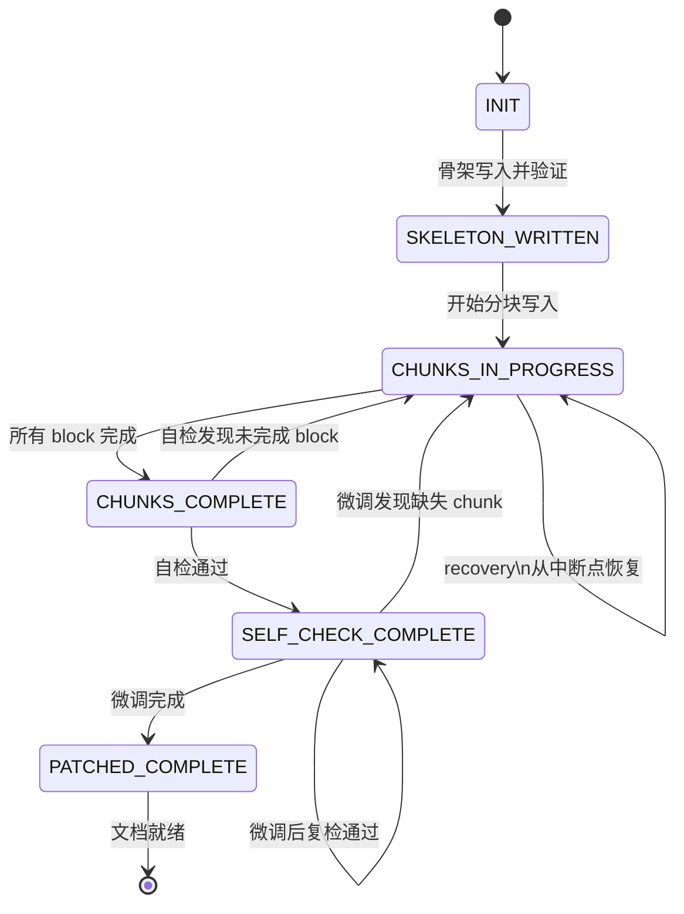

# 分段式实现计划写入机制设计

## 1. 问题陈述

OMP/Codex 在生成长篇实现计划（数百行或超过千行的 `docs/superpowers/plans/*.md` 及 Codex/OMP 交接文档）时，当前依赖于将整个文档内容放入单一 eval heredoc 或 write 工具调用。这种方式存在以下问题：

- **Socket 断连导致全有或全无丢失**：长文档生成过程中，任何网络中断、会话超时或工具调用超时都意味着整篇文档丢失，没有任何部分被持久化。
- **上下文膨胀**：单一巨型 write 调用占用大量 token，容易撞到模型上下文窗口上限，降低生成质量。
- **重复重写**：失败重试必须从头开始，已生成部分被丢弃，浪费计算资源。
- **缺乏可观测性**：没有中间 checkpoint，无法判断写入进展到哪一步，故障排查困难。

## 2. 范围

**首次版本适用范围：**

- 实现计划 / 长文档写入（`docs/superpowers/plans/*.md` 以及 Codex/OMP 手写交接计划）
- 分段式计划写入机制本身的设计文档
- 生成分段式计划后需要进行自我检查的场景

**不在 v1 范围内的场景：**

- 普通代码编辑（短行数、低风险，直接 write 即可）
- 配置文件修改（JSON/YAML/TOML，文件短小，无需分段）
- 测试文件生成（通常由 TDD 流程管理，分段机制不适用）
- 通用 write 工具（本机制不做为通用的写入 API，仅用于计划文档场景）

## 3. 方案选择

三种候选方案对比后，选择 **方案 A：计划生成器强制状态机**。

| 方案 | 描述 | 评价 |
|------|------|------|
| A. 计划生成器强制状态机 | 将写入过程建模为有限状态机，每个阶段有明确输入/输出/验证 | **选中** —— 可验证、可恢复、可观测 |
| B. 仅提示引导 | 通过提示词指导模型分段写入，不强制状态转换 | 没有强制约束，中断后无法恢复，不可靠 |
| C. 通用分段写入器 API | 设计一个通用的流式写入 API，供所有工具使用 | 过度设计，v1 范围外的场景收益低，开发成本高 |

**选择理由：**

状态机方案在三个维度上最优：

- **可靠性**：每个阶段有明确的验证标准，失败时精确知道失败位置。
- **可恢复性**：manifest 记录了完整状态，中断后可以精准恢复。
- **实现成本**：与写入操作紧耦合，不需要通用的流式写入基础设施。
- **可观测性**：每一步都有证据（行数、hash、标记存在性），便于 UI 展示进度。

## 4. 状态机定义

```
INIT ──→ SKELETON_WRITTEN ──→ CHUNKS_IN_PROGRESS ──→ CHUNKS_COMPLETE ──→ SELF_CHECK_COMPLETE ──→ PATCHED_COMPLETE
```

各状态说明：

| 状态 | 含义 | 进入条件 | 退出条件 |
|------|------|----------|----------|
| `INIT` | 初始状态，尚未开始写入 | 接收到分段写入请求 | 骨架文件写入成功并通过验证 |
| `SKELETON_WRITTEN` | 骨架已写入 | INIT 验证通过 | 所有 section/task 分块已写入完毕 |
| `CHUNKS_IN_PROGRESS` | 分块写入中（可以有多个子状态：chunk N/Total） | 骨架验证通过 | 所有 block 标记为完成 |
| `CHUNKS_COMPLETE` | 所有分块写入完成 | 最后一个 chunk 验证通过 | 自检流程启动 |
| `SELF_CHECK_COMPLETE` | 自检完成 | 全部检查项通过 | 微调流程启动 |
| `PATCHED_COMPLETE` | 微调完成，文档终态 | 微调通过验证 | 最终交付 |

## 5. Phase A —— 骨架写入

骨架是整篇计划文档的轮廓，目的是先在磁盘上建立一个可识别的文件，确保后续恢复时能定位到正确的目标。

**骨架内容：**

1. 标题（Title / H1）
2. 目标（Goal）段落
3. 架构决策（Architecture / 设计思路）段落
4. 文件结构（File Structure）列表
5. 任务目录（Task Table of Contents）—— 每个任务 ID、标题、负责角色
6. 恢复/交接注释（Handoff / Recovery Notes）—— 包含计划版本号、生成者、分段写入标记

**写入动作：**

```python
write(file_path, skeleton_content)
```

**验证条件（全部满足才推进到 Phase B）：**

- 文件存在（`os.path.exists`）
- 包含 H1 标题行
- 包含 `## Goal` 或类似目标的段落标题
- 包含 `## 任务` 或类似任务目录的段落标题
- 记录当前行数（line_count）并写入 manifest
- 记录当前文件 sha256 并写入 manifest

**失败处理：** 如果文件不存在或缺少必要标题，重试骨架写入最多 3 次。仍失败则整体失败，不清除已创建的 manifest。

## 6. Phase B —— 分块追加

将完整内容按 section 或 task 划分为多个 chunk，每个 chunk 一次 write 调用追加到文件末尾。

**分块原则：**

- 每个 section 为一个 chunk（如 `## 背景与事实`、`## 实施步骤`）
- 每个 task 为一个 chunk（如 `### Task 1: xxx`、`### Task 2: xxx`）
- chunk 大小建议不超过 200 行（实际行数根据内容复杂度动态决定）

**写入动作：**

```python
# 每次写一个 chunk，追加到文件末尾
# 不 rewrite 整个文件
write(file_path, chunk_content, append=True)
# 或使用 write 工具直接追加
```

**每个 chunk 写入后的验证条件：**

- 文件行数增加（`new_line_count > old_line_count`），增量与 chunk 行数匹配
- 文件 sha256 发生变化（内容确实被修改）
- chunk 头部定义的 section/task 标记存在于文件末尾（如 `## 背景与事实` 或 `### Task 3: 实现 X 模块`）
- 当前文件中代码块（``` 或 ~~~ 或 ````）成对平衡（计算 fences 余数为 0）
- manifest 中标记该 block 状态为 `complete`

**中断恢复：** 如果写入过程中断，从 manifest 读取最后一个 complete 的 block 编号，从下一个 block 继续。

## 7. Phase C —— 自检

所有 chunk 写入完成后，对整篇文档进行全面检查。

**检查项清单：**

| 检查项 | 方法 | 失败处理 |
|--------|------|----------|
| 没有 TODO / TBD / FIXME 残留 | grep 匹配 | 记录位置，Phase D 修复 |
| 没有 placeholder 内容 | grep 匹配 "// TODO"、"placeholder"、"待补充" | 记录位置，Phase D 修复 |
| 任务编号连续无跳号 | 解析 H3 heading，检查编号序列 | 记录断点，Phase D 修复 |
| 每个任务包含 files / tests / commands / expected result | ast 或正则解析每个 H3 下内容 | 记录缺失项，Phase D 补充 |
| Markdown fences 平衡 | 计数 ``` 出现次数（偶数） | 记录，Phase D 修复 |
| H1 标题存在 | 文件第一行检查 | 严重错误，标记失败 |
| 恢复/交接注释存在 | 匹配 handoff / recovery 段 | 缺失则补充 |
| manifest 中 block 状态全部为 complete | 读取 manifest JSON | 标记未完成 block，重新执行 Phase B |

**自检通过后：** 状态推进到 `SELF_CHECK_COMPLETE`，manifest 中记录 self_check 时间戳和结果。

## 8. Phase D —— 微调修补

自检发现的瑕疵通过微小补丁修复，避免全量重写。

**微调原则：**

- 每个修复是一个 `edit`（行级替换/插入/删除），不是 `write`
- 一次微调只改一个 section 或一段内容
- 禁止对整个文档进行 rewrite，除非用户明确批准

**典型微调操作：**

- 替换 `TODO：实现 X` 为具体实现步骤
- 补全任务中缺失的 files 字段
- 修复 fence 不平衡（增加或删除一个 ``` 行）
- 调整编号（如从 `Task 3` 直接跳到 `Task 5`，补充 `Task 4`）

**微调后验证：** 重新运行对应的自检项确认已修复。如果修复引入了新的问题（如 fence 再次不平衡），回退该 edit 并重新微调。

**Phase D 完成后：** 状态推进到 `PATCHED_COMPLETE`，文档终态。

## 9. Manifest / Checkpoint 设计

每个分段写入的计划文件配有一个同名的 sidecar manifest 文件。

**文件路径：**

```
docs/superpowers/plans/xxx-plan.md
docs/superpowers/plans/.xxx-plan.write-manifest.json   ← sidecar
```

**Manifest JSON Schema：**

```json
{
  "plan_path": "docs/superpowers/plans/xxx-plan.md",
  "state": "SKELETON_WRITTEN",
  "writer_role": "SegmentedPlanWriter",
  "writer_model": "deepseek/deepseek-v4-flash",
  "sections": [
    { "id": "goal", "title": "Goal", "status": "complete", "line_start": 1, "line_end": 5 },
    { "id": "architecture", "title": "Architecture", "status": "complete", "line_start": 6, "line_end": 20 }
  ],
  "task_ids": ["task-1", "task-2", "task-3"],
  "line_count": 450,
  "sha256": "abc123...",
  "tail_marker": "<!-- segmented-write-complete -->",
  "code_fence_balanced": true,
  "timestamps": {
    "created": "2026-06-28T10:00:00Z",
    "skeleton_written": "2026-06-28T10:01:00Z",
    "chunks_complete": "2026-06-28T10:12:00Z",
    "self_check_complete": "2026-06-28T10:13:00Z",
    "patched_complete": "2026-06-28T10:14:00Z"
  },
  "recovery": {
    "resume_count": 0,
    "last_recovered_from": null,
    "corrupted_blocks": []
  }
}
```

**Manifest 更新时机：** 每次状态转换或 block 完成时原子更新 manifest 文件。

## 10. 恢复行为

**场景 1：manifest 存在且状态有效**

- 从 manifest 读取当前 `state` 和已完成的 `sections`/`task_ids`
- 从最后一个未完成的 block 继续，跳过已完成的部分
- 验证文件中最后一行是否与 manifest 中的 `tail_marker` 匹配（防止文件在写入后被外部修改）

**场景 2：manifest 缺失但目标文件存在**

- 解析文件中的 H1/H2/H3 heading 重构目录
- 对每个 section 评估完整性（行数、fence 平衡、TODO 存在性）
- 从未完成的 section 开始恢复
- 写入新的 manifest

**场景 3：manifest 存在但部分 block 损坏（如 fence 不平衡）**

- 定位损坏的 block（通过 manifest 中的 section 范围结合文件内容分析）
- 仅重新写入或修补该 block，已完成的 block 不做任何修改
- 在 manifest 的 `corrupted_blocks` 数组中记录问题

**默认策略：**

- 从不重写已完成、已验证的 block
- 从不覆盖用户对该文件的修改（只追加和微调修补）
- 恢复完成后更新 manifest 的 `recovery.resume_count`

## 11. Todo UI 表示

在 OMP harness 或 agent runner UI 中将分段写入过程暴露为细粒度的可恢复任务。

**示例 Todo 列表：**

```
□ 创建计划骨架                 role: SegmentedPlanWriter  model: deepseek/...
□ 写入背景与事实               role: SegmentedPlanWriter  model: deepseek/...
□ 写入任务 1: API 设计         role: SegmentedPlanWriter  model: deepseek/...
□ 写入任务 2: 数据库迁移       role: SegmentedPlanWriter  model: deepseek/...
□ 写入任务 3: 前端实现         role: SegmentedPlanWriter  model: deepseek/...
□ 写入任务 4: 测试与文档       role: SegmentedPlanWriter  model: deepseek/...
□ 自检计划完整性               role: PlanSelfChecker     model: deepseek/...
□ 微调修复计划问题（2 处）     role: PlanPatcher          model: deepseek/...
```

**每个 todo 携带的证据字段：**

- `file_path`: 目标文件路径
- `state_before`: 写入前的状态
- `expected_state_after`: 写入后预期状态
- `checksum_before`: 写入前文件 sha256
- `line_count_before`: 写入前行数
- `verification_command`: 验证命令或检查方法
- `required_skill`: 使用的 skill ID

**断点恢复 UI：** 中断后重新显示未完成的 todo 项，已完成的展示为绿色对勾，并提供 "从第 N 步继续" 按钮。

## 12. 代码集成入口

根据 codebase-memory 上下文，后续实现计划应优先复查以下候选区域：

| 区域 | 说明 |
|------|------|
| `packages/coding-agent/src/codex-plan-run/*` | plan execution/todo/manifest orchestration |
| `packages/coding-agent/src/plan-mode/plan-handoff.ts` | plan handoff/reference loading |
| `packages/coding-agent/src/session/artifacts.ts` and `packages/coding-agent/src/session/session-storage.ts` | persisted artifact/session text writing helpers that may inform durable writes |
| `packages/coding-agent/src/eval/js/shared/helpers.ts` | eval helper write path to consider only if plan generation currently writes via eval helpers |
| 可选新增恢复模块（名称待实现计划确定） | 如需要独立封装 manifest 恢复逻辑再新增；v1 不预设现有路径 |


**确切实现计划应在实施前重新查询 codebase-memory graph**，以确认文件结构是否有变更、是否存在新的相关模块。这些入口点是 codebase-memory graph 检索得到的候选集成点，不是最终实现承诺。

## 13. 接受标准

1. **不存在单次巨型写入**：对于超过 200 行的长计划，写入过程被分解为多个不超过 200 行的片段。
2. **中断可恢复**：模拟中断后重新启动写入，能够从最后一个完成的 block 继续，而不是从头开始。
3. **每个 block 有证据**：manifest 中记录了每个 block 的行数、sha256、写入时间、验证状态。
4. **自检发现缺陷**：自检阶段能检测到 TODO 残留、fence 不平衡、任务编号跳号。
5. **文档声明 v1 性质**：生成的 PRD 或设计文档中明确注明"此版本为分段写入机制的第一个版本"。
6. **不破坏现有流程**：短文档/代码编辑不受影响，正常 write 行为不变。

## 14. 风险和反模式

| 风险 | 影响 | 缓解措施 |
|------|------|----------|
| 过度设计（通用化） | 实现周期拖长，延迟交付 | v1 严格限定范围，拒绝通用 write API |
| Manifest 与文件内容不一致 | 恢复时数据出错 | 每次状态转换时同步检查文件 hash |
| 并发写入冲突 | 多个 agent 同时写入 | v1 所有写入由单一 agent 串行执行 |
| 微调修补引入新问题 | 修复一个破坏另一个 | 每次微调后针对性回检 |
| 骨架阶段后文件未被写透 | 后续追加失败 | Phase A 验证严格检查文件存在性 |

**明确非目标：**

- ❌ 不提供通用的分段写入 API（v1 不做）
- ❌ 不实现自动后台同步（manifest 同步是同步的）
- ❌ 这份设计文档不包含代码实现（仅设计规格）

## 15. 附录：状态转换图


